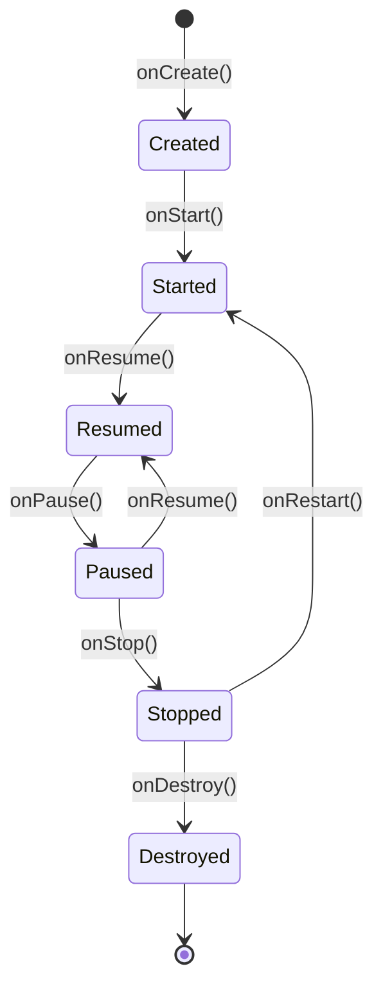
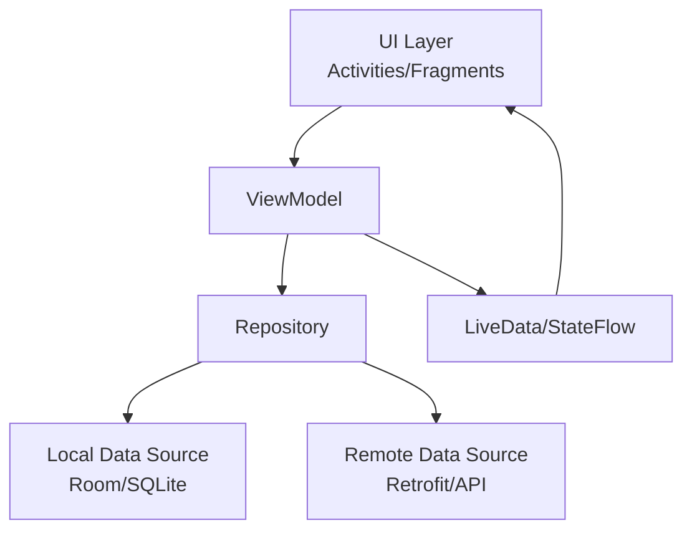
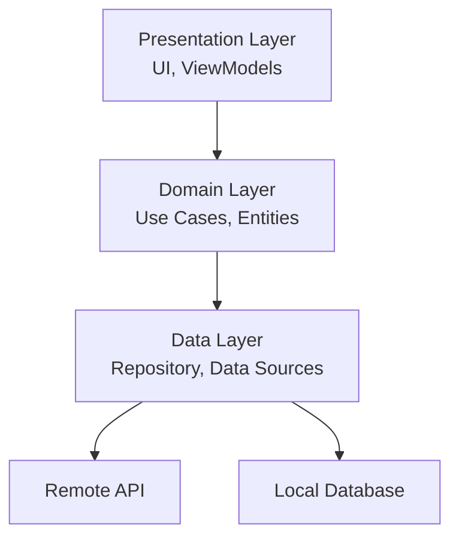
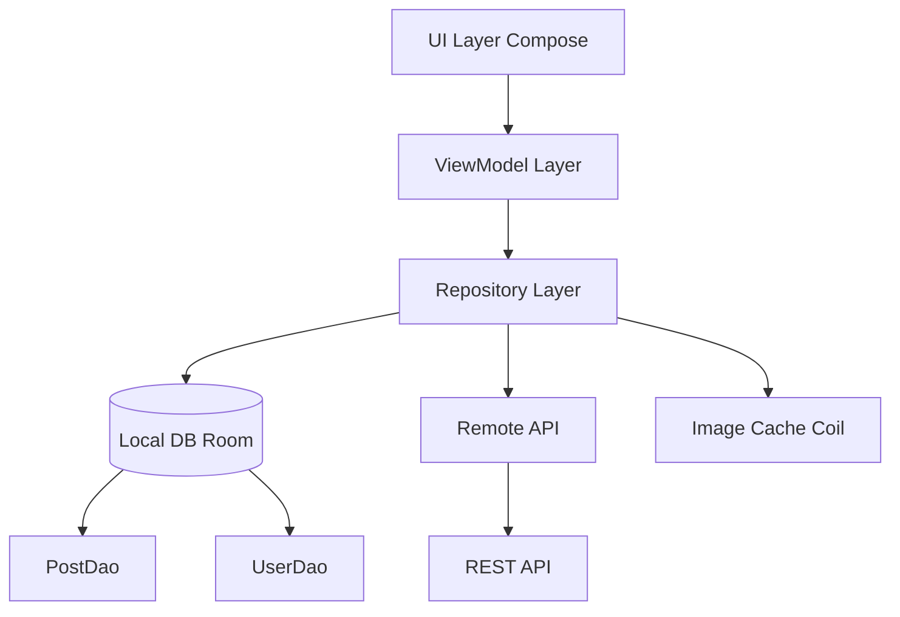
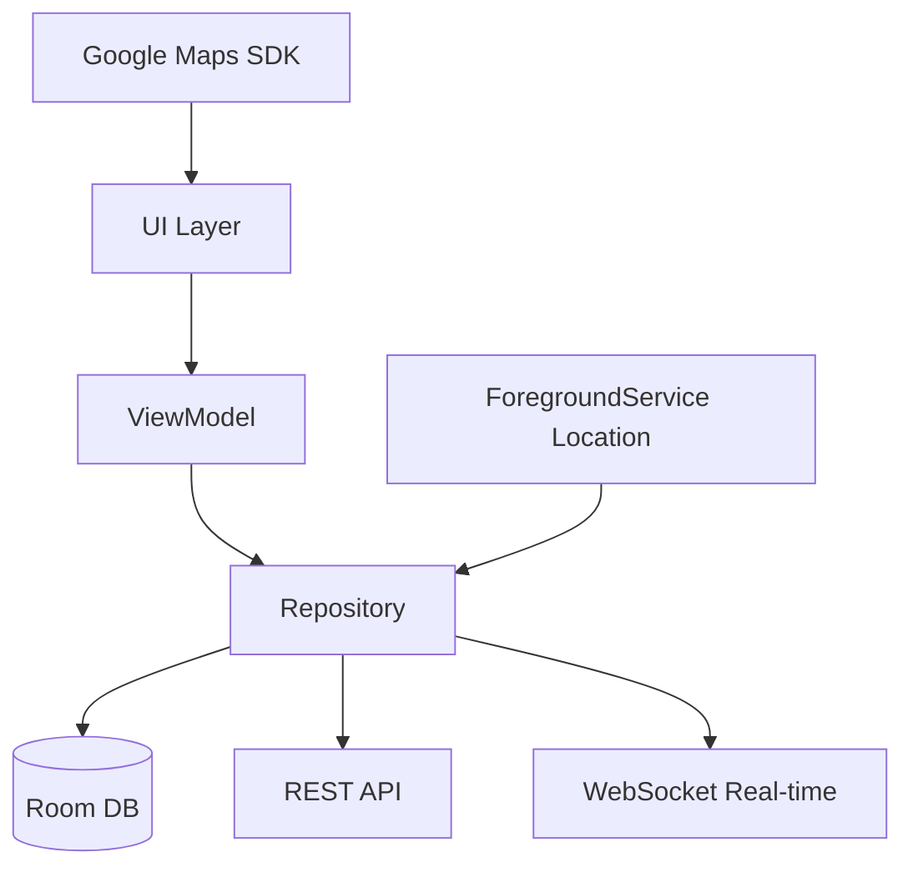
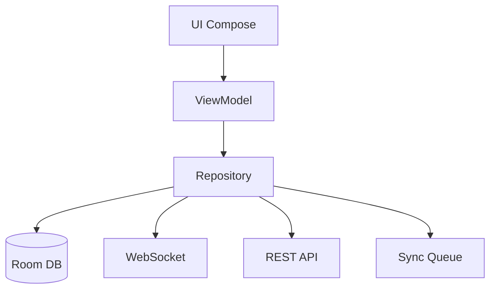

# Android Interview Preparation Guide

> Comprehensive notes for Senior Software Engineers. Complete in 2 days (16-20 hours) covering Android fundamentals, modern architecture, Jetpack Compose, advanced Kotlin, and system design.

## 📚 2-Day Reading Plan

This guide is structured for efficient interview preparation. Follow this schedule to cover all topics systematically.

### Day 1: Fundamentals, Architecture & Modern UI (8-10 hours)

**Hour 1-2: Android Fundamentals**
- Section 1: Android Fundamentals
  - Activity & Fragment Lifecycle
  - Intent & Context
  - View System basics
- Focus: Core concepts, lifecycle management
- Practice: Lifecycle scenario questions

**Hour 3-4: Architecture Patterns**
- Section 2: Android Architecture
  - MVVM, MVP, MVI patterns
  - Repository pattern
  - Clean Architecture
- Focus: Choosing right pattern, data flow
- Practice: Architecture comparison questions

**Hour 5-6: Jetpack Components**
- Section 3: Jetpack Components
  - ViewModel, LiveData, StateFlow
  - Room Database
  - Navigation Component
  - WorkManager, DataStore, Paging 3
- Focus: Modern Android libraries
- Practice: Component integration scenarios

**Hour 7-8: Jetpack Compose**
- Section 13: Jetpack Compose
  - Compose fundamentals & state
  - Side effects & lifecycle
  - Performance & recomposition
  - Navigation in Compose
- Focus: Modern declarative UI
- Practice: Stability questions, recomposition scenarios

**Hour 9-10: Review & Practice**
- Review Day 1 interview questions
- Complete tricky Compose questions
- Practice architecture design discussions

**🎯 Day 1 Goal**: Master fundamentals, architecture patterns, and modern UI development

---

### Day 2: Advanced Topics, Performance & System Design (8-10 hours)

**Hour 1-2: Networking & Concurrency**
- Section 4: Networking & Data
  - Retrofit, OkHttp
  - Error handling, caching
- Section 5: Concurrency
  - Coroutines basics (reference Coroutines.md)
  - Background work patterns
- Focus: API integration, async operations
- Practice: Offline-first scenarios, token refresh

**Hour 3-4: Memory & Performance**
- Section 6: Memory Management
  - Memory leaks, LeakCanary
  - Bitmap optimization
  - ProGuard/R8
- Section 7: Performance Optimization
  - App startup, layout performance
  - RecyclerView optimization
  - ANR prevention
- Focus: Production-ready optimizations
- Practice: OOM scenarios, performance debugging

**Hour 5-6: Dependency Injection & Advanced Kotlin**
- Reference: dependency-injection/Dagger.md
  - Hilt setup & components
  - Multibinding, qualifiers
  - Testing with DI
- Section 15: Advanced Kotlin
  - Flow in depth (StateFlow, SharedFlow)
  - Channels
  - Advanced features (inline, reified, delegates)
- Focus: DI architecture, reactive streams
- Practice: Multi-module DI, Flow operators

**Hour 7-8: System Design**
- Section 17: Android System Design
  - Design approach framework
  - 5 complete app designs:
    1. Instagram-like social media
    2. Uber driver app
    3. WhatsApp-like chat
    4. News reader (offline-first)
    5. Video streaming app
- Focus: Architecture decisions, scalability
- Practice: Design discussions, trade-offs

**Hour 9-10: Mock Interview**
- Review all interview questions
- Practice system design presentations
- Revisit weak areas
- Complete TrickyInterviewQuestions.md

**🎯 Day 2 Goal**: Master advanced topics, performance optimization, and system design

---

## 📋 Quick Reference Files

- **Main Notes**: [Android.md](Android.md) (this file)
- **Coroutines Deep Dive**: [Coroutines.md](coroutines/Coroutines.md)
- **Dependency Injection**: [Dagger.md](dependency-injection/Dagger.md)
- **Gradle Build System**: [Gradle.md](Gradle.md)
- **Kotlin Language**: [Kotlin.md](Kotlin.md)
- **Tricky Questions**: [TrickyInterviewQuestions.md](TrickyInterviewQuestions.md)

---

## 💡 Study Tips

1. **Active Learning**: Don't just read - write code examples
2. **Focus on "Why"**: Understand reasons behind patterns and decisions
3. **Practice Scenarios**: Spend 40% time on scenario-based questions
4. **System Design**: Draw diagrams, explain out loud
5. **Review Weak Areas**: Identify gaps and revisit those sections
6. **Real-World Context**: Think how concepts apply to your projects

---

## Table of Contents

1. [Android Fundamentals](#1-android-fundamentals)
2. [Android Architecture](#2-android-architecture)
3. [Jetpack Components](#3-jetpack-components)
4. [Networking & Data](#4-networking--data)
5. [Concurrency & Background Work](#5-concurrency--background-work)
6. [Memory Management](#6-memory-management)
7. [Performance Optimization](#7-performance-optimization)
8. [Build System & Gradle](#8-build-system--gradle)
9. [Testing](#9-testing)
10. [Security](#10-security)
11. [Advanced Topics](#11-advanced-topics)
12. [Modern Android Development](#12-modern-android-development)
13. [Jetpack Compose](#13-jetpack-compose) ⭐ NEW
14. [Interview Questions (Legacy)](#14-interview-questions)
15. [Advanced Kotlin for Android](#15-advanced-kotlin-for-android) ⭐ NEW
16. [Interview Questions (Comprehensive)](#16-interview-questions)
17. [Android System Design](#17-android-system-design) ⭐ NEW

---

## 1. Android Fundamentals

### Activity Lifecycle

**What is it?**
Activities are the entry points for user interaction. The lifecycle represents different states an Activity goes through from creation to destruction.

**Why important?**
- Properly manage resources (camera, sensors, network)
- Save/restore user data during configuration changes
- Prevent memory leaks and crashes
- Optimize battery usage

**When methods are called:**
- `onCreate()`: Activity created - Initialize UI, restore state
- `onStart()`: Activity visible - Prepare UI for interaction
- `onResume()`: Activity in foreground - Start animations, acquire exclusive resources
- `onPause()`: Activity losing focus - Pause operations, save critical data
- `onStop()`: Activity not visible - Stop animations, release resources
- `onDestroy()`: Activity destroyed - Final cleanup

Activities are the entry points for user interaction. Understanding the lifecycle is crucial for proper state management.

#### Lifecycle States



#### Lifecycle Methods

| Method | When Called | Purpose |
|--------|-------------|---------|
| `onCreate()` | Activity first created | Initialize UI, bind data, set content view |
| `onStart()` | Activity becomes visible | Prepare UI for user interaction |
| `onResume()` | Activity in foreground | Start animations, sensors, camera |
| `onPause()` | Activity losing focus | Pause operations, save data |
| `onStop()` | Activity no longer visible | Stop animations, release resources |
| `onDestroy()` | Activity being destroyed | Final cleanup, release references |
| `onRestart()` | Activity restarting from stopped | Reinitialize resources |

#### Key Points

**Configuration Changes:**
- What: Device rotation, language change, screen size change
- Effect: Activity is destroyed and recreated (onDestroy → onCreate)
- Solution: Use ViewModel to preserve data across config changes

**Process Death:**
- What: System kills app process to free memory
- Effect: All Activities destroyed, no callbacks
- Solution: Use `onSaveInstanceState()` to save critical state to Bundle
- Limitation: Bundle has ~1MB limit, only for small/primitive data

**Best Practices:**
- Use ViewModel for UI data (survives config changes)
- Use onSaveInstanceState for transient state (scroll position, text input)
- Never hold Activity references in long-lived objects (causes memory leaks)

- **Configuration Changes**: Activity is destroyed and recreated (onDestroy → onCreate)
- **Process Death**: System may kill process, use `onSaveInstanceState()` to save state
- **Lifecycle-Aware Components**: Use ViewModel, LiveData for data that survives configuration changes

```kotlin
class MainActivity : AppCompatActivity() {
    override fun onCreate(savedInstanceState: Bundle?) {
        super.onCreate(savedInstanceState)
        setContentView(R.layout.activity_main)
        
        // Restore saved state
        savedInstanceState?.getString("key")?.let {
            // Restore data
        }
    }
    
    override fun onSaveInstanceState(outState: Bundle) {
        super.onSaveInstanceState(outState)
        outState.putString("key", "value")
    }
}
```

### Fragment Lifecycle

**What is it?**
Fragments are reusable UI components that must be hosted in an Activity. They have their own lifecycle that's tied to, but more complex than, the Activity lifecycle.

**Why use Fragments?**
- **Reusability**: Same UI component in multiple Activities
- **Modular UI**: Break complex screens into manageable pieces
- **Navigation**: Easy screen transitions within same Activity
- **Tablet Support**: Show multiple fragments side-by-side

**Key Differences from Activity:**
- Fragments have `onCreateView()` - called to create the view hierarchy
- `onViewCreated()` - safe to access views after this
- `onDestroyView()` - view destroyed but fragment instance may remain
- Fragment can exist without a view (retained fragments)

Fragments have a more complex lifecycle tied to their host Activity.

#### Fragment Lifecycle Methods

```kotlin
override fun onCreateView(inflater: LayoutInflater, container: ViewGroup?, 
                          savedInstanceState: Bundle?): View {
        return inflater.inflate(R.layout.fragment_my, container, false)
    }
    
    override fun onViewCreated(view: View, savedInstanceState: Bundle?) {
        super.onViewCreated(view, savedInstanceState)
    // Setup UI - views are ready
    }
    
    override fun onDestroyView() {
    _binding = null  // Important: prevent memory leak
        super.onDestroyView()
}
```

#### Fragment Lifecycle States

| State | Description |
|-------|-------------|
| `INITIALIZED` | Fragment created but not attached |
| `CREATED` | Fragment attached, view created |
| `STARTED` | Fragment visible but not interactive |
| `RESUMED` | Fragment visible and interactive |
| `DESTROYED` | Fragment destroyed |

### Intent and Intent Filters

**What is Intent?**
Intent is a messaging object used to request an action from another app component (Activity, Service, BroadcastReceiver).

**Why use Intents?**
- Start Activities (navigate between screens)
- Start Services (background work)
- Deliver broadcasts (system-wide announcements)
- Inter-app communication (share data, open URLs)

**Two Types:**

**1. Explicit Intent** - You specify exact component
- Use case: Navigation within your app
- Pros: Fast, secure, guaranteed delivery
- Cons: Requires knowledge of target component
```kotlin
val intent = Intent(this, DetailActivity::class.java)
intent.putExtra("key", "value")
startActivity(intent)
```

**Implicit Intent**: Describes action, system finds component
```kotlin
val intent = Intent(Intent.ACTION_SEND)
intent.type = "text/plain"
intent.putExtra(Intent.EXTRA_TEXT, "Share this")
startActivity(Intent.createChooser(intent, "Share via"))
```

#### Intent Filters

Declare in `AndroidManifest.xml`:
```xml
<activity android:name=".ShareActivity">
    <intent-filter>
        <action android:name="android.intent.action.SEND" />
        <category android:name="android.intent.category.DEFAULT" />
        <data android:mimeType="text/plain" />
    </intent-filter>
</activity>
```

#### Intent Components

- **Action**: What to do (ACTION_VIEW, ACTION_SEND, etc.)
- **Data**: URI and MIME type
- **Category**: Additional context (CATEGORY_BROWSABLE, etc.)
- **Extras**: Key-value pairs for additional data
- **Flags**: Control behavior (FLAG_ACTIVITY_NEW_TASK, etc.)

### Context

**What is Context?**
Context is an interface to global application environment information. It provides access to resources, databases, preferences, and system services.

**Why is Context needed?**
- Access app resources (strings, drawables, layouts)
- Get system services (LocationManager, NotificationManager)
- Start Activities, Services, Broadcasts
- Access databases and SharedPreferences

**Types & When to Use:**

Context provides access to application resources and system services.

| Type | Lifetime | Use Cases |
|------|----------|-----------|
| **Application Context** | App lifetime | Long-lived operations, singletons, avoid memory leaks |
| **Activity Context** | Activity lifetime | UI operations, dialogs, starting activities, theme-dependent |
| **Service Context** | Service lifetime | Service-specific operations |

**Rule of Thumb:**
- Use Application Context for long-lived objects (repositories, managers)
- Use Activity Context for UI-related operations
- Never hold Activity Context in static/singleton objects (memory leak!)

#### Context Types

| Type | Lifetime | Use Cases |
|------|----------|-----------|
| **Application Context** | App lifetime | Long-lived operations, singletons |
| **Activity Context** | Activity lifetime | UI operations, starting activities |
| **Service Context** | Service lifetime | Service-specific operations |

#### Best Practices

```kotlin
// ✅ Good: Use Application Context for long-lived objects
class MyRepository(context: Context) {
    private val appContext = context.applicationContext
}

// ❌ Bad: Holding Activity Context in singleton
object Singleton {
    var context: Context? = null // Memory leak!
}
```

#### Common Context Operations

```kotlin
context.getString(R.string.app_name)
context.getSystemService(Context.VIBRATOR_SERVICE) as Vibrator
context.startActivity(intent)
context.getSharedPreferences("prefs", Context.MODE_PRIVATE)
```

### View System and Layouts

#### View Hierarchy

```
ViewGroup (Container)
├── View (Leaf)
├── ViewGroup
│   ├── View
│   └── View
└── View
```

#### Common Layouts

| Layout | Use Case | Performance |
|--------|----------|-------------|
| **ConstraintLayout** | Complex layouts, flat hierarchy | ⭐⭐⭐⭐⭐ |
| **LinearLayout** | Simple linear arrangements | ⭐⭐⭐ |
| **RelativeLayout** | Relative positioning | ⭐⭐ |
| **FrameLayout** | Single child, overlays | ⭐⭐⭐⭐ |
| **CoordinatorLayout** | Material Design, scrolling | ⭐⭐⭐⭐ |

#### View Measurement

```kotlin
override fun onMeasure(widthMeasureSpec: Int, heightMeasureSpec: Int) {
    val width = MeasureSpec.getSize(widthMeasureSpec)
    val widthMode = MeasureSpec.getMode(widthMeasureSpec)  // EXACTLY, AT_MOST, UNSPECIFIED
    setMeasuredDimension(desiredWidth, desiredHeight)
}
```

**MeasureSpec Modes**:
- `EXACTLY`: Parent determined exact size
- `AT_MOST`: Parent set maximum size
- `UNSPECIFIED`: No constraints

#### View Drawing

```kotlin
override fun onDraw(canvas: Canvas) {
    super.onDraw(canvas)
    canvas.drawCircle(centerX, centerY, radius, paint)
}
```

### Resources and Assets

#### Resource Types

| Type | Location | Access |
|------|----------|--------|
| **Strings** | `res/values/strings.xml` | `getString(R.string.key)` |
| **Colors** | `res/values/colors.xml` | `getColor(R.color.primary)` |
| **Dimensions** | `res/values/dimens.xml` | `getDimension(R.dimen.margin)` |
| **Drawables** | `res/drawable/` | `getDrawable(R.drawable.icon)` |
| **Layouts** | `res/layout/` | `setContentView(R.layout.activity_main)` |
| **Menus** | `res/menu/` | `inflate(R.menu.main, menu)` |

#### Resource Qualifiers

Qualifiers allow different resources for different configurations:

```
res/
├── values/
│   └── strings.xml (default)
├── values-land/
│   └── strings.xml (landscape)
├── values-night/
│   └── strings.xml (dark theme)
├── drawable-mdpi/
│   └── icon.png
└── drawable-xhdpi/
    └── icon.png
```

**Common Qualifiers**:
- `-land`, `-port`: Orientation
- `-night`: Dark theme
- `-sw600dp`: Smallest width (tablets)
- `-v21`: API level
- `-en`, `-es`: Language

#### Assets

```kotlin
val text = assets.open("file.txt").bufferedReader().use { it.readText() }
```

**Resources vs Assets**:
- **Resources**: Compiled, optimized, localized, accessed via R class
- **Assets**: Raw files, not compiled, accessed via AssetManager

### Interview Questions - Android Fundamentals

**Q: Explain the difference between `onSaveInstanceState()` and ViewModel for state preservation**
A:
- `onSaveInstanceState()`: Saves small amounts of data (primitives, parcelables) to Bundle, survives process death but has size limits (~1MB)
- ViewModel: Stores any data, survives configuration changes but NOT process death, better for complex objects
- **Use both**: ViewModel for UI data, onSaveInstanceState for user's transient state (scroll position, text input)

**Q: What happens if you start an Activity from a non-Activity context without FLAG_ACTIVITY_NEW_TASK?**
A: You'll get an exception: "Calling startActivity() from outside of an Activity context requires the FLAG_ACTIVITY_NEW_TASK flag." Non-Activity contexts don't have a task stack, so you must create a new task.

**Q: How do you handle Fragment transactions properly to avoid crashes?**
A:
```kotlin
// ❌ Bad: Can crash if activity is not in valid state
fragmentManager.beginTransaction()
    .replace(R.id.container, MyFragment())
    .commit()

// ✅ Good: Check state and use commitAllowingStateLoss if appropriate
if (lifecycle.currentState.isAtLeast(Lifecycle.State.STARTED)) {
    fragmentManager.beginTransaction()
        .replace(R.id.container, MyFragment())
        .commit()
}

// Or use commitNow() for immediate execution
fragmentManager.beginTransaction()
    .replace(R.id.container, MyFragment())
    .commitNow()
```

**Scenario: App crashes on rotation when loading image. Debug and fix.**

Answer:
```kotlin
// Problem: Activity reference in AsyncTask/Thread
class MainActivity : AppCompatActivity() {
    override fun onCreate(savedInstanceState: Bundle?) {
        super.onCreate(savedInstanceState)
        
        // ❌ Bad: Leaks activity
        Thread {
            val bitmap = loadLargeImage()
            runOnUiThread {
                imageView.setImageBitmap(bitmap) // Crash if activity destroyed
            }
        }.start()
    }
}

// ✅ Solution 1: Use ViewModel + Coroutines
class ImageViewModel : ViewModel() {
    private val _image = MutableLiveData<Bitmap>()
    val image: LiveData<Bitmap> = _image
    
    fun loadImage() {
        viewModelScope.launch {
            val bitmap = withContext(Dispatchers.IO) {
                loadLargeImage()
            }
            _image.value = bitmap
        }
    }
}

class MainActivity : AppCompatActivity() {
    private val viewModel: ImageViewModel by viewModels()
    
    override fun onCreate(savedInstanceState: Bundle?) {
        super.onCreate(savedInstanceState)
        
        viewModel.image.observe(this) { bitmap ->
            imageView.setImageBitmap(bitmap)
        }
        
        if (viewModel.image.value == null) {
            viewModel.loadImage()
        }
    }
}

// ✅ Solution 2: Use image loading library
// In onCreate:
Coil.load(imageView) {
    data(imageUrl)
    crossfade(true)
    error(R.drawable.error)
}
```

---

## 2. Android Architecture

### Android Architecture Components Overview



### MVVM Pattern

**What is MVVM?**
Model-View-ViewModel is an architectural pattern that separates UI (View) from business logic (ViewModel) and data (Model).

**Why use MVVM?**
- **Separation of Concerns**: UI, logic, and data are independent
- **Testability**: ViewModel can be unit tested without UI
- **Lifecycle Awareness**: ViewModel survives configuration changes
- **Reactive**: UI automatically updates when data changes

**How it works:**
1. **View** (Activity/Fragment) observes ViewModel
2. **ViewModel** holds UI state and business logic
3. **Model** (Repository) provides data from network/database
4. Data flows: Model → ViewModel → View (one direction)
5. Events flow: View → ViewModel (user actions)

**When to use:**
- Default choice for most Android apps
- When you need reactive UI updates
- When testing is important

**Model-View-ViewModel** separates UI logic from business logic.

#### Components

- **Model**: Data and business logic
- **View**: UI components (Activity/Fragment)
- **ViewModel**: Holds UI-related data, survives configuration changes

#### Example

```kotlin
// ViewModel
class UserViewModel(private val repository: UserRepository) : ViewModel() {
    private val _user = MutableLiveData<User>()
    val user: LiveData<User> = _user
    
    fun loadUser(id: String) {
        viewModelScope.launch {
            _user.value = repository.getUser(id)
        }
    }
}

// View
        viewModel.user.observe(this) { user ->
            nameTextView.text = user.name
}
```

### MVP Pattern

**Model-View-Presenter** uses a presenter to handle UI logic.

```kotlin
// Presenter
class UserPresenter(private val view: UserView, private val repository: UserRepository) {
    fun loadUser(id: String) {
        viewModelScope.launch {
                val user = repository.getUser(id)
                view.showUser(user)
        }
    }
}

// View
class UserActivity : AppCompatActivity(), UserView {
    override fun showUser(user: User) {
        nameTextView.text = user.name
    }
}
```

### MVI Pattern

**Model-View-Intent** uses unidirectional data flow.

```kotlin
sealed class UserIntent {
    object LoadUser : UserIntent()
    data class UpdateName(val name: String) : UserIntent()
}

data class UserState(val user: User? = null, val isLoading: Boolean = false)

// ViewModel
    fun processIntent(intent: UserIntent) {
        when (intent) {
        is UserIntent.LoadUser -> _state.value = _state.value.copy(isLoading = true)
            is UserIntent.UpdateName -> updateName(intent.name)
    }
}
```

### Clean Architecture

Clean Architecture separates concerns into layers:



#### Layers

1. **Presentation Layer**: UI, ViewModels, UI state
2. **Domain Layer**: Business logic, use cases, entities (no Android dependencies)
3. **Data Layer**: Repositories, data sources, API clients

#### Example Structure

```
app/
├── presentation/
│   ├── ui/
│   │   ├── MainActivity.kt
│   │   └── MainFragment.kt
│   └── viewmodel/
│       └── MainViewModel.kt
├── domain/
│   ├── model/
│   │   └── User.kt
│   └── usecase/
│       └── GetUserUseCase.kt
└── data/
    ├── repository/
    │   └── UserRepositoryImpl.kt
    ├── remote/
    │   └── UserApi.kt
    └── local/
        └── UserDao.kt
```

### Repository Pattern

Repository abstracts data sources and provides a clean API.

```kotlin
class UserRepositoryImpl(
    private val remoteDataSource: UserRemoteDataSource,
    private val localDataSource: UserLocalDataSource
) : UserRepository {
    
    override suspend fun getUser(id: String): Result<User> {
        return try {
            val user = remoteDataSource.getUser(id)
            localDataSource.saveUser(user)  // Cache
            Result.success(user)
        } catch (e: Exception) {
            localDataSource.getUser(id)?.let { Result.success(it) } 
                ?: Result.failure(e)
        }
    }
}
```

### Use Cases / Interactors

Use cases encapsulate single business operations.

```kotlin
class GetUserUseCase(private val repository: UserRepository) {
    suspend operator fun invoke(userId: String): Result<User> {
        if (userId.isBlank()) return Result.failure(IllegalArgumentException())
        return repository.getUser(userId)
    }
}

// Usage
getUserUseCase(id).onSuccess { _user.value = it }
```

---

## 3. Jetpack Components

### ViewModel

**What is ViewModel?**
ViewModel is a class designed to store and manage UI-related data in a lifecycle-conscious way. It survives configuration changes like screen rotation.

**Why use ViewModel?**
- **Survives Config Changes**: Data persists across screen rotations
- **Lifecycle-Aware**: Automatically cleared when Activity/Fragment destroyed
- **Separation of Concerns**: Keeps UI logic out of Activity/Fragment
- **Shared Data**: Can be shared between fragments

**Key Rules:**
- ✅ Store UI state, LiveData/StateFlow
- ✅ Make network calls, database queries
- ❌ Never hold Activity/Fragment/View references (causes memory leaks!)
- ❌ Never access Context directly (use AndroidViewModel if needed)

**Lifecycle:**
- Created when Activity/Fragment created
- Survives configuration changes
- Destroyed when Activity finished or Fragment removed

ViewModel stores and manages UI-related data in a lifecycle-conscious way.

#### Key Features

- **Survives configuration changes**: Data persists across screen rotations
- **Lifecycle-aware**: Automatically cleared when Activity/Fragment destroyed
- **No UI references**: Never holds references to Views, Activities, or Context

#### Basic Usage

```kotlin
class MyViewModel : ViewModel() {
    private val _data = MutableLiveData<String>()
    val data: LiveData<String> = _data
    
    init { loadData() }
    
    override fun onCleared() {
        super.onCleared()  // Cleanup
    }
}

// In Activity
    private val viewModel: MyViewModel by viewModels()
viewModel.data.observe(this) { /* Update UI */ }
```

#### ViewModel with SavedStateHandle

```kotlin
class MyViewModel(private val savedStateHandle: SavedStateHandle) : ViewModel() {
    var state: String
        get() = savedStateHandle.get<String>("key") ?: ""
        set(value) = savedStateHandle.set("key", value)
    
    // Or use LiveData
    val stateLiveData: LiveData<String> = savedStateHandle.getLiveData("key", "")
}
```

#### ViewModelFactory

For ViewModels with constructor parameters:

```kotlin
class MyViewModelFactory(
    private val repository: Repository
) : ViewModelProvider.Factory {
    override fun <T : ViewModel> create(modelClass: Class<T>): T {
        if (modelClass.isAssignableFrom(MyViewModel::class.java)) {
            @Suppress("UNCHECKED_CAST")
            return MyViewModel(repository) as T
        }
        throw IllegalArgumentException("Unknown ViewModel class")
    }
}

// Usage
val factory = MyViewModelFactory(repository)
val viewModel = ViewModelProvider(this, factory)[MyViewModel::class.java]
```

### LiveData

**What is LiveData?**
LiveData is an observable data holder class that's lifecycle-aware. It only updates observers that are in an active lifecycle state.

**Why use LiveData?**
- **Lifecycle-Aware**: Automatically manages subscriptions, no memory leaks
- **No Manual Cleanup**: Observers auto-removed when lifecycle destroyed
- **Always Up-to-Date**: Inactive observers get latest value when becoming active
- **Configuration Change Safe**: Works seamlessly with ViewModel

**When to use:**
- Simple UI state updates
- When you need automatic lifecycle handling
- One-to-many observer pattern

**Limitations:**
- Main thread only for updates (postValue for background)
- Limited operators compared to Flow
- Not suitable for one-time events (use SharedFlow/Channel)

LiveData is an observable data holder class that is lifecycle-aware.

#### Characteristics

- **Lifecycle-aware**: Automatically manages subscriptions based on lifecycle
- **No memory leaks**: Observers automatically removed when lifecycle destroyed
- **Always up-to-date**: Receives latest data when becoming active
- **Thread-safe**: Main thread only for updates

#### Basic Usage

```kotlin
class MyViewModel : ViewModel() {
    private val _data = MutableLiveData<String>()
    val data: LiveData<String> = _data  // Expose immutable
    
    fun updateData(newData: String) {
        _data.value = newData          // Main thread
        _data.postValue(newData)       // Background thread
    }
}

viewModel.data.observe(this) { /* Update UI */ }
```

#### LiveData Transformations

```kotlin
val userName: LiveData<String> = Transformations.map(user) { 
    "${it.firstName} ${it.lastName}" 
}

val userData: LiveData<User> = Transformations.switchMap(userId) { 
    repository.getUser(it) 
}

// Combine multiple LiveData
val combined = MediatorLiveData<String>().apply {
    addSource(liveData1) { value = "$it + ${liveData2.value}" }
    addSource(liveData2) { value = "${liveData1.value} + $it" }
}
```

#### Custom LiveData

```kotlin
class LocationLiveData(context: Context) : LiveData<Location>() {
    private val locationManager = context.getSystemService(Context.LOCATION_SERVICE) as LocationManager
    
    private val listener = LocationListener { location ->
        value = location
    }
    
    override fun onActive() {
        // Start listening when observer active
        locationManager.requestLocationUpdates(
            LocationManager.GPS_PROVIDER,
            0L,
            0f,
            listener
        )
    }
    
    override fun onInactive() {
        // Stop listening when no active observers
        locationManager.removeUpdates(listener)
    }
}
```

### Room Database

**What is Room?**
Room is a persistence library providing an abstraction layer over SQLite. It makes database access easier with compile-time verification of SQL queries.

**Why use Room over SQLite?**
- **Compile-Time Safety**: SQL queries verified at compile time, fewer runtime errors
- **Less Boilerplate**: No need to write ContentValues, Cursor parsing
- **Kotlin Support**: Suspend functions, Flow for reactive queries
- **Migration Support**: Easier schema upgrades
- **Integration**: Works with LiveData, Flow, Paging, RxJava

**When to use:**
- Need local database storage
- Offline-first apps
- Caching network responses
- Complex queries and relationships

**Core Concepts:**
- **Entity**: Represents a table (@Entity annotation)
- **DAO**: Data Access Object with query methods (@Dao)
- **Database**: Main access point holding DAOs (@Database)

Room is a persistence library providing an abstraction layer over SQLite.

#### Components

- **Database**: Main access point, holds DAOs
- **Entity**: Represents a table
- **DAO**: Data Access Object, contains database methods
- **Type Converters**: Convert complex types to database-compatible types

#### Setup

```kotlin
// Entity
@Entity(tableName = "users")
data class User(
    @PrimaryKey val id: String,
    val name: String,
    @ColumnInfo(name = "created_at") val createdAt: Long
)

// DAO
@Dao
interface UserDao {
    @Query("SELECT * FROM users WHERE id = :id")
    suspend fun getUserById(id: String): User?
    
    @Insert(onConflict = OnConflictStrategy.REPLACE)
    suspend fun insertUser(user: User)
}

// Database
@Database(entities = [User::class], version = 1)
abstract class AppDatabase : RoomDatabase() {
    abstract fun userDao(): UserDao
}
```

#### Migrations

```kotlin
val MIGRATION_1_2 = object : Migration(1, 2) {
    override fun migrate(database: SupportSQLiteDatabase) {
        database.execSQL("ALTER TABLE users ADD COLUMN age INTEGER NOT NULL DEFAULT 0")
    }
}

Room.databaseBuilder(context, AppDatabase::class.java, "db")
    .addMigrations(MIGRATION_1_2)
            .build()
```

#### Relationships

```kotlin
// One-to-Many
@Entity
data class User(
    @PrimaryKey val id: String,
    val name: String
)

@Entity
data class Post(
    @PrimaryKey val id: String,
    val userId: String,
    val title: String,
    @ForeignKey(
        entity = User::class,
        parentColumns = ["id"],
        childColumns = ["userId"]
    )
    val user: User
)

// With Relations
data class UserWithPosts(
    @Embedded val user: User,
    @Relation(
        parentColumn = "id",
        entityColumn = "userId"
    )
    val posts: List<Post>
)

@Dao
interface UserDao {
    @Transaction
    @Query("SELECT * FROM users WHERE id = :id")
    suspend fun getUserWithPosts(id: String): UserWithPosts
}
```

### Navigation Component

Navigation Component simplifies navigation between destinations.

#### Setup

```kotlin
// build.gradle
dependencies {
    implementation "androidx.navigation:navigation-fragment-ktx:$nav_version"
    implementation "androidx.navigation:navigation-ui-ktx:$nav_version"
}

// Navigation Graph (res/navigation/nav_graph.xml)
<navigation xmlns:android="http://schemas.android.com/apk/res/android"
    xmlns:app="http://schemas.android.com/apk/res-auto"
    android:id="@+id/nav_graph"
    app:startDestination="@id/homeFragment">
    
    <fragment
        android:id="@+id/homeFragment"
        android:name="com.example.HomeFragment"
        android:label="Home">
        <action
            android:id="@+id/action_home_to_detail"
            app:destination="@id/detailFragment" />
    </fragment>
    
    <fragment
        android:id="@+id/detailFragment"
        android:name="com.example.DetailFragment"
        android:label="Detail">
        <argument
            android:name="itemId"
            app:argType="string" />
    </fragment>
</navigation>

// In Activity
class MainActivity : AppCompatActivity() {
    override fun onCreate(savedInstanceState: Bundle?) {
        super.onCreate(savedInstanceState)
        setContentView(R.layout.activity_main)
        
        val navController = findNavController(R.id.nav_host_fragment)
        setupActionBarWithNavController(navController)
    }
}

// Navigate
findNavController().navigate(R.id.action_home_to_detail)

// With arguments
val action = HomeFragmentDirections.actionHomeToDetail(itemId = "123")
findNavController().navigate(action)
```

#### Deep Linking

```xml
<fragment
    android:id="@+id/detailFragment"
    android:name="com.example.DetailFragment">
    <deepLink
        android:id="@+id/deepLink"
        app:uri="example://detail/{itemId}" />
</fragment>
```

### WorkManager

WorkManager handles deferrable, guaranteed background work.

#### Work Types

- **OneTimeWorkRequest**: One-time task
- **PeriodicWorkRequest**: Recurring task (minimum 15 minutes)

#### Basic Usage

```kotlin
// Define Worker
class MyWorker(context: Context, params: WorkerParameters) : CoroutineWorker(context, params) {
    override suspend fun doWork(): Result {
        return try {
            // Do work
            Result.success()
        } catch (e: Exception) {
            Result.retry()
        }
    }
}

// Enqueue work
val workRequest = OneTimeWorkRequestBuilder<MyWorker>()
    .setConstraints(
        Constraints.Builder()
            .setRequiredNetworkType(NetworkType.CONNECTED)
            .setRequiresCharging(true)
            .build()
    )
    .setInitialDelay(1, TimeUnit.HOURS)
    .addTag("sync")
    .build()

WorkManager.getInstance(context).enqueue(workRequest)

// Observe work
WorkManager.getInstance(context)
    .getWorkInfoByIdLiveData(workRequest.id)
    .observe(this) { workInfo ->
        when (workInfo?.state) {
            WorkInfo.State.SUCCEEDED -> { /* Success */ }
            WorkInfo.State.FAILED -> { /* Failed */ }
            WorkInfo.State.RUNNING -> { /* Running */ }
            else -> { /* Other states */ }
        }
    }
```

#### Constraints

- `setRequiredNetworkType()`: Network requirement
- `setRequiresCharging()`: Device must be charging
- `setRequiresBatteryNotLow()`: Battery not low
- `setRequiresDeviceIdle()`: Device idle
- `setRequiresStorageNotLow()`: Storage not low

#### Chaining Work

```kotlin
val workA = OneTimeWorkRequestBuilder<WorkerA>().build()
val workB = OneTimeWorkRequestBuilder<WorkerB>().build()
val workC = OneTimeWorkRequestBuilder<WorkerC>().build()

WorkManager.getInstance(context)
    .beginWith(workA)
    .then(workB)
    .then(workC)
    .enqueue()
```

### DataStore

DataStore is a modern data storage solution replacing SharedPreferences.

#### Preferences DataStore

```kotlin
val Context.dataStore: DataStore<Preferences> by preferencesDataStore(name = "settings")

// Write
suspend fun saveUserPreference(name: String) {
    context.dataStore.edit { preferences ->
        preferences[stringPreferencesKey("user_name")] = name
    }
}

// Read
val userNameFlow: Flow<String> = context.dataStore.data
    .map { preferences ->
        preferences[stringPreferencesKey("user_name")] ?: ""
    }

// Collect
lifecycleScope.launch {
    userNameFlow.collect { name ->
        // Update UI
    }
}
```

#### Proto DataStore

For complex data:

```kotlin
// Define proto schema (user_prefs.proto)
syntax = "proto3";
option java_package = "com.example.datastore";
option java_outer_classname = "UserPrefs";

message UserPreferences {
    string name = 1;
    int32 age = 2;
}

// Serializer
object UserPreferencesSerializer : Serializer<UserPreferences> {
    override val defaultValue: UserPreferences = UserPreferences.getDefaultInstance()
    
    override suspend fun readFrom(input: InputStream): UserPreferences {
        return UserPreferences.parseFrom(input)
    }
    
    override suspend fun writeTo(t: UserPreferences, output: OutputStream) {
        t.writeTo(output)
    }
}

// Usage
val Context.userPreferencesStore: DataStore<UserPreferences> by dataStore(
    fileName = "user_prefs.pb",
    serializer = UserPreferencesSerializer
)
```

### Paging 3

Paging 3 simplifies loading and displaying large datasets.

#### Setup

```kotlin
// PagingSource
class UserPagingSource(
    private val api: ApiService
) : PagingSource<Int, User>() {
    override suspend fun load(params: LoadParams<Int>): LoadResult<Int, User> {
        return try {
            val page = params.key ?: 1
            val response = api.getUsers(page)
            
            LoadResult.Page(
                data = response.users,
                prevKey = if (page == 1) null else page - 1,
                nextKey = if (response.hasMore) page + 1 else null
            )
        } catch (e: Exception) {
            LoadResult.Error(e)
        }
    }
    
    override fun getRefreshKey(state: PagingState<Int, User>): Int? {
        return state.anchorPosition?.let { anchorPosition ->
            state.closestPageToPosition(anchorPosition)?.prevKey?.plus(1)
                ?: state.closestPageToPosition(anchorPosition)?.nextKey?.minus(1)
        }
    }
}

// Repository
class UserRepository {
    fun getUsers(): Flow<PagingData<User>> {
        return Pager(
            config = PagingConfig(pageSize = 20),
            pagingSourceFactory = { UserPagingSource(api) }
        ).flow
    }
}

// ViewModel
class UserViewModel(private val repository: UserRepository) : ViewModel() {
    val users: Flow<PagingData<User>> = repository.getUsers()
        .cachedIn(viewModelScope)
}

// Adapter
class UserAdapter : PagingDataAdapter<User, UserViewHolder>(UserDiffCallback()) {
    // ...
}

// In Fragment
viewModel.users.observe(viewLifecycleOwner) { pagingData ->
    adapter.submitData(lifecycle, pagingData)
}
```

#### RemoteMediator (Network + Database)

```kotlin
@RemoteMediator(
    entity = User::class,
    remoteKeys = RemoteKeys::class
)
class UserRemoteMediator(
    private val api: ApiService,
    private val database: AppDatabase
) : RemoteMediator<Int, User>() {
    
    override suspend fun load(
        loadType: LoadType,
        state: PagingState<Int, User>
    ): MediatorResult {
        return try {
            val page = when (loadType) {
                LoadType.REFRESH -> 1
                LoadType.PREPEND -> return MediatorResult.Success(endOfPaginationReached = true)
                LoadType.APPEND -> {
                    val remoteKeys = getRemoteKeyForLastItem(state)
                    remoteKeys?.nextKey ?: return MediatorResult.Success(endOfPaginationReached = true)
                }
            }
            
            val response = api.getUsers(page)
            
            database.withTransaction {
                if (loadType == LoadType.REFRESH) {
                    database.userDao().clearUsers()
                }
                
                database.userDao().insertUsers(response.users)
                database.remoteKeysDao().insertRemoteKeys(response.remoteKeys)
            }
            
            MediatorResult.Success(endOfPaginationReached = !response.hasMore)
        } catch (e: Exception) {
            MediatorResult.Error(e)
        }
    }
}
```

---

## 4. Networking & Data

### Retrofit

**What is Retrofit?**
Retrofit is a type-safe HTTP client for Android that converts HTTP API into Java/Kotlin interfaces. It handles all the networking boilerplate.

**Why use Retrofit?**
- **Type-Safe**: Compile-time checking of API calls
- **Simple**: Declare API as interface with annotations
- **Powerful**: Supports sync/async, RxJava, coroutines
- **Customizable**: Interceptors, converters, adapters
- **Error Handling**: Built-in error handling mechanisms

**When to use:**
- RESTful API communication
- JSON/XML parsing
- File uploads/downloads
- Need interceptors (logging, auth, caching)

**How it works:**
1. Define API interface with annotations (@GET, @POST, etc.)
2. Create Retrofit instance with base URL
3. Call methods - Retrofit generates implementation
4. Handles serialization/deserialization automatically

Retrofit is a type-safe HTTP client for Android and Java.

#### Setup

```kotlin
// Interface
interface ApiService {
    @GET("users/{id}")
    suspend fun getUser(@Path("id") id: String): User
    
    @GET("users")
    suspend fun getUsers(@Query("page") page: Int): List<User>
    
    @POST("users")
    suspend fun createUser(@Body user: User): User
    
    @Multipart
    @POST("upload")
    suspend fun uploadFile(
        @Part file: MultipartBody.Part,
        @Part("description") description: RequestBody
    ): Response
}

// Create Retrofit instance
val retrofit = Retrofit.Builder()
    .baseUrl("https://api.example.com/")
    .addConverterFactory(GsonConverterFactory.create())
    .addCallAdapterFactory(CoroutineCallAdapterFactory())
    .client(okHttpClient)
    .build()

val apiService = retrofit.create(ApiService::class.java)
```

#### Interceptors

```kotlin
// Logging Interceptor
val loggingInterceptor = HttpLoggingInterceptor().apply {
    level = HttpLoggingInterceptor.Level.BODY
}

// Auth Interceptor
val authInterceptor = Interceptor { chain ->
    val originalRequest = chain.request()
    val newRequest = originalRequest.newBuilder()
        .header("Authorization", "Bearer $token")
        .build()
    chain.proceed(newRequest)
}

val okHttpClient = OkHttpClient.Builder()
    .addInterceptor(loggingInterceptor)
    .addInterceptor(authInterceptor)
    .build()
```

#### Error Handling

```kotlin
sealed class Result<out T> {
    data class Success<T>(val data: T) : Result<T>()
    data class Error(val exception: Throwable) : Result<Nothing>()
    object Loading : Result<Nothing>()
}

suspend fun <T> safeApiCall(apiCall: suspend () -> T): Result<T> {
    return try {
        Result.Success(apiCall())
    } catch (e: HttpException) {
        Result.Error(e)
    } catch (e: IOException) {
        Result.Error(e)
    } catch (e: Exception) {
        Result.Error(e)
    }
}

// Usage
val result = safeApiCall { apiService.getUser("123") }
when (result) {
    is Result.Success -> { /* Handle success */ }
    is Result.Error -> { /* Handle error */ }
    is Result.Loading -> { /* Show loading */ }
}
```

### OkHttp

OkHttp is an HTTP client that works alongside Retrofit.

#### Features

- Connection pooling
- Transparent GZIP
- Response caching
- Automatic retries

#### Caching

```kotlin
val cacheSize = 10 * 1024 * 1024L // 10 MB
val cache = Cache(File(context.cacheDir, "http-cache"), cacheSize)

val okHttpClient = OkHttpClient.Builder()
    .cache(cache)
    .addInterceptor { chain ->
        val response = chain.proceed(chain.request())
        val cacheControl = CacheControl.Builder()
            .maxAge(1, TimeUnit.HOURS)
            .build()
        response.newBuilder()
            .header("Cache-Control", cacheControl.toString())
            .build()
    }
    .build()
```

#### Connection Pooling

```kotlin
val connectionPool = ConnectionPool(
    maxIdleConnections = 5,
    keepAliveDuration = 5,
    timeUnit = TimeUnit.MINUTES
)

val okHttpClient = OkHttpClient.Builder()
    .connectionPool(connectionPool)
    .build()
```

### JSON Parsing

#### Gson

```kotlin
// Serialize/Deserialize
val gson = Gson()
val json = gson.toJson(user)
val user = gson.fromJson(json, User::class.java)

// Custom Serializer
class UserSerializer : JsonSerializer<User> {
    override fun serialize(
        src: User,
        typeOfSrc: Type,
        context: JsonSerializationContext
    ): JsonElement {
        val jsonObject = JsonObject()
        jsonObject.addProperty("id", src.id)
        jsonObject.addProperty("full_name", "${src.firstName} ${src.lastName}")
        return jsonObject
    }
}

val gson = GsonBuilder()
    .registerTypeAdapter(User::class.java, UserSerializer())
    .create()
```

#### Moshi (Alternative)

```kotlin
val moshi = Moshi.Builder().build()
val jsonAdapter = moshi.adapter(User::class.java)

// To JSON
val json = jsonAdapter.toJson(user)

// From JSON
val user = jsonAdapter.fromJson(json)
```

### RESTful API Best Practices

- **Use appropriate HTTP methods**: GET, POST, PUT, DELETE, PATCH
- **Proper status codes**: 200, 201, 400, 401, 404, 500
- **Pagination**: Use query parameters for page/size
- **Versioning**: Include API version in URL or headers
- **Error handling**: Consistent error response format
- **Rate limiting**: Handle 429 Too Many Requests

### Interview Questions - Networking & Data

**Q: How do you handle token refresh in Retrofit?**
A: Use an Authenticator to automatically refresh expired tokens:

```kotlin
class TokenAuthenticator @Inject constructor(
    private val tokenManager: TokenManager
) : Authenticator {
    override fun authenticate(route: Route?, response: Response): Request? {
        // Avoid infinite loop
        if (response.request.header("Authorization") == null) {
            return null
        }
        
        synchronized(this) {
            val newToken = tokenManager.refreshToken()
            
            return if (newToken != null) {
                response.request.newBuilder()
                    .header("Authorization", "Bearer $newToken")
                    .build()
            } else {
                null // Let it fail, user needs to re-login
            }
        }
    }
}

val okHttpClient = OkHttpClient.Builder()
    .authenticator(tokenAuthenticator)
    .build()
```

**Scenario: Implement offline-first repository with cache invalidation**

```kotlin
@Singleton
class ArticleRepository @Inject constructor(
    private val articleDao: ArticleDao,
    private val articleApi: ArticleApi,
    private val networkMonitor: NetworkMonitor
) {
    private val cacheTimeout = TimeUnit.HOURS.toMillis(1)
    
    fun getArticles(forceRefresh: Boolean = false): Flow<Result<List<Article>>> = flow {
        // Emit cached data first
        val cached = articleDao.getArticles()
        if (cached.isNotEmpty()) {
            emit(Result.success(cached))
        }
        
        // Check if cache is valid
        val lastFetch = articleDao.getLastFetchTimestamp()
        val cacheValid = System.currentTimeMillis() - lastFetch < cacheTimeout
        
        // Fetch from network if needed
        if (forceRefresh || !cacheValid || cached.isEmpty()) {
            if (networkMonitor.isOnline()) {
                try {
                    val articles = articleApi.getArticles()
                    articleDao.insertArticles(articles)
                    emit(Result.success(articles))
                } catch (e: Exception) {
                    if (cached.isEmpty()) emit(Result.failure(e))
                }
            }
        }
    }
}
```

---

## 5. Concurrency & Background Work

### Threading Basics

#### Handler, Looper, MessageQueue

```kotlin
// Handler on Main Thread
val handler = Handler(Looper.getMainLooper())
handler.post {
    // Update UI
}

// Handler on Background Thread
val handlerThread = HandlerThread("BackgroundThread")
handlerThread.start()
val handler = Handler(handlerThread.looper)
handler.post {
    // Background work
}

// Send Message
val message = Message.obtain().apply {
    what = 1
    obj = data
}
handler.sendMessage(message)

// Handle Message
val handler = object : Handler(Looper.getMainLooper()) {
    override fun handleMessage(msg: Message) {
        when (msg.what) {
            1 -> { /* Handle message */ }
        }
    }
}
```

#### Executors and ThreadPoolExecutor

```kotlin
// Fixed Thread Pool
val executor = Executors.newFixedThreadPool(4)
executor.execute {
    // Background work
}

// Cached Thread Pool
val executor = Executors.newCachedThreadPool()

// Single Thread Executor
val executor = Executors.newSingleThreadExecutor()

// Custom ThreadPoolExecutor
val executor = ThreadPoolExecutor(
    2, // Core pool size
    4, // Maximum pool size
    60L, // Keep alive time
    TimeUnit.SECONDS,
    LinkedBlockingQueue() // Work queue
)
```

### AsyncTask (Deprecated)

**Note**: AsyncTask is deprecated. Use Coroutines instead.

```kotlin
class MyAsyncTask : AsyncTask<String, Int, String>() {
    override fun onPreExecute() {
        // UI thread before execution
    }
    
    override fun doInBackground(vararg params: String?): String {
        // Background thread
        publishProgress(50) // Update progress
        return "Result"
    }
    
    override fun onProgressUpdate(vararg values: Int?) {
        // UI thread - update progress
    }
    
    override fun onPostExecute(result: String?) {
        // UI thread after execution
    }
}
```

### Coroutines

**What are Coroutines?**
Coroutines are Kotlin's solution for asynchronous programming. They're lightweight threads that can suspend execution without blocking.

**Why use Coroutines?**
- **Lightweight**: Can create thousands without performance impact
- **Sequential Code**: Write async code that looks synchronous (readable)
- **Structured Concurrency**: Automatic cancellation, no leaks
- **Built-in Support**: Lifecycle-aware (viewModelScope, lifecycleScope)
- **Less Memory**: No callback hell, cleaner than RxJava

**Key Concepts:**
- **Suspend Function**: Can pause and resume execution
- **Coroutine Builder**: launch, async, runBlocking
- **Dispatcher**: Determines which thread coroutine runs on
- **Scope**: Defines coroutine lifetime and cancellation

**When to use:**
- Network calls, database operations
- Long-running computations
- Need to switch threads (UI to background)
- Asynchronous data streams (Flow)

**Reference**: See [Coroutines.md](coroutines/Coroutines.md) for comprehensive guide.

**Key Points**:
- Lightweight threads
- Structured concurrency
- Suspend functions
- Dispatchers (Main, IO, Default)
- Scopes (viewModelScope, lifecycleScope)

### WorkManager vs JobScheduler

| Feature | WorkManager | JobScheduler |
|---------|------------|-------------|
| **API Level** | API 14+ | API 21+ |
| **Guaranteed Execution** | ✅ Yes | ⚠️ Best effort |
| **Constraints** | ✅ Rich constraints | ⚠️ Limited |
| **Chaining** | ✅ Yes | ❌ No |
| **Periodic Work** | ✅ Yes (min 15 min) | ✅ Yes (min 15 min) |
| **Battery Optimization** | ✅ Handles | ⚠️ May be affected |

**Use WorkManager for**:
- Guaranteed background work
- Work that needs to run even if app is closed
- Periodic tasks
- Work with constraints

**Use JobScheduler for**:
- System-level jobs
- Jobs that need system privileges

---

## 6. Memory Management

### Memory Leaks

**What is a Memory Leak?**
A memory leak occurs when objects that are no longer needed remain in memory because they're still referenced, preventing garbage collection.

**Why are they problematic?**
- **OutOfMemoryError**: App crashes when memory runs out
- **Performance**: Slower app, increased battery usage
- **ANR**: App Not Responding dialogs
- **Bad UX**: Laggy, unresponsive interface

**How to detect:**
- Android Studio Profiler (Memory tab)
- LeakCanary library (automatic detection)
- Watch for growing memory over time

**Common Causes & Solutions:**

#### Common Causes

1. **Static References**
```kotlin
// ❌ Bad
object Singleton {
    var activity: Activity? = null
}

// ✅ Good
object Singleton {
    var context: Context? = null
        private set
    
    fun init(context: Context) {
        this.context = context.applicationContext
    }
}
```

2. **Inner Classes Holding Outer Class**
```kotlin
// ❌ Bad
class OuterActivity {
    inner class InnerClass {
        fun doSomething() {
            // Holds reference to OuterActivity
        }
    }
}

// ✅ Good - Use static inner class or pass context
class OuterActivity {
    class InnerClass(private val context: Context) {
        fun doSomething() {
            // No reference to OuterActivity
        }
    }
}
```

3. **Listeners Not Removed**
```kotlin
// ❌ Bad
override fun onResume() {
    sensorManager.registerListener(this, sensor, SensorManager.SENSOR_DELAY_NORMAL)
    // Forgot to unregister
}

// ✅ Good
override fun onResume() {
    sensorManager.registerListener(this, sensor, SensorManager.SENSOR_DELAY_NORMAL)
}

override fun onPause() {
    sensorManager.unregisterListener(this)
}
```

4. **Handler Leaks**
```kotlin
// ❌ Bad
class MyActivity : AppCompatActivity() {
    private val handler = Handler()
    
    override fun onCreate(savedInstanceState: Bundle?) {
        handler.postDelayed({
            // Activity reference held
        }, 10000)
    }
}

// ✅ Good
class MyActivity : AppCompatActivity() {
    private val handler = Handler(Looper.getMainLooper())
    
    override fun onDestroy() {
        handler.removeCallbacksAndMessages(null)
        super.onDestroy()
    }
}
```

### LeakCanary

LeakCanary detects memory leaks automatically.

```kotlin
// build.gradle
dependencies {
    debugImplementation 'com.squareup.leakcanary:leakcanary-android:2.x'
}

// Automatically detects leaks, no code needed
```

### WeakReference and SoftReference

```kotlin
// WeakReference - GC can collect immediately
val weakRef = WeakReference(activity)
val activity = weakRef.get() // May be null

// SoftReference - GC collects when memory is low
val softRef = SoftReference(largeObject)
val obj = softRef.get() // May be null

// Use case: Cache that can be cleared
class ImageCache {
    private val cache = mutableMapOf<String, SoftReference<Bitmap>>()
    
    fun get(key: String): Bitmap? {
        return cache[key]?.get()
    }
    
    fun put(key: String, bitmap: Bitmap) {
        cache[key] = SoftReference(bitmap)
    }
}
```

### Bitmap Optimization

```kotlin
// Load scaled bitmap
fun decodeSampledBitmapFromResource(
    res: Resources,
    resId: Int,
    reqWidth: Int,
    reqHeight: Int
): Bitmap {
    return BitmapFactory.Options().run {
        inJustDecodeBounds = true
        BitmapFactory.decodeResource(res, resId, this)
        
        inSampleSize = calculateInSampleSize(this, reqWidth, reqHeight)
        
        inJustDecodeBounds = false
        BitmapFactory.decodeResource(res, resId, this)
    }
}

fun calculateInSampleSize(
    options: BitmapFactory.Options,
    reqWidth: Int,
    reqHeight: Int
): Int {
    val (height: Int, width: Int) = options.run { outHeight to outWidth }
    var inSampleSize = 1
    
    if (height > reqHeight || width > reqWidth) {
        val halfHeight: Int = height / 2
        val halfWidth: Int = width / 2
        
        while (halfHeight / inSampleSize >= reqHeight &&
                halfWidth / inSampleSize >= reqWidth) {
            inSampleSize *= 2
        }
    }
    
    return inSampleSize
}
```

### ProGuard/R8

R8 performs code shrinking, obfuscation, and optimization.

```proguard
# Keep classes
-keep class com.example.model.** { *; }

# Keep methods
-keepclassmembers class * {
    @com.example.annotations.Keep *;
}

# Remove logging
-assumenosideeffects class android.util.Log {
    public static *** d(...);
    public static *** v(...);
}
```

### Interview Questions - Memory Management

**Q: What causes memory leaks in ViewBinding?**
A: Not clearing the binding reference in Fragment's `onDestroyView()`:

```kotlin
// ❌ Bad: Memory leak
class MyFragment : Fragment() {
    private var binding: FragmentMyBinding? = null
    
    override fun onCreateView(...): View {
        binding = FragmentMyBinding.inflate(inflater, container, false)
        return binding!!.root
    }
    // Forgot to clear binding!
}

// ✅ Good: Clear binding
class MyFragment : Fragment() {
    private var _binding: FragmentMyBinding? = null
    private val binding get() = _binding!!
    
    override fun onCreateView(...): View {
        _binding = FragmentMyBinding.inflate(inflater, container, false)
        return binding.root
    }
    
    override fun onDestroyView() {
        _binding = null // Prevent leak
        super.onDestroyView()
    }
}
```

**Scenario: App showing OOM errors with large bitmaps. How do you optimize?**

```kotlin
// Solution 1: Load scaled bitmap
fun loadScaledBitmap(file: File, reqWidth: Int, reqHeight: Int): Bitmap {
    return BitmapFactory.Options().run {
        inJustDecodeBounds = true
        BitmapFactory.decodeFile(file.path, this)
        
        inSampleSize = calculateInSampleSize(this, reqWidth, reqHeight)
        inJustDecodeBounds = false
        
        BitmapFactory.decodeFile(file.path, this)
    }
}

// Solution 2: Use image loading library with automatic sizing
Coil.load(imageView) {
    data(imageUrl)
    size(imageView.width, imageView.height) // Auto-scale
    transformations(CircleCropTransformation())
}

// Solution 3: Recycle bitmaps when done
bitmap.recycle()

// Solution 4: Use RGB_565 instead of ARGB_8888 where transparency not needed
BitmapFactory.Options().apply {
    inPreferredConfig = Bitmap.Config.RGB_565 // Half the memory
}
```

---

## 7. Performance Optimization

### App Startup Optimization

#### Cold Start Optimization

1. **Lazy Initialize**
```kotlin
// ❌ Bad - Initialize in Application.onCreate()
class MyApplication : Application() {
    override fun onCreate() {
        super.onCreate()
        HeavyLibrary.init() // Blocks startup
    }
}

// ✅ Good - Lazy initialize
class MyApplication : Application() {
    override fun onCreate() {
        super.onCreate()
        // Initialize only critical components
    }
}

// Initialize heavy libraries when needed
object HeavyLibrary {
    private var initialized = false
    
    fun init() {
        if (!initialized) {
            // Initialize
            initialized = true
        }
    }
}
```

2. **Use App Startup Library**
```kotlin
// Initializer
class MyInitializer : Initializer<Unit> {
    override fun create(context: Context) {
        // Initialize component
    }
    
    override fun dependencies(): List<Class<out Initializer<*>>> {
        return emptyList()
    }
}

// AndroidManifest.xml
<provider
    android:name="androidx.startup.InitializationProvider"
    android:authorities="${applicationId}.androidx-startup">
    <meta-data
        android:name="com.example.MyInitializer"
        android:value="androidx.startup" />
</provider>
```

### Layout Performance

#### ConstraintLayout

```xml
<!-- Flat hierarchy, better performance -->
<androidx.constraintlayout.widget.ConstraintLayout>
    <TextView
        android:id="@+id/text1"
        app:layout_constraintTop_toTopOf="parent"
        app:layout_constraintStart_toStartOf="parent" />
    
    <TextView
        android:id="@+id/text2"
        app:layout_constraintTop_toBottomOf="@id/text1"
        app:layout_constraintStart_toStartOf="parent" />
</androidx.constraintlayout.widget.ConstraintLayout>
```

#### ViewStub

Lazy load views:

```xml
<ViewStub
    android:id="@+id/viewStub"
    android:layout="@layout/heavy_layout"
    android:layout_width="match_parent"
    android:layout_height="wrap_content" />
```

```kotlin
// Inflate when needed
val viewStub = findViewById<ViewStub>(R.id.viewStub)
viewStub.inflate()
```

### RecyclerView Optimization

```kotlin
// ✅ Good practices
class MyAdapter : RecyclerView.Adapter<MyViewHolder>() {
    override fun onCreateViewHolder(parent: ViewGroup, viewType: Int): MyViewHolder {
        // Reuse view holder
        val view = LayoutInflater.from(parent.context)
            .inflate(R.layout.item_layout, parent, false)
        return MyViewHolder(view)
    }
    
    override fun onBindViewHolder(holder: MyViewHolder, position: Int) {
        // Bind data efficiently
        holder.bind(items[position])
    }
    
    // ✅ Use DiffUtil for efficient updates
    fun updateItems(newItems: List<Item>) {
        val diffCallback = ItemDiffCallback(items, newItems)
        val diffResult = DiffUtil.calculateDiff(diffCallback)
        items = newItems
        diffResult.dispatchUpdatesTo(this)
    }
}

// ✅ Set fixed size if RecyclerView size doesn't change
recyclerView.setHasFixedSize(true)

// ✅ Use view pooling
recyclerView.recycledViewPool.setMaxRecycledViews(viewType, maxPoolSize)
```

### ANR (Application Not Responding)

ANR occurs when the main thread is blocked for >5 seconds.

#### Common Causes

- Long-running operations on main thread
- Synchronous network calls
- Heavy computations
- Blocking I/O operations

#### Prevention

```kotlin
// ❌ Bad - Blocking main thread
fun loadData() {
    val data = api.getData() // Blocks!
    updateUI(data)
}

// ✅ Good - Use coroutines
fun loadData() {
    viewModelScope.launch {
        val data = withContext(Dispatchers.IO) {
            api.getData()
        }
        updateUI(data)
    }
}
```

### Profiling Tools

#### Android Profiler

- **CPU Profiler**: Analyze CPU usage
- **Memory Profiler**: Track memory allocations
- **Network Profiler**: Monitor network activity

#### Systrace / Perfetto

```bash
# Record trace
python systrace.py -t 10 -o trace.html sched freq idle am wm gfx view binder_driver hal dalvik camera input res

# Analyze in Chrome: chrome://tracing
```

---

## 8. Build System & Gradle

For comprehensive Gradle coverage, see [Gradle.md](Gradle.md).

### Quick Overview

- **Gradle**: Build automation tool
- **build.gradle**: Project and module configuration
- **Build Variants**: Debug, Release, Flavors
- **Dependencies**: Manage libraries
- **ProGuard/R8**: Code shrinking and obfuscation

---

## 9. Testing

### Unit Testing

```kotlin
// Test ViewModel
class UserViewModelTest {
    @get:Rule
    val instantExecutorRule = InstantTaskExecutorRule()
    
    private lateinit var viewModel: UserViewModel
    private lateinit var repository: UserRepository
    
    @Before
    fun setup() {
        repository = mockk()
        viewModel = UserViewModel(repository)
    }
    
    @Test
    fun `loadUser should update user LiveData`() = runTest {
        // Given
        val user = User("1", "John")
        coEvery { repository.getUser("1") } returns user
        
        // When
        viewModel.loadUser("1")
        
        // Then
        assertEquals(user, viewModel.user.value)
    }
}
```

### Integration Testing

```kotlin
@RunWith(AndroidJUnit4::class)
class UserRepositoryTest {
    private lateinit var database: AppDatabase
    private lateinit var repository: UserRepository
    
    @Before
    fun setup() {
        database = Room.inMemoryDatabaseBuilder(
            ApplicationProvider.getApplicationContext(),
            AppDatabase::class.java
        ).build()
        repository = UserRepositoryImpl(database.userDao())
    }
    
    @After
    fun tearDown() {
        database.close()
    }
    
    @Test
    fun testSaveAndLoadUser() = runTest {
        val user = User("1", "John")
        repository.saveUser(user)
        val loaded = repository.getUser("1")
        assertEquals(user, loaded)
    }
}
```

### UI Testing with Espresso

```kotlin
@RunWith(AndroidJUnit4::class)
class MainActivityTest {
    @get:Rule
    val activityRule = ActivityScenarioRule(MainActivity::class.java)
    
    @Test
    fun testUserDisplay() {
        // Find view and perform action
        onView(withId(R.id.userName))
            .check(matches(isDisplayed()))
            .check(matches(withText("John")))
        
        // Perform click
        onView(withId(R.id.button))
            .perform(click())
        
        // Verify result
        onView(withId(R.id.result))
            .check(matches(withText("Success")))
    }
}
```

---

## 10. Security

### Data Encryption

```kotlin
// Encrypt sensitive data
fun encrypt(data: String, key: SecretKey): String {
    val cipher = Cipher.getInstance("AES/GCM/NoPadding")
    cipher.init(Cipher.ENCRYPT_MODE, key)
    val encrypted = cipher.doFinal(data.toByteArray())
    return Base64.encodeToString(encrypted, Base64.DEFAULT)
}
```

### Network Security Config

```xml
<!-- res/xml/network_security_config.xml -->
<network-security-config>
    <domain-config>
        <domain includeSubdomains="true">api.example.com</domain>
        <trust-anchors>
            <certificates src="system" />
            <certificates src="@raw/certificate" />
        </trust-anchors>
    </domain-config>
</network-security-config>
```

```xml
<!-- AndroidManifest.xml -->
<application
    android:networkSecurityConfig="@xml/network_security_config">
</application>
```

### Certificate Pinning

```kotlin
val certificatePinner = CertificatePinner.Builder()
    .add("api.example.com", "sha256/AAAAAAAAAAAAAAAAAAAAAAAAAAAAAAAAAAAAAAAAAAA=")
    .build()

val okHttpClient = OkHttpClient.Builder()
    .certificatePinner(certificatePinner)
    .build()
```

### Secure Storage

```kotlin
// Use EncryptedSharedPreferences
val masterKey = MasterKey.Builder(context)
    .setKeyScheme(MasterKey.KeyScheme.AES256_GCM)
    .build()

val sharedPreferences = EncryptedSharedPreferences.create(
    context,
    "secret_prefs",
    masterKey,
    EncryptedSharedPreferences.PrefKeyEncryptionScheme.AES256_SIV,
    EncryptedSharedPreferences.PrefValueEncryptionScheme.AES256_GCM
)
```

---

## 11. Advanced Topics

### Custom Views

```kotlin
class CustomView @JvmOverloads constructor(
    context: Context,
    attrs: AttributeSet? = null,
    defStyleAttr: Int = 0
) : View(context, attrs, defStyleAttr) {
    
    private var paint = Paint().apply {
        color = Color.BLUE
        style = Paint.Style.FILL
    }
    
    override fun onMeasure(widthMeasureSpec: Int, heightMeasureSpec: Int) {
        val width = resolveSize(200, widthMeasureSpec)
        val height = resolveSize(200, heightMeasureSpec)
        setMeasuredDimension(width, height)
    }
    
    override fun onDraw(canvas: Canvas) {
        super.onDraw(canvas)
        canvas.drawCircle(
            width / 2f,
            height / 2f,
            min(width, height) / 2f,
            paint
        )
    }
}
```

### Services

#### Started Service

```kotlin
class MyService : Service() {
    override fun onStartCommand(intent: Intent?, flags: Int, startId: Int): Int {
        // Do work
        return START_STICKY // Restart if killed
    }
    
    override fun onBind(intent: Intent?): IBinder? = null
}

// Start service
startService(Intent(this, MyService::class.java))
```

#### Bound Service

```kotlin
class BoundService : Service() {
    private val binder = LocalBinder()
    
    inner class LocalBinder : Binder() {
        fun getService(): BoundService = this@BoundService
    }
    
    override fun onBind(intent: Intent): IBinder = binder
}

// Bind service
val connection = object : ServiceConnection {
    override fun onServiceConnected(name: ComponentName?, service: IBinder?) {
        val binder = service as BoundService.LocalBinder
        val boundService = binder.getService()
    }
    
    override fun onServiceDisconnected(name: ComponentName?) {}
}

bindService(Intent(this, BoundService::class.java), connection, Context.BIND_AUTO_CREATE)
```

#### Foreground Service

```kotlin
class ForegroundService : Service() {
    override fun onStartCommand(intent: Intent?, flags: Int, startId: Int): Int {
        val notification = createNotification()
        startForeground(1, notification)
        return START_STICKY
    }
    
    private fun createNotification(): Notification {
        return NotificationCompat.Builder(this, CHANNEL_ID)
            .setContentTitle("Foreground Service")
            .setContentText("Running...")
            .setSmallIcon(R.drawable.ic_notification)
            .build()
    }
}

// Start foreground service (API 26+)
startForegroundService(Intent(this, ForegroundService::class.java))
```

### BroadcastReceivers

```kotlin
// Dynamic Receiver
class MyReceiver : BroadcastReceiver() {
    override fun onReceive(context: Context, intent: Intent) {
        when (intent.action) {
            Intent.ACTION_BOOT_COMPLETED -> { /* Handle boot */ }
            ConnectivityManager.CONNECTIVITY_ACTION -> { /* Handle connectivity */ }
        }
    }
}

// Register
val receiver = MyReceiver()
val filter = IntentFilter().apply {
    addAction(Intent.ACTION_BOOT_COMPLETED)
}
registerReceiver(receiver, filter)

// Unregister
unregisterReceiver(receiver)
```

### ContentProviders

```kotlin
class MyContentProvider : ContentProvider() {
    override fun onCreate(): Boolean {
        // Initialize
        return true
    }
    
    override fun query(
        uri: Uri,
        projection: Array<out String>?,
        selection: String?,
        selectionArgs: Array<out String>?,
        sortOrder: String?
    ): Cursor? {
        // Query data
        return null
    }
    
    override fun insert(uri: Uri, values: ContentValues?): Uri? {
        // Insert data
        return null
    }
    
    override fun update(
        uri: Uri,
        values: ContentValues?,
        selection: String?,
        selectionArgs: Array<out String>?
    ): Int {
        // Update data
        return 0
    }
    
    override fun delete(
        uri: Uri,
        selection: String?,
        selectionArgs: Array<out String>?
    ): Int {
        // Delete data
        return 0
    }
    
    override fun getType(uri: Uri): String? {
        // Return MIME type
        return null
    }
}
```

### Notifications

```kotlin
// Create notification channel (API 26+)
val channel = NotificationChannel(
    CHANNEL_ID,
    "Channel Name",
    NotificationManager.IMPORTANCE_HIGH
).apply {
    description = "Channel Description"
}

val notificationManager = getSystemService(NotificationManager::class.java)
notificationManager.createNotificationChannel(channel)

// Create notification
val notification = NotificationCompat.Builder(this, CHANNEL_ID)
    .setContentTitle("Title")
    .setContentText("Text")
    .setSmallIcon(R.drawable.ic_notification)
    .setPriority(NotificationCompat.PRIORITY_HIGH)
    .setAutoCancel(true)
    .build()

// Show notification
notificationManager.notify(NOTIFICATION_ID, notification)
```

---

## 12. Modern Android Development

### Material Design 3

```kotlin
// Material 3 theming
// values/themes.xml
<style name="Theme.MyApp" parent="Theme.Material3.DayNight">
    <item name="colorPrimary">@color/md_theme_light_primary</item>
    <item name="colorOnPrimary">@color/md_theme_light_onPrimary</item>
    <item name="colorPrimaryContainer">@color/md_theme_light_primaryContainer</item>
</style>
```

### Dark Theme

```kotlin
// Enable dark theme
AppCompatDelegate.setDefaultNightMode(AppCompatDelegate.MODE_NIGHT_YES)

// Check if dark theme
val isDarkTheme = (resources.configuration.uiMode and 
    Configuration.UI_MODE_NIGHT_MASK) == Configuration.UI_MODE_NIGHT_YES
```

### Adaptive Layouts

```xml
<!-- res/layout/activity_main.xml (default) -->
<LinearLayout>
    <!-- Single column -->
</LinearLayout>

<!-- res/layout-sw600dp/activity_main.xml (tablets) -->
<LinearLayout android:orientation="horizontal">
    <!-- Two columns -->
</LinearLayout>
```

### App Bundles

App Bundles (.aab) are optimized for Play Store distribution.

**Benefits**:
- Smaller download size
- Dynamic feature delivery
- Optimized for device configuration

### Kotlin Multiplatform (Basics)

```kotlin
// commonMain
expect class Platform() {
    val platform: String
}

// androidMain
actual class Platform actual constructor() {
    actual val platform: String = "Android"
}

// iosMain
actual class Platform actual constructor() {
    actual val platform: String = "iOS"
}
```

---

## 13. Jetpack Compose

**What is Jetpack Compose?**
Compose is Android's modern, declarative UI toolkit. Instead of XML layouts, you build UI with Kotlin functions.

**Why use Compose?**
- **Less Code**: 25-30% less code than View system
- **Declarative**: Describe what UI should look like, not how to build it
- **Kotlin-First**: Full power of Kotlin (type safety, null safety)
- **Live Preview**: See changes instantly without running app
- **Interop**: Works alongside existing Views
- **Modern**: State-driven UI, reactive updates

**Declarative vs Imperative:**
- **Imperative (Views)**: findViewById, setText, setVisibility - tell HOW
- **Declarative (Compose)**: Text(state.name) - tell WHAT

**When to use:**
- New Android apps (recommended by Google)
- Modern UI with animations
- Dynamic, state-driven interfaces
- Want faster development

**Key Difference from Views:**
- No XML - everything in Kotlin
- No findViewById - direct access to state
- Recomposition replaces invalidate/requestLayout

Jetpack Compose is Android's modern toolkit for building native UI. It simplifies and accelerates UI development with less code, powerful tools, and intuitive Kotlin APIs.

### Compose Fundamentals

#### What is Compose?

Compose is a **declarative UI framework** where you describe what the UI should look like, and the framework handles the rest.

**Key Principles**:
- **Declarative**: Describe UI as functions of state
- **Composable functions**: Building blocks annotated with `@Composable`
- **Recomposition**: UI automatically updates when state changes
- **Unidirectional data flow**: State flows down, events flow up

#### Your First Composable

```kotlin
@Composable
fun Greeting(name: String) {
    Text(text = "Hello, $name!")
}

@Preview(showBackground = true)
@Composable
fun GreetingPreview() = Greeting("Android")
```

#### Compose in Activity

```kotlin
class MainActivity : ComponentActivity() {
    override fun onCreate(savedInstanceState: Bundle?) {
        super.onCreate(savedInstanceState)
        setContent {
            MyAppTheme {
                Greeting("World")
            }
        }
    }
}
```

### State Management

**What is State in Compose?**
State is any value that can change over time. When state changes, Compose automatically recomposes (redraws) affected UI parts.

**Why manage State properly?**
- **Reactive UI**: UI automatically updates when data changes
- **Single Source of Truth**: One place for each piece of data
- **Predictable**: Always know what UI looks like for given state
- **Testable**: Easy to test UI with different states

**Key Principle: State Hoisting**
- Move state up to make composables stateless
- Composable becomes reusable and easier to test
- Parent controls state, child reports events

**State Persistence:**
- `remember`: Survives recomposition, lost on config change
- `rememberSaveable`: Survives config change AND process death
- `ViewModel`: Best for complex state, survives config changes

State in Compose drives the UI. When state changes, Compose recomposes affected parts.

#### remember

`remember` stores a value across recompositions but is lost on configuration changes.

```kotlin
@Composable
fun Counter() {
    var count by remember { mutableStateOf(0) }
    
    Column {
        Text("Count: $count")
        Button(onClick = { count++ }) {
            Text("Increment")
        }
    }
}
```

#### rememberSaveable

`rememberSaveable` survives configuration changes and process death.

```kotlin
@Composable
fun CounterSurvivesRotation() {
    var count by rememberSaveable { mutableStateOf(0) }
    
    Column {
        Text("Count: $count")
        Button(onClick = { count++ }) {
            Text("Increment")
        }
    }
}
```

#### State Hoisting

```kotlin
@Composable
fun StatefulCounter() {
    var count by remember { mutableStateOf(0) }
    StatelessCounter(count = count, onIncrement = { count++ })
}

@Composable
fun StatelessCounter(count: Int, onIncrement: () -> Unit) {
    Button(onClick = onIncrement) {
        Text("Count: $count")
    }
}
```

#### derivedStateOf

Compute state from other state, minimizing recompositions.

```kotlin
@Composable
fun TodoList(todos: List<Todo>) {
    val highPriorityCount by remember {
        derivedStateOf { 
            todos.count { it.priority == Priority.HIGH }
        }
    }
    
    Text("High priority: $highPriorityCount")
    // List rendering...
}
```

#### produceState

Convert non-Compose state into Compose state.

```kotlin
@Composable
fun LoadImageFromNetwork(url: String): State<Result<ImageBitmap>> {
    return produceState<Result<ImageBitmap>>(initialValue = Result.Loading) {
        value = try {
            Result.Success(loadImage(url))
        } catch (e: Exception) {
            Result.Error(e)
        }
    }
}
```

### Lifecycle & Side Effects

**What are Side Effects?**
Side effects are operations that happen outside Compose's normal flow - like network calls, database operations, or registering listeners.

**Why do we need special handling?**
- Compose recomposes frequently (on every state change)
- Side effects shouldn't run on every recomposition
- Need to tie side effects to specific lifecycle events
- Must clean up resources to avoid leaks

**Types of Effects:**

**LaunchedEffect** - For coroutine-based side effects
- Runs when keys change
- Cancels when composable leaves composition
- Use for: Network calls, one-time events, collecting Flows

**DisposableEffect** - When you need cleanup
- Provides onDispose callback
- Use for: Register/unregister listeners, start/stop resources

**SideEffect** - Publish Compose state to non-Compose code
- Runs after every successful recomposition
- Use for: Analytics, syncing with external systems

**rememberCoroutineScope** - Get coroutine scope for event handlers
- Use for: Launching coroutines from callbacks (button clicks)

#### LaunchedEffect

```kotlin
@Composable
fun MyScreen(userId: String) {
    var user by remember { mutableStateOf<User?>(null) }
    
    LaunchedEffect(userId) {
        user = loadUser(userId)  // Runs when userId changes
    }
}

// Collect Flow
LaunchedEffect(viewModel) {
    viewModel.uiState.collect { /* Handle state */ }
}
```

#### DisposableEffect

```kotlin
@Composable
fun EventHandler(lifecycleOwner: LifecycleOwner) {
    DisposableEffect(lifecycleOwner) {
        val observer = LifecycleEventObserver { _, event -> /* Handle */ }
        lifecycleOwner.lifecycle.addObserver(observer)
        
        onDispose {
            lifecycleOwner.lifecycle.removeObserver(observer)
        }
    }
}
```

#### SideEffect

Publish Compose state to non-Compose code. Runs after every successful recomposition.

```kotlin
@Composable
fun Analytics(screenName: String) {
    SideEffect {
        // This runs after every successful recomposition
        Analytics.setCurrentScreen(screenName)
    }
}
```

#### rememberCoroutineScope

```kotlin
@Composable
fun MyScreen() {
    val scope = rememberCoroutineScope()
    val snackbarHostState = remember { SnackbarHostState() }
    
    Button(onClick = {
        scope.launch {
            snackbarHostState.showSnackbar("Action completed")
        }
    }) { Text("Show Snackbar") }
}
```

#### rememberUpdatedState

Capture and update values without restarting effects.

```kotlin
@Composable
fun TimedEffect(onTimeout: () -> Unit) {
    val currentOnTimeout by rememberUpdatedState(onTimeout)
    
    LaunchedEffect(Unit) {
        delay(5000)
        currentOnTimeout() // Always calls latest onTimeout
    }
}
```

### Compose Layouts

#### Column, Row, Box

```kotlin
Column(
    modifier = Modifier.fillMaxSize(),
    verticalArrangement = Arrangement.Center
) {
    Text("First")
    Text("Second")
}

Row(horizontalArrangement = Arrangement.SpaceBetween) {
    Text("Left")
    Text("Right")
}

Box(modifier = Modifier.fillMaxSize(), contentAlignment = Alignment.Center) {
    Text("Centered")
}
```

#### Modifiers

```kotlin
Text(
    text = "Styled Text",
    modifier = Modifier
        .fillMaxWidth()
        .padding(16.dp)
        .background(Color.Blue)
        .clickable { /* Handle click */ }
)
```

**⚠️ Modifier Order Matters**:
```kotlin
Modifier.background(Color.Blue).padding(16.dp)  // Padding INSIDE
Modifier.padding(16.dp).background(Color.Blue)  // Padding OUTSIDE
```

#### LazyColumn & LazyRow

Efficiently display large lists.

```kotlin
@Composable
fun UserList(users: List<User>) {
    LazyColumn(
        modifier = Modifier.fillMaxSize(),
        contentPadding = PaddingValues(16.dp),
        verticalArrangement = Arrangement.spacedBy(8.dp)
    ) {
        items(users) { user ->
            UserItem(user)
        }
        
        // Or with key for better performance
        items(
            items = users,
            key = { user -> user.id }
        ) { user ->
            UserItem(user)
        }
    }
}

@Composable
fun UserItem(user: User) {
    Row(
        modifier = Modifier
            .fillMaxWidth()
            .padding(8.dp)
    ) {
        Text(user.name)
    }
}
```

**LazyColumn Features**:

```kotlin
LazyColumn {
    // Single item
    item {
        Header()
    }
    
    // Multiple items
    items(users) { user ->
        UserItem(user)
    }
    
    // Items with index
    itemsIndexed(users) { index, user ->
        Text("$index: ${user.name}")
    }
    
    // Sticky header
    stickyHeader {
        CategoryHeader("A")
    }
}
```

#### Scaffold

Standard material design layout structure.

```kotlin
@Composable
fun MyScreen() {
    val snackbarHostState = remember { SnackbarHostState() }
    
    Scaffold(
        topBar = {
            TopAppBar(
                title = { Text("My App") },
                navigationIcon = {
                    IconButton(onClick = { /* Handle back */ }) {
                        Icon(Icons.Default.ArrowBack, contentDescription = "Back")
                    }
                }
            )
        },
        floatingActionButton = {
            FloatingActionButton(onClick = { /* Handle FAB */ }) {
                Icon(Icons.Default.Add, contentDescription = "Add")
            }
        },
        snackbarHost = { SnackbarHost(snackbarHostState) }
    ) { paddingValues ->
        Content(
            modifier = Modifier.padding(paddingValues)
        )
    }
}
```

### Navigation in Compose

```kotlin
// Define destinations
sealed class Screen(val route: String) {
    object Home : Screen("home")
    object Profile : Screen("profile/{userId}") {
        fun createRoute(userId: String) = "profile/$userId"
    }
}

@Composable
fun AppNavigation() {
    val navController = rememberNavController()
    
    NavHost(
        navController = navController,
        startDestination = Screen.Home.route
    ) {
        composable(Screen.Home.route) {
            HomeScreen(
                onNavigateToProfile = { userId ->
                    navController.navigate(Screen.Profile.createRoute(userId))
                }
            )
        }
        
        composable(
            route = Screen.Profile.route,
            arguments = listOf(navArgument("userId") { type = NavType.StringType })
        ) { backStackEntry ->
            val userId = backStackEntry.arguments?.getString("userId")
            ProfileScreen(userId = userId ?: "")
        }
    }
}
```

### Theming

#### Material Design 3 Theme

```kotlin
private val LightColorScheme = lightColorScheme(
    primary = Purple40,
    secondary = PurpleGrey40,
    tertiary = Pink40
)

private val DarkColorScheme = darkColorScheme(
    primary = Purple80,
    secondary = PurpleGrey80,
    tertiary = Pink80
)

@Composable
fun MyAppTheme(
    darkTheme: Boolean = isSystemInDarkTheme(),
    dynamicColor: Boolean = true,
    content: @Composable () -> Unit
) {
    val colorScheme = when {
        dynamicColor && Build.VERSION.SDK_INT >= Build.VERSION_CODES.S -> {
            val context = LocalContext.current
            if (darkTheme) dynamicDarkColorScheme(context) else dynamicLightColorScheme(context)
        }
        darkTheme -> DarkColorScheme
        else -> LightColorScheme
    }
    
    MaterialTheme(
        colorScheme = colorScheme,
        typography = Typography,
        content = content
    )
}
```

#### Custom Theme Values

```kotlin
// Define custom values
data class CustomColors(
    val success: Color,
    val warning: Color,
    val error: Color
)

private val LocalCustomColors = staticCompositionLocalOf {
    CustomColors(
        success = Color.Green,
        warning = Color.Yellow,
        error = Color.Red
    )
}

@Composable
fun MyAppTheme(content: @Composable () -> Unit) {
    val customColors = CustomColors(
        success = Color(0xFF4CAF50),
        warning = Color(0xFFFFC107),
        error = Color(0xFFF44336)
    )
    
    CompositionLocalProvider(LocalCustomColors provides customColors) {
        MaterialTheme {
            content()
        }
    }
}

// Usage
@Composable
fun MyComponent() {
    val customColors = LocalCustomColors.current
    Text(
        "Success",
        color = customColors.success
    )
}
```

### Performance & Stability

#### Understanding Stability

Compose uses stability to determine if a composable needs recomposition.

**Stable** = Compose can skip recomposition if inputs haven't changed.

**Stable Types**:
- Primitives: `Int`, `String`, `Boolean`, etc.
- Immutable data classes with stable properties
- `MutableState<T>`, `SnapshotStateList`, etc. (tracked by Compose)
- Classes annotated with `@Stable` or `@Immutable`

```kotlin
// ✅ Stable - All properties immutable
@Immutable
data class User(val id: String, val name: String)

// ✅ Stable - Uses tracked state
data class Counter(val value: MutableState<Int>)

// ❌ Unstable - Mutable property
data class MutableUser(var name: String)

// ❌ Unstable - List is interface, mutability unknown
data class TodoList(val items: List<Todo>)

// ✅ Stable - Uses immutable list
@Immutable
data class ImmutableTodoList(val items: ImmutableList<Todo>)
```

#### @Stable and @Immutable

```kotlin
// @Immutable: Promise all properties are immutable
@Immutable
data class UserProfile(
    val id: String,
    val name: String,
    val email: String
)

// @Stable: Promise equals() implementation indicates changes
@Stable
interface Repository {
    fun getUser(id: String): User
}

@Stable
class UserRepository(private val api: ApiService) : Repository {
    override fun getUser(id: String): User = api.getUser(id)
}
```

#### Common Recomposition Issues

**Problem: List recomposes all items**

```kotlin
// ❌ Bad: No keys, entire list recomposes
LazyColumn {
    items(users) { user ->
        UserItem(user)
    }
}

// ✅ Good: With keys, only changed items recompose
LazyColumn {
    items(
        items = users,
        key = { it.id }
    ) { user ->
        UserItem(user)
    }
}
```

**Problem: Reading state in parent causes unnecessary recompositions**

```kotlin
// ❌ Bad: Parent reads state, causing parent recomposition
@Composable
fun Parent() {
    val count = remember { mutableStateOf(0) }
    
    ChildA(count.value) // Reading .value in Parent
    ChildB()
}

// ✅ Good: Pass State object, child reads
@Composable
fun Parent() {
    val count = remember { mutableStateOf(0) }
    
    ChildA(count) // Pass State object
    ChildB()
}

@Composable
fun ChildA(count: State<Int>) {
    Text("${count.value}") // Read in child
}
```

**Problem: Lambda recreates on every recomposition**

```kotlin
// ❌ Bad: New lambda on every recomposition
@Composable
fun MyScreen(viewModel: MyViewModel) {
    Button(onClick = { viewModel.onAction() }) {
        Text("Click")
    }
}

// ✅ Good: Remember lambda or pass directly
@Composable
fun MyScreen(viewModel: MyViewModel) {
    Button(onClick = viewModel::onAction) {
        Text("Click")
    }
}
```

#### Debugging Recomposition

```kotlin
// Log recompositions
@Composable
fun LogCompositions(tag: String) {
    val ref = remember { Ref(0) }
    SideEffect { ref.value++ }
    Log.d(tag, "Compositions: ${ref.value}")
}

class Ref(var value: Int)

// Usage
@Composable
fun MyScreen() {
    LogCompositions("MyScreen")
    // Content...
}
```

### ViewModel Integration

```kotlin
class UserViewModel : ViewModel() {
    private val _uiState = MutableStateFlow(UiState())
    val uiState: StateFlow<UiState> = _uiState.asStateFlow()
    
    fun loadUser(userId: String) {
        viewModelScope.launch {
            _uiState.value = _uiState.value.copy(isLoading = true)
            try {
                val user = repository.getUser(userId)
                _uiState.value = _uiState.value.copy(
                    user = user,
                    isLoading = false
                )
            } catch (e: Exception) {
                _uiState.value = _uiState.value.copy(
                    error = e.message,
                    isLoading = false
                )
            }
        }
    }
}

data class UiState(
    val user: User? = null,
    val isLoading: Boolean = false,
    val error: String? = null
)

@Composable
fun UserScreen(
    userId: String,
    viewModel: UserViewModel = viewModel()
) {
    val uiState by viewModel.uiState.collectAsStateWithLifecycle()
    
    LaunchedEffect(userId) {
        viewModel.loadUser(userId)
    }
    
    when {
        uiState.isLoading -> LoadingIndicator()
        uiState.error != null -> ErrorMessage(uiState.error!!)
        uiState.user != null -> UserContent(uiState.user!!)
    }
}
```

### Compose and View Interop

#### Compose in Views (ComposeView)

```kotlin
class MainActivity : AppCompatActivity() {
    override fun onCreate(savedInstanceState: Bundle?) {
        super.onCreate(savedInstanceState)
        setContentView(R.layout.activity_main)
        
        findViewById<ComposeView>(R.id.compose_view).setContent {
            MyAppTheme {
                Greeting("Android")
            }
        }
    }
}
```

```xml
<!-- activity_main.xml -->
<LinearLayout>
    <TextView
        android:text="Traditional View"
        android:layout_width="match_parent"
        android:layout_height="wrap_content" />
    
    <androidx.compose.ui.platform.ComposeView
        android:id="@+id/compose_view"
        android:layout_width="match_parent"
        android:layout_height="wrap_content" />
</LinearLayout>
```

#### Views in Compose (AndroidView)

```kotlin
@Composable
fun CustomView() {
    AndroidView(
        factory = { context ->
            // Create and return view
            TextView(context).apply {
                text = "Traditional TextView"
            }
        },
        modifier = Modifier.fillMaxWidth(),
        update = { view ->
            // Update view when needed
            view.text = "Updated text"
        }
    )
}

// Complex example: RecyclerView in Compose
@Composable
fun RecyclerViewInCompose(items: List<String>) {
    AndroidView(
        factory = { context ->
            RecyclerView(context).apply {
                layoutManager = LinearLayoutManager(context)
                adapter = MyAdapter(items)
            }
        },
        update = { recyclerView ->
            (recyclerView.adapter as? MyAdapter)?.updateItems(items)
        }
    )
}
```

### Real-World Example: Search Screen

```kotlin
@Composable
fun SearchScreen(
    viewModel: SearchViewModel = viewModel()
) {
    val uiState by viewModel.uiState.collectAsStateWithLifecycle()
    val searchQuery by viewModel.searchQuery.collectAsStateWithLifecycle()
    
    Column(modifier = Modifier.fillMaxSize()) {
        SearchBar(
            query = searchQuery,
            onQueryChange = viewModel::onSearchQueryChange,
            modifier = Modifier.fillMaxWidth()
        )
        
        when {
            uiState.isLoading -> {
                Box(
                    modifier = Modifier.fillMaxSize(),
                    contentAlignment = Alignment.Center
                ) {
                    CircularProgressIndicator()
                }
            }
            uiState.error != null -> {
                ErrorView(
                    message = uiState.error!!,
                    onRetry = viewModel::retry
                )
            }
            uiState.results.isEmpty() && searchQuery.isNotEmpty() -> {
                EmptyState(message = "No results found")
            }
            else -> {
                SearchResults(
                    results = uiState.results,
                    onItemClick = viewModel::onItemClick
                )
            }
        }
    }
}

@Composable
fun SearchBar(
    query: String,
    onQueryChange: (String) -> Unit,
    modifier: Modifier = Modifier
) {
    OutlinedTextField(
        value = query,
        onValueChange = onQueryChange,
        modifier = modifier.padding(16.dp),
        placeholder = { Text("Search...") },
        leadingIcon = {
            Icon(Icons.Default.Search, contentDescription = "Search")
        },
        trailingIcon = {
            if (query.isNotEmpty()) {
                IconButton(onClick = { onQueryChange("") }) {
                    Icon(Icons.Default.Clear, contentDescription = "Clear")
                }
            }
        },
        singleLine = true
    )
}

@Composable
fun SearchResults(
    results: List<SearchResult>,
    onItemClick: (SearchResult) -> Unit
) {
    LazyColumn {
        items(
            items = results,
            key = { it.id }
        ) { result ->
            SearchResultItem(
                result = result,
                onClick = { onItemClick(result) }
            )
        }
    }
}

// ViewModel with debouncing
class SearchViewModel : ViewModel() {
    private val _searchQuery = MutableStateFlow("")
    val searchQuery: StateFlow<String> = _searchQuery.asStateFlow()
    
    private val _uiState = MutableStateFlow(SearchUiState())
    val uiState: StateFlow<SearchUiState> = _uiState.asStateFlow()
    
    init {
        // Debounce search query
        viewModelScope.launch {
            searchQuery
                .debounce(300)
                .distinctUntilChanged()
                .collectLatest { query ->
                    if (query.isNotEmpty()) {
                        performSearch(query)
                    } else {
                        _uiState.value = SearchUiState()
                    }
                }
        }
    }
    
    fun onSearchQueryChange(query: String) {
        _searchQuery.value = query
    }
    
    private suspend fun performSearch(query: String) {
        _uiState.value = _uiState.value.copy(isLoading = true)
        try {
            val results = repository.search(query)
            _uiState.value = SearchUiState(results = results)
        } catch (e: Exception) {
            _uiState.value = SearchUiState(error = e.message)
        }
    }
    
    fun onItemClick(result: SearchResult) {
        // Navigate or handle click
    }
    
    fun retry() {
        performSearch(searchQuery.value)
    }
}

data class SearchUiState(
    val results: List<SearchResult> = emptyList(),
    val isLoading: Boolean = false,
    val error: String? = null
)
```

### Interview Questions - Jetpack Compose

#### Quick Q&A

**Q: What is recomposition and when does it occur?**
A: Recomposition is the process of calling composable functions again when state changes. It occurs when:
- A `State<T>` object's value changes
- A parameter to a composable changes
- Only affected composables recompose, not the entire tree

**Q: Difference between `remember` and `rememberSaveable`?**
A:
- `remember`: Stores value across recompositions, lost on configuration changes
- `rememberSaveable`: Survives configuration changes AND process death (uses Bundle)

**Q: What makes a class Stable in Compose?**
A: A class is stable if:
- All public properties are immutable (`val`) with stable types (primitives, immutable classes)
- Uses tracked mutable state (`MutableState`, `SnapshotStateList`)
- Annotated with `@Stable` or `@Immutable`
- Stable classes allow Compose to skip recomposition when inputs haven't changed

**Q: LaunchedEffect vs DisposableEffect - when to use each?**
A:
- **LaunchedEffect**: For coroutine-based side effects (network calls, collect flows). Cancels and restarts when key changes.
- **DisposableEffect**: For side effects that need cleanup (register/unregister listeners). Provides `onDispose` callback.

**Q: What is the purpose of keys in LazyColumn items?**
A: Keys help Compose identify items across recompositions. Benefits:
- Preserves state when items reorder
- Animates items correctly
- Minimizes recomposition (only changed items recompose)
- Improves performance for large lists

**Q: Explain state hoisting in Compose**
A: Moving state from a composable to its caller to make it stateless and reusable. Benefits:
- Single source of truth
- Shareable state across composables
- Easier testing
- Follows unidirectional data flow

**Q: What's the difference between `MutableState` and `SnapshotStateList`?**
A:
- `MutableState<T>`: Single observable value, tracked by Compose
- `SnapshotStateList<T>`: Observable list, tracks add/remove/update operations
- Both trigger recomposition when changed

**Q: When should you use `derivedStateOf`?**
A: When you need to compute state from other state and want to minimize recompositions. Without it, any input state change triggers recomposition even if derived result is same.

```kotlin
// Without derivedStateOf: recomposes on every scroll
val firstVisibleIndex = listState.firstVisibleItemIndex

// With derivedStateOf: recomposes only when show/hide changes
val showButton by remember {
    derivedStateOf { listState.firstVisibleItemIndex > 0 }
}
```

**Q: How do you prevent unnecessary recompositions?**
A:
1. Use stable classes for parameters
2. Use keys in LazyColumn
3. Pass State objects instead of values
4. Use `derivedStateOf` for computed state
5. Hoist state appropriately
6. Avoid reading state in parent composables

**Q: What is the Composition Local and when to use it?**
A: Implicit way to pass data down the composition tree without explicit parameters. Use for:
- Theme values
- LocalContext, LocalConfiguration
- Dependency injection
- Avoid for frequently changing values (causes wide recomposition)

```kotlin
val LocalCustomValue = compositionLocalOf { "default" }

CompositionLocalProvider(LocalCustomValue provides "custom") {
    // Child composables can access it
}
```

#### Scenario-Based Questions

**Scenario 1: List Performance Issue**

*"Your LazyColumn with 1000 items is scrolling slowly and items flicker. How do you debug and fix it?"*

**Answer:**

1. **Add keys to items**:
```kotlin
LazyColumn {
    items(
        items = users,
        key = { it.id } // Stable unique key
    ) { user ->
        UserItem(user)
    }
}
```

2. **Make item composables stable**:
```kotlin
// ❌ Bad: List parameter is unstable
@Composable
fun UserItem(user: User, tags: List<String>)

// ✅ Good: Use ImmutableList or mark stable
@Composable
fun UserItem(user: User, tags: ImmutableList<String>)
```

3. **Avoid reading state in list items**:
```kotlin
// ❌ Bad: Reading ViewModel state in item
@Composable
fun UserItem(user: User, viewModel: MyViewModel) {
    val selected = viewModel.selectedId.value == user.id
}

// ✅ Good: Pass computed value
@Composable
fun UserItem(user: User, isSelected: Boolean)
```

4. **Use ContentType for heterogeneous lists**:
```kotlin
LazyColumn {
    items(
        items = items,
        key = { it.id },
        contentType = { it.type } // Reuses view holders by type
    ) { item ->
        when (item) {
            is Header -> HeaderItem(item)
            is Content -> ContentItem(item)
        }
    }
}
```

5. **Enable Layout Inspector to see recomposition counts**

**Scenario 2: Form with Validation**

*"Design a registration form with email, password validation using Compose best practices"*

**Answer:**

```kotlin
@Composable
fun RegistrationScreen(
    viewModel: RegistrationViewModel = viewModel()
) {
    val uiState by viewModel.uiState.collectAsStateWithLifecycle()
    
    Column(
        modifier = Modifier
            .fillMaxSize()
            .padding(16.dp)
            .verticalScroll(rememberScrollState())
    ) {
        EmailField(
            value = uiState.email,
            error = uiState.emailError,
            onValueChange = viewModel::onEmailChange
        )
        
        Spacer(modifier = Modifier.height(16.dp))
        
        PasswordField(
            value = uiState.password,
            error = uiState.passwordError,
            onValueChange = viewModel::onPasswordChange
        )
        
        Spacer(modifier = Modifier.height(16.dp))
        
        PasswordField(
            value = uiState.confirmPassword,
            error = uiState.confirmPasswordError,
            onValueChange = viewModel::onConfirmPasswordChange,
            label = "Confirm Password"
        )
        
        Spacer(modifier = Modifier.height(24.dp))
        
        Button(
            onClick = viewModel::onSubmit,
            enabled = uiState.isValid && !uiState.isLoading,
            modifier = Modifier.fillMaxWidth()
        ) {
            if (uiState.isLoading) {
                CircularProgressIndicator(
                    modifier = Modifier.size(24.dp),
                    color = Color.White
                )
            } else {
                Text("Register")
            }
        }
    }
}

@Composable
fun EmailField(
    value: String,
    error: String?,
    onValueChange: (String) -> Unit,
    modifier: Modifier = Modifier
) {
    OutlinedTextField(
        value = value,
        onValueChange = onValueChange,
        label = { Text("Email") },
        isError = error != null,
        supportingText = error?.let { { Text(it) } },
        keyboardOptions = KeyboardOptions(
            keyboardType = KeyboardType.Email,
            imeAction = ImeAction.Next
        ),
        modifier = modifier.fillMaxWidth()
    )
}

@Composable
fun PasswordField(
    value: String,
    error: String?,
    onValueChange: (String) -> Unit,
    label: String = "Password",
    modifier: Modifier = Modifier
) {
    var passwordVisible by remember { mutableStateOf(false) }
    
    OutlinedTextField(
        value = value,
        onValueChange = onValueChange,
        label = { Text(label) },
        isError = error != null,
        supportingText = error?.let { { Text(it) } },
        visualTransformation = if (passwordVisible) {
            VisualTransformation.None
        } else {
            PasswordVisualTransformation()
        },
        trailingIcon = {
            IconButton(onClick = { passwordVisible = !passwordVisible }) {
                Icon(
                    imageVector = if (passwordVisible) {
                        Icons.Default.Visibility
                    } else {
                        Icons.Default.VisibilityOff
                    },
                    contentDescription = if (passwordVisible) "Hide" else "Show"
                )
            }
        },
        keyboardOptions = KeyboardOptions(
            keyboardType = KeyboardType.Password,
            imeAction = ImeAction.Done
        ),
        modifier = modifier.fillMaxWidth()
    )
}

// ViewModel
class RegistrationViewModel : ViewModel() {
    private val _uiState = MutableStateFlow(RegistrationUiState())
    val uiState: StateFlow<RegistrationUiState> = _uiState.asStateFlow()
    
    fun onEmailChange(email: String) {
        _uiState.update { it.copy(
            email = email,
            emailError = validateEmail(email)
        ) }
    }
    
    fun onPasswordChange(password: String) {
        _uiState.update { it.copy(
            password = password,
            passwordError = validatePassword(password)
        ) }
    }
    
    fun onConfirmPasswordChange(confirmPassword: String) {
        _uiState.update { 
            val error = if (confirmPassword != it.password) {
                "Passwords don't match"
            } else null
            
            it.copy(
                confirmPassword = confirmPassword,
                confirmPasswordError = error
            )
        }
    }
    
    private fun validateEmail(email: String): String? {
        return when {
            email.isBlank() -> "Email is required"
            !android.util.Patterns.EMAIL_ADDRESS.matcher(email).matches() -> 
                "Invalid email"
            else -> null
        }
    }
    
    private fun validatePassword(password: String): String? {
        return when {
            password.length < 8 -> "Password must be at least 8 characters"
            !password.any { it.isDigit() } -> "Password must contain a digit"
            !password.any { it.isUpperCase() } -> "Password must contain uppercase"
            else -> null
        }
    }
    
    fun onSubmit() {
        val state = _uiState.value
        if (state.isValid) {
            viewModelScope.launch {
                _uiState.update { it.copy(isLoading = true) }
                try {
                    repository.register(state.email, state.password)
                    // Navigate to success
                } catch (e: Exception) {
                    // Handle error
                } finally {
                    _uiState.update { it.copy(isLoading = false) }
                }
            }
        }
    }
}

data class RegistrationUiState(
    val email: String = "",
    val emailError: String? = null,
    val password: String = "",
    val passwordError: String? = null,
    val confirmPassword: String = "",
    val confirmPasswordError: String? = null,
    val isLoading: Boolean = false
) {
    val isValid: Boolean
        get() = email.isNotBlank() &&
                emailError == null &&
                password.isNotBlank() &&
                passwordError == null &&
                confirmPassword == password &&
                confirmPasswordError == null
}
```

**Scenario 3: Pull-to-Refresh with Proper State Management**

*"Implement pull-to-refresh for a list with proper loading states"*

**Answer:**

```kotlin
@Composable
fun RefreshableUserList(
    viewModel: UserListViewModel = viewModel()
) {
    val uiState by viewModel.uiState.collectAsStateWithLifecycle()
    val pullRefreshState = rememberPullRefreshState(
        refreshing = uiState.isRefreshing,
        onRefresh = viewModel::refresh
    )
    
    Box(
        modifier = Modifier
            .fillMaxSize()
            .pullRefresh(pullRefreshState)
    ) {
        when {
            uiState.isInitialLoading -> {
                LoadingView()
            }
            uiState.error != null && uiState.users.isEmpty() -> {
                ErrorView(
                    message = uiState.error!!,
                    onRetry = viewModel::retry
                )
            }
            else -> {
                LazyColumn(modifier = Modifier.fillMaxSize()) {
                    items(
                        items = uiState.users,
                        key = { it.id }
                    ) { user ->
                        UserListItem(user)
                    }
                    
                    if (uiState.isLoadingMore) {
                        item {
                            Box(
                                modifier = Modifier
                                    .fillMaxWidth()
                                    .padding(16.dp),
                                contentAlignment = Alignment.Center
                            ) {
                                CircularProgressIndicator()
                            }
                        }
                    }
                }
            }
        }
        
        PullRefreshIndicator(
            refreshing = uiState.isRefreshing,
            state = pullRefreshState,
            modifier = Modifier.align(Alignment.TopCenter)
        )
    }
}

class UserListViewModel : ViewModel() {
    private val _uiState = MutableStateFlow(UserListUiState())
    val uiState: StateFlow<UserListUiState> = _uiState.asStateFlow()
    
    init {
        loadUsers()
    }
    
    private fun loadUsers(isRefresh: Boolean = false) {
        viewModelScope.launch {
            if (isRefresh) {
                _uiState.update { it.copy(isRefreshing = true) }
            } else {
                _uiState.update { it.copy(isInitialLoading = true) }
            }
            
            try {
                val users = repository.getUsers()
                _uiState.update { 
                    UserListUiState(
                        users = users,
                        isRefreshing = false,
                        isInitialLoading = false
                    )
                }
            } catch (e: Exception) {
                _uiState.update { 
                    it.copy(
                        error = e.message,
                        isRefreshing = false,
                        isInitialLoading = false
                    )
                }
            }
        }
    }
    
    fun refresh() {
        loadUsers(isRefresh = true)
    }
    
    fun retry() {
        loadUsers()
    }
}

data class UserListUiState(
    val users: List<User> = emptyList(),
    val isInitialLoading: Boolean = false,
    val isRefreshing: Boolean = false,
    val isLoadingMore: Boolean = false,
    val error: String? = null
)
```

**Intent of Compose Questions:**
These questions test understanding of:
- Compose's recomposition model and performance optimization
- State management patterns (hoisting, derivation)
- Lifecycle management with side effects
- Stability concepts critical for production apps
- Real-world implementation patterns

#### Advanced Stability Question

**Q: Which of the following data classes would the Compose compiler consider Stable?**

```kotlin
data class A(val value: Int)

data class B(var value: Int)

data class C(val value: MutableState<Int>)

data class D(val value: List<Int>)

data class E(val value: SnapshotStateList<Int>)

data class F(val value: I)

sealed interface I {
    data object Child : I
}
```

**Answer: A, C, E**

**Explanation:**

In Compose, stability is determined based on whether the class's internal properties are immutable or whether the Compose runtime can track the type.

- **A: ✅ Stable** — Internal property is **immutable** (`val value: Int`).

- **B: ❌ Unstable** — Internal property is **mutable and not traceable** by Compose (`var value: Int`).

- **C: ✅ Stable** — Internal property is **mutable but traceable** by Compose (`val value: MutableState<Int>`).

- **D: ❌ Unstable** — `List<T>` is a **read-only API** but does **not guarantee immutability**, so its stability cannot be ensured.

- **E: ✅ Stable** — Uses `SnapshotStateList`, which is a **mutable list traceable** by the Compose runtime.

- **F: ⚠️ Runtime** — Property is an **interface type**; the **actual stability depends on the implementation at runtime**. Compose cannot determine its stability at compile time.

**Actual Compose Compiler Metrics:**

```kotlin
// Stable: A class whose fields are immutable or tracked types
stable class A {
    stable val value: Int
    <runtime stability> = Stable
}

// Unstable: Class with mutable property not tracked by Compose
unstable class B {
    stable var value: Int
    <runtime stability> = Unstable
}

// Stable: Compose tracks MutableState automatically
stable class C {
    stable val value: MutableState<Int>
    <runtime stability> = Stable
}

// Unstable: List is not regarded as truly immutable or tracked
unstable class D {
    unstable val value: List<Int>
    <runtime stability> = Unstable
}

// Stable: SnapshotStateList is tracked by Compose
stable class E {
    stable val value: SnapshotStateList<Int>
    <runtime stability> = Stable
}

// Runtime: Stability depends on the implementation of interface I
runtime class F {
    runtime val value: I
    <runtime stability> = Uncertain(I)
}
```

**Intent of this question:**
This question tests your understanding of Compose's stability rules and your ability to correctly identify and apply stable or unstable types, which is critical for performance optimization in production apps.

#### State Reading Location Question

**Q: Select Child Composables that do NOT directly read the Count state from the Parent.**

```kotlin
@Composable
fun Parent() {
    val count = remember { mutableIntStateOf(0) }

    LaunchedEffect(Unit) {
        delay(1000)
        count.value += 1
    }

    ChildA(count.intValue)
    ChildB { count.intValue }
    ChildC(count)
    ChildD(count)
}

@Composable
fun ChildA(count: Int) {
    Text("$count")
}

@Composable
fun ChildB(count: () -> Int) {
    Text("${count()}")
}

@Composable
fun ChildC(count: State<Int>) {
    Text("${count.value}")
}

@Composable
fun ChildD(count: State<Int>) {
    Text("$count")
}
```

**Answer: B, C, D**

**Explanation:**

In Compose, **state is considered "read" at the moment `.value` is called**. The Composable that reads the state is registered in the recomposition scope and will recompose if that state changes.

| Child | Does it read state at the Parent? | Why? |
|-------|:---------------------------------:|------|
| **A** | ✅ Yes | State is read in the **Parent** (because `count.intValue` is accessed directly in Parent). |
| **B** | ❌ No | Passing a **lambda**, not a value. The state is only read *inside ChildB* when the lambda is invoked. |
| **C** | ❌ No | Passes the **State object**, not its value; reading occurs inside **ChildC** |
| **D** | ❌ No | Same as C: State object is passed; reading occurs inside **ChildD** |

**Follow-Up Question:**
If the `count` changes, will `ChildD` recompose? Why or why not?

**Answer:**
No, `ChildD` will *not* recompose. This is because `ChildD` receives the entire `State<Int>` object, but does not read its `.value` property within its composable. Since Compose only tracks state reads when `.value` is accessed, `ChildD` is not registered in the recomposition scope for changes to `count`.

**Clarification with Examples:**

- **Case 1: ChildA, ChildB, ChildC, ChildD in Parent**
  - If only `ChildA` reads `count.value` in the parent, only the parent and `ChildA` are registered for recomposition on `count` changes.

- **Case 2: Only ChildB, ChildC, ChildD in Parent**
  - When `ChildA` is removed and the parent no longer reads `count.value`, then only children that read `.value` in their own composable (`ChildC`) are registered for recomposition.
  - `ChildB` and `ChildD` do not read `.value` (unless invoked inside), so they will *not* recompose when `count` changes.

**Intent of This Question:**
This question checks whether you understand how Compose tracks state reads for recomposition, and how reading (or not reading) `state.value` within a composable determines recomposition behavior and efficiency. This is crucial for optimizing performance in large Compose UIs.

---

## 15. Advanced Kotlin for Android

**Why Learn Advanced Kotlin?**
- Write cleaner, more maintainable code
- Leverage powerful language features
- Understand Android libraries better (they use these features)
- Write DSLs for configuration, testing
- Better performance with inline functions

**Topics Covered:**
- **Flow**: Reactive async data streams
- **Channels**: Hot streams for communication
- **Advanced Coroutines**: Structured concurrency patterns
- **Inline & Reified**: Performance and type access
- **Delegates**: Property delegation patterns
- **DSLs**: Type-safe builders

### Kotlin Flow in Depth

**What is Flow?**
Flow is Kotlin's solution for handling asynchronous data streams. Think of it as an async sequence that emits values over time.

**Why use Flow over LiveData?**
- **More Operators**: map, filter, combine, etc. (100+ operators)
- **Cold by Default**: Doesn't start until collected
- **Thread-Safe**: Can emit from any thread
- **Backpressure**: Built-in handling of slow consumers
- **Testable**: Easy to test with TestDispatcher

**When to use:**
- Reactive data streams (database queries, API responses)
- Multiple transformations needed
- Complex async operations
- Want full power of reactive programming

Flow is Kotlin's cold asynchronous stream that emits values sequentially.

#### Cold vs Hot Flows

**Cold Flow** (regular Flow)
- Starts emitting only when collected
- Each collector gets independent stream
- Like a YouTube video - starts from beginning for each viewer
- Use for: Database queries, API calls

**Hot Flow** (StateFlow, SharedFlow)
- Emits regardless of collectors
- Multiple collectors share same stream  
- Like live TV - join at current point
- Use for: UI state, events, real-time updates

**Key Difference:**
```kotlin
// Cold: Runs for each collector independently
val cold = flow { emit(heavyComputation()) }

// Hot: Runs once, all collectors get same value
val hot = MutableStateFlow(initialValue)
```

**Cold Flow**:
- Starts emitting only when collected
- Each collector gets independent stream
- Examples: `flow { }`, repository queries

```kotlin
val coldFlow = flow {
    println("Flow started")
    emit(1)
    emit(2)
    emit(3)
}

// Collector 1
coldFlow.collect { println("Collector 1: $it") } // Prints: Flow started, 1, 2, 3

// Collector 2
coldFlow.collect { println("Collector 2: $it") } // Prints: Flow started, 1, 2, 3
```

**Hot Flow** (`StateFlow`, `SharedFlow`):
- Emits values regardless of collectors
- Multiple collectors share same stream
- Examples: UI state, events

```kotlin
val hotFlow = MutableStateFlow(0)

// Collector 1 starts
launch {
    hotFlow.collect { println("Collector 1: $it") }
}

delay(100)
hotFlow.value = 1 // Both collectors receive

// Collector 2 starts (gets current value immediately)
launch {
    hotFlow.collect { println("Collector 2: $it") }
}
```

#### StateFlow vs SharedFlow vs LiveData

| Feature | StateFlow | SharedFlow | LiveData |
|---------|-----------|------------|----------|
| **Type** | Hot | Hot | Hot |
| **Initial Value** | Required | Optional | Optional |
| **Replay** | Last value | Configurable | Last value |
| **Thread** | Any | Any | Main thread |
| **Lifecycle** | Manual | Manual | Automatic |
| **Operators** | Full Flow API | Full Flow API | Limited |
| **Distinctness** | Distinct by default | No | Distinct by default |

**When to Use Each**:
- **StateFlow**: UI state, single current value
- **SharedFlow**: Events, multiple values, custom replay
- **LiveData**: When you need built-in lifecycle handling

#### StateFlow

```kotlin
class UserViewModel : ViewModel() {
    private val _uiState = MutableStateFlow(UiState())
    val uiState: StateFlow<UiState> = _uiState.asStateFlow()
    
    fun updateState() {
        _uiState.value = UiState(loading = true)
        // Or
        _uiState.update { it.copy(loading = true) }
    }
}

// Collect in UI
lifecycleScope.launch {
    repeatOnLifecycle(Lifecycle.State.STARTED) {
        viewModel.uiState.collect { state ->
            // Update UI
        }
    }
}
```

#### SharedFlow

```kotlin
class EventViewModel : ViewModel() {
    private val _events = MutableSharedFlow<Event>(
        replay = 0, // Don't replay past events
        extraBufferCapacity = 1,
        onBufferOverflow = BufferOverflow.DROP_OLDEST
    )
    val events: SharedFlow<Event> = _events.asSharedFlow()
    
    fun sendEvent(event: Event) {
        viewModelScope.launch {
            _events.emit(event)
        }
    }
}

// Collect events
lifecycleScope.launch {
    repeatOnLifecycle(Lifecycle.State.STARTED) {
        viewModel.events.collect { event ->
            when (event) {
                is Event.ShowSnackbar -> showSnackbar(event.message)
                is Event.Navigate -> navigate(event.destination)
            }
        }
    }
}
```

#### Flow Operators

```kotlin
// Creation operators
fun getUsers(): Flow<List<User>> = flow {
    emit(repository.getUsers())
}

val numbersFlow = flowOf(1, 2, 3, 4, 5)
val listFlow = listOf(1, 2, 3).asFlow()

// Transformation operators
flow.map { user -> user.name }
flow.filter { user -> user.age >= 18 }
flow.transform { value ->
    emit("Start: $value")
    emit("End: $value")
}

// Combining flows
flow1.zip(flow2) { a, b -> "$a $b" }
flow1.combine(flow2) { a, b -> a + b }

// Flattening flows
flow.flatMapConcat { fetchDetails(it) } // Sequential
flow.flatMapMerge { fetchDetails(it) } // Concurrent
flow.flatMapLatest { fetchDetails(it) } // Cancel previous

// Terminal operators
flow.collect { value -> println(value) }
flow.toList()
flow.first()
flow.reduce { acc, value -> acc + value }
```

#### Real-World Flow Examples

**Search with Debounce**:

```kotlin
class SearchViewModel : ViewModel() {
    private val _searchQuery = MutableStateFlow("")
    val searchQuery: StateFlow<String> = _searchQuery.asStateFlow()
    
    val searchResults: StateFlow<List<Result>> = searchQuery
        .debounce(300) // Wait 300ms after typing stops
        .filter { it.length >= 3 } // Minimum 3 characters
        .distinctUntilChanged() // Only if query changed
        .flatMapLatest { query ->
            repository.search(query)
                .catch { emit(emptyList()) } // Handle errors
        }
        .stateIn(
            scope = viewModelScope,
            started = SharingStarted.WhileSubscribed(5000),
            initialValue = emptyList()
        )
    
    fun onSearchQueryChange(query: String) {
        _searchQuery.value = query
    }
}
```

**Combining Multiple Data Sources**:

```kotlin
class DashboardViewModel : ViewModel() {
    val dashboardData: StateFlow<DashboardData> = combine(
        userRepository.getCurrentUser(),
        statsRepository.getStats(),
        notificationsRepository.getUnreadCount()
    ) { user, stats, unreadCount ->
        DashboardData(
            user = user,
            stats = stats,
            unreadNotifications = unreadCount
        )
    }.stateIn(
        scope = viewModelScope,
        started = SharingStarted.WhileSubscribed(5000),
        initialValue = DashboardData()
    )
}
```

**Retry Logic with Exponential Backoff**:

```kotlin
fun <T> Flow<T>.retryWithExponentialBackoff(
    maxRetries: Int = 3,
    initialDelay: Long = 1000,
    maxDelay: Long = 10000,
    factor: Double = 2.0
): Flow<T> = retryWhen { cause, attempt ->
    if (attempt >= maxRetries) {
        return@retryWhen false
    }
    
    val delay = (initialDelay * factor.pow(attempt.toDouble()))
        .toLong()
        .coerceAtMost(maxDelay)
    
    delay(delay)
    true
}

// Usage
fun loadData(): Flow<Data> = flow {
    emit(api.fetchData())
}.retryWithExponentialBackoff()
```

### Channels

**What are Channels?**
Channels are hot streams for communication between coroutines. Unlike Flow (pull-based), Channels are push-based.

**Why use Channels?**
- **Hot Communication**: Send data between coroutines
- **Backpressure Control**: Different buffer strategies
- **Producer-Consumer**: Classic concurrency pattern
- **Fan-out/Fan-in**: Multiple producers/consumers

**When to use:**
- Communication between coroutines
- Event bus within app
- Pipeline processing
- Need explicit closing

**Channel vs Flow:**
- Channel: Hot, one consumer, explicit close
- Flow: Cold, multiple collectors, auto-complete

Channels are hot streams for communication between coroutines.

#### Channel Types

```kotlin
// Rendezvous (default): No buffer, sender suspends until receiver ready
val channel = Channel<Int>()

// Buffered: Fixed buffer size
val bufferedChannel = Channel<Int>(capacity = 10)

// Unlimited: Unlimited buffer (may cause OOM)
val unlimitedChannel = Channel<Int>(Channel.UNLIMITED)

// Conflated: Keeps only latest value
val conflatedChannel = Channel<Int>(Channel.CONFLATED)
```

#### Channel Operations

```kotlin
// Sending
channel.send(value) // Suspends if buffer full
channel.trySend(value) // Non-suspending, returns result

// Receiving
val value = channel.receive() // Suspends until value available
val value = channel.tryReceive() // Non-suspending, returns result

// Closing
channel.close()

// Iteration
for (value in channel) {
    println(value)
}
```

#### Producer-Consumer Pattern

```kotlin
fun CoroutineScope.produceNumbers() = produce<Int> {
    var x = 1
    while (true) {
        send(x++)
        delay(100)
    }
}

fun CoroutineScope.filterOdd(numbers: ReceiveChannel<Int>) = produce<Int> {
    for (number in numbers) {
        if (number % 2 == 1) {
            send(number)
        }
    }
}

// Usage
val numbers = produceNumbers()
val oddNumbers = filterOdd(numbers)

launch {
    oddNumbers.consumeEach { println(it) }
}
```

#### Channel vs Flow

| Feature | Channel | Flow |
|---------|---------|------|
| **Temperature** | Hot | Cold |
| **Backpressure** | Buffer/suspend | Built-in |
| **Completion** | Manual close | Automatic |
| **Use Case** | Communication | Data streams |
| **Multiple Receivers** | Single consumer | Multiple collectors |

**Use Channel When**:
- Communication between coroutines
- Fan-out pattern (one producer, multiple consumers need coordination)
- Need explicit closing

**Use Flow When**:
- Data streams
- Transformations
- Multiple independent collectors

### Advanced Coroutines

#### SupervisorJob

Regular Job cancels all children when one fails. SupervisorJob keeps others running.

```kotlin
// Regular Job: One failure cancels all
val scope = CoroutineScope(Job())
scope.launch {
    launch { throw Exception("Child 1 failed") }
    launch { delay(1000); println("Child 2") } // Won't print
}

// SupervisorJob: Children independent
val supervisorScope = CoroutineScope(SupervisorJob())
supervisorScope.launch {
    launch { throw Exception("Child 1 failed") }
    launch { delay(1000); println("Child 2") } // Prints!
}
```

#### CoroutineExceptionHandler

```kotlin
val exceptionHandler = CoroutineExceptionHandler { context, exception ->
    println("Caught: ${exception.message}")
}

val scope = CoroutineScope(SupervisorJob() + exceptionHandler)

scope.launch {
    throw Exception("Error!") // Caught by handler
}
```

#### Structured Concurrency

```kotlin
suspend fun loadData(): Result<Data> = coroutineScope {
    try {
        val user = async { fetchUser() }
        val posts = async { fetchPosts() }
        val friends = async { fetchFriends() }
        
        Result.Success(
            Data(
                user = user.await(),
                posts = posts.await(),
                friends = friends.await()
            )
        )
    } catch (e: Exception) {
        // If any fails, all are cancelled
        Result.Error(e)
    }
}
```

#### withContext vs async/await

```kotlin
// withContext: Sequential, cleaner
suspend fun loadUser(): User = withContext(Dispatchers.IO) {
    api.getUser()
}

// async/await: Parallel execution
suspend fun loadDashboard(): Dashboard = coroutineScope {
    val user = async { api.getUser() }
    val posts = async { api.getPosts() }
    
    Dashboard(user.await(), posts.await())
}
```

### Advanced Kotlin Features

#### Inline Functions & Reified Types

```kotlin
// Inline: Function body inlined at call site
inline fun <T> measureTime(block: () -> T): T {
    val start = System.currentTimeMillis()
    val result = block()
    println("Time: ${System.currentTimeMillis() - start}ms")
    return result
}

// Reified: Access generic type at runtime
inline fun <reified T> Context.startActivity() {
    startActivity(Intent(this, T::class.java))
}

// Usage
startActivity<DetailActivity>()

// JSON parsing with reified
inline fun <reified T> String.fromJson(): T {
    return Gson().fromJson(this, T::class.java)
}
```

#### Delegates

```kotlin
// Lazy delegate
val expensiveValue: String by lazy {
    println("Computing...")
    "Result"
}

// Observable delegate
var name: String by Delegates.observable("Initial") { prop, old, new ->
    println("$old -> $new")
}

// Custom delegate
class PreferenceDelegate<T>(
    private val key: String,
    private val defaultValue: T
) : ReadWriteProperty<Any?, T> {
    override fun getValue(thisRef: Any?, property: KProperty<*>): T {
        return prefs.get(key, defaultValue)
    }
    
    override fun setValue(thisRef: Any?, property: KProperty<*>, value: T) {
        prefs.put(key, value)
    }
}

// Usage
var userName: String by PreferenceDelegate("user_name", "")
```

#### Sealed Classes & Interfaces

```kotlin
sealed class Result<out T> {
    data class Success<T>(val data: T) : Result<T>()
    data class Error(val exception: Throwable) : Result<Nothing>()
    object Loading : Result<Nothing>()
}

// Exhaustive when
fun <T> handleResult(result: Result<T>) {
    when (result) {
        is Result.Success -> println(result.data)
        is Result.Error -> println(result.exception)
        is Result.Loading -> println("Loading...")
        // No else needed - compiler knows all cases
    }
}

// Sealed interface (Kotlin 1.5+)
sealed interface UiState {
    object Loading : UiState
    data class Success(val data: Data) : UiState
    data class Error(val message: String) : UiState
}
```

#### Type-Safe DSL Builders

```kotlin
// HTML DSL
@DslMarker
annotation class HtmlDsl

@HtmlDsl
class HTML {
    private val children = mutableListOf<Tag>()
    
    fun body(init: Body.() -> Unit) {
        children.add(Body().apply(init))
    }
    
    override fun toString() = children.joinToString("")
}

@HtmlDsl
class Body {
    private val children = mutableListOf<Tag>()
    
    fun div(init: Div.() -> Unit) {
        children.add(Div().apply(init))
    }
    
    override fun toString() = "<body>${children.joinToString("")}</body>"
}

@HtmlDsl
class Div {
    var text: String = ""
    
    override fun toString() = "<div>$text</div>"
}

fun html(init: HTML.() -> Unit): HTML {
    return HTML().apply(init)
}

// Usage
val page = html {
    body {
        div {
            text = "Hello, DSL!"
        }
    }
}
```

#### Extension Functions & Scope Functions

```kotlin
// Extension function
fun String.isValidEmail(): Boolean {
    return android.util.Patterns.EMAIL_ADDRESS.matcher(this).matches()
}

// Scope functions comparison
val user = User("John", 25)

// let: Transform and return result
val name = user?.let { it.name.uppercase() }

// run: Execute block and return result
val isAdult = user.run { age >= 18 }

// with: Non-extension, execute and return result
val description = with(user) {
    "$name is $age years old"
}

// apply: Configure and return receiver
val configuredUser = User("John", 25).apply {
    email = "john@example.com"
    verified = true
}

// also: Side effects and return receiver
val savedUser = user.also {
    database.save(it)
    log("Saved: ${it.name}")
}
```

### Kotlin Contracts

```kotlin
// Contracts tell compiler about function behavior
fun require(condition: Boolean, message: () -> String) {
    contract {
        returns() implies condition
    }
    if (!condition) throw IllegalArgumentException(message())
}

// Usage: Compiler knows userId is not null after check
fun processUser(userId: String?) {
    require(userId != null) { "User ID required" }
    // userId is smart-cast to String (not String?)
    println(userId.length)
}
```

### Interview Questions - Advanced Kotlin

#### Quick Q&A

**Q: StateFlow vs LiveData vs SharedFlow - when to use each?**
A:
- **StateFlow**: Always has a value, distinct by default, perfect for UI state. Use for: screen state, single current value scenarios
- **LiveData**: Lifecycle-aware, main thread only, limited operators. Use when: you need automatic lifecycle handling, existing LiveData codebase
- **SharedFlow**: Optional initial value, configurable replay, events. Use for: one-time events, multiple emissions, custom replay behavior

**Q: When should you use Channel instead of Flow?**
A:
- **Use Channel**: Hot communication between coroutines, fan-out pattern, need explicit closing, single consumer scenarios
- **Use Flow**: Cold data streams, multiple independent collectors, need transformations, backpressure handling

**Q: Explain structured concurrency and why it matters**
A: Structured concurrency ensures coroutines follow a hierarchy where:
- Parent waits for all children to complete
- If parent is cancelled, all children are cancelled
- If a child fails in regular Job, parent and siblings are cancelled
- Prevents coroutine leaks and ensures proper cleanup
- Use `coroutineScope` for structured concurrent operations

**Q: Difference between `flatMapConcat`, `flatMapMerge`, and `flatMapLatest`?**
A:
- **flatMapConcat**: Sequential processing, waits for each inner flow to complete
- **flatMapMerge**: Concurrent processing, processes multiple flows in parallel
- **flatMapLatest**: Cancels previous flow when new value arrives, for latest results only

```kotlin
// flatMapConcat: 1->A, 1->B, 2->A, 2->B (sequential)
// flatMapMerge: 1->A, 2->A, 1->B, 2->B (concurrent)
// flatMapLatest: 2->A, 2->B (only latest)
```

**Q: What is the purpose of inline and reified keywords?**
A:
- **inline**: Copies function body to call site, eliminates lambda allocation overhead, allows non-local returns
- **reified**: Allows access to generic type at runtime (only with inline functions)

```kotlin
inline fun <reified T> isOfType(value: Any): Boolean {
    return value is T // Can check type at runtime
}
```

**Q: How does `lazy` delegate work?**
A: `lazy` initializes value on first access and caches it:
- Thread-safe by default (synchronized)
- Options: SYNCHRONIZED, PUBLICATION, NONE
- Computes value only once
- Good for expensive initializations

**Q: What's the difference between `Job` and `SupervisorJob`?**
A:
- **Job**: Failure of one child cancels parent and all siblings
- **SupervisorJob**: Children failures are independent, don't affect parent or siblings
- Use SupervisorJob in ViewModel scope to prevent one failure from cancelling all operations

**Q: How do you handle backpressure in Flow?**
A: Several strategies:
- **buffer()**: Buffer emissions
- **conflate()**: Keep only latest value
- **collectLatest {}**: Cancel previous collection
- **debounce()**: Wait for emission pause
- **sample()**: Take values at fixed intervals

```kotlin
flow.buffer(10) // Buffer up to 10 items
flow.conflate() // Skip intermediate values
flow.debounce(300) // Wait 300ms after last emission
```

#### Scenario-Based Questions

**Scenario 1: Retry Logic with Exponential Backoff**

*"Implement a network call with retry logic using exponential backoff. Should retry 3 times with increasing delays."*

**Answer:**

```kotlin
fun <T> Flow<T>.retryWithExponentialBackoff(
    maxRetries: Int = 3,
    initialDelay: Long = 1000,
    maxDelay: Long = 10000,
    factor: Double = 2.0,
    shouldRetry: (Throwable) -> Boolean = { true }
): Flow<T> = retryWhen { cause, attempt ->
    if (attempt >= maxRetries || !shouldRetry(cause)) {
        return@retryWhen false
    }
    
    val delay = (initialDelay * factor.pow(attempt.toDouble()))
        .toLong()
        .coerceAtMost(maxDelay)
    
    Log.d("Retry", "Attempt ${attempt + 1} after ${delay}ms")
    delay(delay)
    true
}

// Usage
fun loadUser(userId: String): Flow<User> = flow {
    emit(api.getUser(userId))
}.retryWithExponentialBackoff(
    maxRetries = 3,
    shouldRetry = { it is IOException } // Only retry network errors
)

// In ViewModel
class UserViewModel : ViewModel() {
    fun loadUser(userId: String) {
        viewModelScope.launch {
            loadUser(userId)
                .catch { e ->
                    _uiState.value = UiState.Error(e.message)
                }
                .collect { user ->
                    _uiState.value = UiState.Success(user)
                }
        }
    }
}
```

**Scenario 2: Multiple API Calls with Different Error Strategies**

*"Load user profile, posts, and friends concurrently. Profile is required, but posts/friends are optional (show partial data on failure)."*

**Answer:**

```kotlin
data class ProfileData(
    val user: User,
    val posts: List<Post>? = null,
    val friends: List<Friend>? = null,
    val postsError: String? = null,
    val friendsError: String? = null
)

suspend fun loadProfileData(userId: String): Result<ProfileData> = coroutineScope {
    try {
        // User is required - if fails, entire operation fails
        val userDeferred = async { api.getUser(userId) }
        
        // Posts and friends are optional
        val postsDeferred = async {
            try {
                api.getPosts(userId)
            } catch (e: Exception) {
                null
            }
        }
        
        val friendsDeferred = async {
            try {
                api.getFriends(userId)
            } catch (e: Exception) {
                null
            }
        }
        
        val user = userDeferred.await() // Will throw if fails
        val posts = postsDeferred.await()
        val friends = friendsDeferred.await()
        
        Result.success(
            ProfileData(
                user = user,
                posts = posts,
                friends = friends,
                postsError = if (posts == null) "Failed to load posts" else null,
                friendsError = if (friends == null) "Failed to load friends" else null
            )
        )
    } catch (e: Exception) {
        Result.failure(e) // User load failed
    }
}

// Alternative: Using supervisorScope for more control
suspend fun loadProfileDataAdvanced(userId: String): ProfileData = supervisorScope {
    val user = async { api.getUser(userId) }
    
    val posts = async {
        try {
            api.getPosts(userId)
        } catch (e: Exception) {
            Log.e("Profile", "Posts error", e)
            null
        }
    }
    
    val friends = async {
        try {
            api.getFriends(userId)
        } catch (e: Exception) {
            Log.e("Profile", "Friends error", e)
            null
        }
    }
    
    ProfileData(
        user = user.await(), // Will throw if user fails
        posts = posts.await(),
        friends = friends.await()
    )
}

// In ViewModel
class ProfileViewModel : ViewModel() {
    private val _uiState = MutableStateFlow<UiState>(UiState.Loading)
    val uiState: StateFlow<UiState> = _uiState.asStateFlow()
    
    fun loadProfile(userId: String) {
        viewModelScope.launch {
            _uiState.value = UiState.Loading
            
            loadProfileData(userId)
                .onSuccess { data ->
                    _uiState.value = UiState.Success(data)
                }
                .onFailure { error ->
                    _uiState.value = UiState.Error(error.message ?: "Unknown error")
                }
        }
    }
}
```

**Scenario 3: Type-Safe DSL for UI Configuration**

*"Create a type-safe DSL for building dialog configurations"*

**Answer:**

```kotlin
@DslMarker
annotation class DialogDsl

@DialogDsl
class DialogBuilder {
    var title: String = ""
    var message: String = ""
    var cancelable: Boolean = true
    
    private var positiveButton: ButtonConfig? = null
    private var negativeButton: ButtonConfig? = null
    private var neutralButton: ButtonConfig? = null
    
    fun positiveButton(text: String, action: () -> Unit) {
        positiveButton = ButtonConfig(text, action)
    }
    
    fun negativeButton(text: String, action: () -> Unit) {
        negativeButton = ButtonConfig(text, action)
    }
    
    fun neutralButton(text: String, action: () -> Unit) {
        neutralButton = ButtonConfig(text, action)
    }
    
    internal fun build(): DialogConfig {
        require(title.isNotBlank()) { "Title is required" }
        return DialogConfig(
            title = title,
            message = message,
            cancelable = cancelable,
            positiveButton = positiveButton,
            negativeButton = negativeButton,
            neutralButton = neutralButton
        )
    }
}

data class ButtonConfig(
    val text: String,
    val action: () -> Unit
)

data class DialogConfig(
    val title: String,
    val message: String,
    val cancelable: Boolean,
    val positiveButton: ButtonConfig?,
    val negativeButton: ButtonConfig?,
    val neutralButton: ButtonConfig?
)

fun dialog(init: DialogBuilder.() -> Unit): DialogConfig {
    return DialogBuilder().apply(init).build()
}

// Usage
fun showDeleteConfirmation(context: Context) {
    val config = dialog {
        title = "Delete Item"
        message = "Are you sure you want to delete this item?"
        cancelable = true
        
        positiveButton("Delete") {
            // Handle delete
            performDelete()
        }
        
        negativeButton("Cancel") {
            // Do nothing
        }
    }
    
    // Build Android dialog from config
    AlertDialog.Builder(context)
        .setTitle(config.title)
        .setMessage(config.message)
        .setCancelable(config.cancelable)
        .apply {
            config.positiveButton?.let { button ->
                setPositiveButton(button.text) { _, _ -> button.action() }
            }
            config.negativeButton?.let { button ->
                setNegativeButton(button.text) { _, _ -> button.action() }
            }
        }
        .show()
}
```

**Scenario 4: Flow Combining Multiple Data Sources**

*"Implement a dashboard that combines user data, notifications, and stats. Update UI whenever any source changes."*

**Answer:**

```kotlin
class DashboardRepository(
    private val userRepository: UserRepository,
    private val notificationRepository: NotificationRepository,
    private val statsRepository: StatsRepository
) {
    fun getDashboardData(): Flow<DashboardData> = combine(
        userRepository.getCurrentUser(),
        notificationRepository.getUnreadCount(),
        statsRepository.getStats()
    ) { user, unreadCount, stats ->
        DashboardData(
            user = user,
            unreadNotifications = unreadCount,
            stats = stats,
            lastUpdate = System.currentTimeMillis()
        )
    }.catch { e ->
        // Emit default data on error
        emit(DashboardData.default())
    }
}

class DashboardViewModel(
    private val repository: DashboardRepository
) : ViewModel() {
    
    val dashboardData: StateFlow<UiState<DashboardData>> = repository
        .getDashboardData()
        .map { UiState.Success(it) as UiState<DashboardData> }
        .catch { emit(UiState.Error(it.message ?: "Unknown error")) }
        .stateIn(
            scope = viewModelScope,
            started = SharingStarted.WhileSubscribed(5000),
            initialValue = UiState.Loading
        )
    
    // Trigger manual refresh
    fun refresh() {
        viewModelScope.launch {
            // Repositories will emit new values, Flow will combine them
            repository.refreshAll()
        }
    }
}

sealed class UiState<out T> {
    object Loading : UiState<Nothing>()
    data class Success<T>(val data: T) : UiState<T>()
    data class Error(val message: String) : UiState<Nothing>()
}

data class DashboardData(
    val user: User? = null,
    val unreadNotifications: Int = 0,
    val stats: Stats? = null,
    val lastUpdate: Long = 0
) {
    companion object {
        fun default() = DashboardData()
    }
}

// In Compose UI
@Composable
fun DashboardScreen(viewModel: DashboardViewModel = viewModel()) {
    val uiState by viewModel.dashboardData.collectAsStateWithLifecycle()
    
    when (uiState) {
        is UiState.Loading -> LoadingView()
        is UiState.Error -> ErrorView((uiState as UiState.Error).message)
        is UiState.Success -> {
            val data = (uiState as UiState.Success).data
            DashboardContent(
                data = data,
                onRefresh = viewModel::refresh
            )
        }
    }
}
```

**Intent of Advanced Kotlin Questions:**
These questions test:
- Deep understanding of Flow and coroutines beyond basics
- Ability to handle complex async scenarios with proper error handling
- Knowledge of Kotlin's advanced features for building robust APIs
- Real-world problem-solving with modern Kotlin patterns

---

## 17. Android System Design

System design interviews test your ability to architect complete Android applications, make architectural trade-offs, and solve real-world scalability challenges.

### Design Approach Framework

When approaching system design questions, follow this structure:

1. **Requirements Clarification** (5 mins)
   - Functional requirements: What features?
   - Non-functional requirements: Scale, performance, offline support?
   - Target audience and devices
   
2. **High-Level Architecture** (10 mins)
   - Choose architecture pattern (MVVM/MVI)
   - Define major components
   - Data flow diagram

3. **Data Modeling** (5 mins)
   - Define entities and relationships
   - Local vs remote data
   - Caching strategy

4. **Tech Stack** (5 mins)
   - UI framework (Compose/Views)
   - Networking, database, DI
   - Third-party libraries

5. **Deep Dives** (15 mins)
   - Focus on 2-3 critical components
   - Handle edge cases
   - Performance optimization

6. **Trade-offs** (5 mins)
   - Discuss alternatives
   - Scalability considerations
   - Future improvements

---

### Design 1: Instagram-Like Social Media App

**Requirements:**
- User can view photo feed with pagination
- Like and comment on posts
- Upload photos with filters
- Offline support for viewing cached posts
- Real-time like count updates
- Profile page with user's posts

#### High-Level Architecture



#### Component Breakdown

**1. Feed Screen Architecture**

```kotlin
// Domain Models
@Entity(tableName = "posts")
data class Post(
    @PrimaryKey val id: String,
    val userId: String,
    val imageUrl: String,
    val caption: String,
    val likeCount: Int,
    val isLiked: Boolean,
    val timestamp: Long
)

@Entity(tableName = "users")
data class User(
    @PrimaryKey val id: String,
    val username: String,
    val profileImageUrl: String
)

// Repository with offline-first approach
@Singleton
class PostRepository @Inject constructor(
    private val postDao: PostDao,
    private val postApi: PostApi,
    private val networkMonitor: NetworkMonitor
) {
    // Feed with pagination - offline first
    fun getPostFeed(): Flow<PagingData<Post>> {
        return Pager(
            config = PagingConfig(
                pageSize = 20,
                prefetchDistance = 10,
                enablePlaceholders = false
            ),
            remoteMediator = PostRemoteMediator(postApi, postDao),
            pagingSourceFactory = { postDao.getPosts() }
        ).flow
    }
    
    // Like post - optimistic update
    suspend fun likePost(postId: String): Result<Unit> {
        return withContext(Dispatchers.IO) {
            try {
                // Optimistic update
                postDao.updateLikeStatus(postId, isLiked = true, increment = 1)
                
                // Network call
                if (networkMonitor.isOnline()) {
                    postApi.likePost(postId)
                } else {
                    // Queue for later sync
                    syncQueue.addLikeAction(postId)
                }
                Result.success(Unit)
            } catch (e: Exception) {
                // Rollback on failure
                postDao.updateLikeStatus(postId, isLiked = false, increment = -1)
                Result.failure(e)
            }
        }
    }
}

// Paging 3 RemoteMediator for caching
@OptIn(ExperimentalPagingApi::class)
class PostRemoteMediator(
    private val api: PostApi,
    private val dao: PostDao
) : RemoteMediator<Int, Post>() {
    
    override suspend fun load(
        loadType: LoadType,
        state: PagingState<Int, Post>
    ): MediatorResult {
        return try {
            val page = when (loadType) {
                LoadType.REFRESH -> 0
                LoadType.PREPEND -> return MediatorResult.Success(endOfPaginationReached = true)
                LoadType.APPEND -> {
                    val lastItem = state.lastItemOrNull()
                        ?: return MediatorResult.Success(endOfPaginationReached = true)
                    lastItem.timestamp
                }
            }
            
            val posts = api.getPosts(page, state.config.pageSize)
            
            dao.withTransaction {
                if (loadType == LoadType.REFRESH) {
                    dao.clearPosts()
                }
                dao.insertPosts(posts)
            }
            
            MediatorResult.Success(endOfPaginationReached = posts.isEmpty())
        } catch (e: Exception) {
            MediatorResult.Error(e)
        }
    }
}

// ViewModel
@HiltViewModel
class FeedViewModel @Inject constructor(
    private val repository: PostRepository
) : ViewModel() {
    
    val posts: Flow<PagingData<Post>> = repository.getPostFeed()
        .cachedIn(viewModelScope)
    
    fun likePost(postId: String) {
        viewModelScope.launch {
            repository.likePost(postId)
        }
    }
}

// Compose UI
@Composable
fun FeedScreen(viewModel: FeedViewModel = viewModel()) {
    val posts = viewModel.posts.collectAsLazyPagingItems()
    
    LazyColumn {
        items(
            count = posts.itemCount,
            key = posts.itemKey { it.id }
        ) { index ->
            posts[index]?.let { post ->
                PostItem(
                    post = post,
                    onLike = { viewModel.likePost(post.id) }
                )
            }
        }
    }
}

@Composable
fun PostItem(post: Post, onLike: () -> Unit) {
    Column(modifier = Modifier.fillMaxWidth()) {
        // User info
        UserHeader(post.userId)
        
        // Image with Coil
        AsyncImage(
            model = ImageRequest.Builder(LocalContext.current)
                .data(post.imageUrl)
                .crossfade(true)
                .placeholder(R.drawable.placeholder)
                .build(),
            contentDescription = null,
            modifier = Modifier
                .fillMaxWidth()
                .aspectRatio(1f)
        )
        
        // Actions
        Row {
            IconButton(onClick = onLike) {
                Icon(
                    imageVector = if (post.isLiked) {
                        Icons.Filled.Favorite
                    } else {
                        Icons.Outlined.FavoriteBorder
                    },
                    tint = if (post.isLiked) Color.Red else Color.Gray
                )
            }
            Text("${post.likeCount} likes")
        }
        
        // Caption
        Text(post.caption)
    }
}
```

**2. Photo Upload with Filters**

```kotlin
// Upload with WorkManager for reliability
class PhotoUploadWorker(
    context: Context,
    params: WorkerParameters,
    private val uploadRepository: UploadRepository
) : CoroutineWorker(context, params) {
    
    override suspend fun doWork(): Result {
        val photoUri = inputData.getString("photo_uri") ?: return Result.failure()
        val caption = inputData.getString("caption") ?: ""
        val filter = inputData.getString("filter")
        
        return try {
            // Compress image
            val compressedFile = compressImage(Uri.parse(photoUri))
            
            // Upload
            uploadRepository.uploadPhoto(compressedFile, caption, filter)
            
            Result.success()
        } catch (e: Exception) {
            if (runAttemptCount < 3) {
                Result.retry()
            } else {
                Result.failure()
            }
        }
    }
}

// Image compression
suspend fun compressImage(uri: Uri): File = withContext(Dispatchers.IO) {
    val bitmap = context.contentResolver.openInputStream(uri)?.use {
        BitmapFactory.decodeStream(it)
    } ?: throw Exception("Cannot read image")
    
    // Resize if needed
    val maxSize = 2048
    val ratio = min(
        maxSize.toFloat() / bitmap.width,
        maxSize.toFloat() / bitmap.height
    )
    
    val resized = if (ratio < 1) {
        Bitmap.createScaledBitmap(
            bitmap,
            (bitmap.width * ratio).toInt(),
            (bitmap.height * ratio).toInt(),
            true
        )
    } else bitmap
    
    // Compress to JPEG
    val file = File(context.cacheDir, "upload_${System.currentTimeMillis()}.jpg")
    file.outputStream().use {
        resized.compress(Bitmap.CompressFormat.JPEG, 85, it)
    }
    file
}
```

#### Tech Stack

- **UI**: Jetpack Compose
- **Architecture**: MVVM + Clean Architecture
- **DI**: Hilt
- **Networking**: Retrofit + OkHttp
- **Image Loading**: Coil
- **Database**: Room
- **Pagination**: Paging 3
- **Background Work**: WorkManager
- **Real-time Updates**: WebSocket / Firebase Cloud Messaging

#### Scalability Considerations

1. **Image Optimization**:
   - Multiple image sizes (thumbnail, medium, full)
   - WebP format for smaller size
   - Progressive loading

2. **Caching Strategy**:
   - Memory cache (Coil default)
   - Disk cache (Coil + Room)
   - Cache expiration policy

3. **Performance**:
   - RecyclerView/LazyColumn view pooling
   - Image preloading for next pages
   - Debounce like actions

4. **Offline Support**:
   - Room as single source of truth
   - Sync queue for pending actions
   - Conflict resolution strategy

---

### Design 2: Uber Driver App

**Requirements:**
- Real-time location tracking and display
- Receive ride requests with map preview
- Navigation to pickup/dropoff
- Earnings tracking
- Background location updates
- Battery optimization

#### High-Level Architecture



#### Component Breakdown

**1. Location Tracking Service**

```kotlin
@AndroidEntryPoint
class LocationTrackingService : Service() {
    
    @Inject
    lateinit var locationRepository: LocationRepository
    
    @Inject
    lateinit var fusedLocationClient: FusedLocationProviderClient
    
    private val locationCallback = object : LocationCallback() {
        override fun onLocationResult(result: LocationResult) {
            result.lastLocation?.let { location ->
                handleNewLocation(location)
            }
        }
    }
    
    override fun onStartCommand(intent: Intent?, flags: Int, startId: Int): Int {
        when (intent?.action) {
            ACTION_START_TRACKING -> startLocationTracking()
            ACTION_STOP_TRACKING -> stopLocationTracking()
        }
        return START_STICKY
    }
    
    private fun startLocationTracking() {
        val notification = createNotification()
        startForeground(NOTIFICATION_ID, notification)
        
        val locationRequest = LocationRequest.Builder(
            Priority.PRIORITY_HIGH_ACCURACY,
            5000 // 5 seconds interval
        ).apply {
            setMinUpdateIntervalMillis(2000)
            setMaxUpdateDelayMillis(10000)
        }.build()
        
        if (hasLocationPermission()) {
            fusedLocationClient.requestLocationUpdates(
                locationRequest,
                locationCallback,
                Looper.getMainLooper()
            )
        }
    }
    
    private fun handleNewLocation(location: Location) {
        // Send to server
        CoroutineScope(Dispatchers.IO).launch {
            locationRepository.updateDriverLocation(
                lat = location.latitude,
                lng = location.longitude
            )
        }
    }
    
    // Battery optimization: Adjust update frequency based on state
    private fun adjustLocationUpdateFrequency(state: DriverState) {
        val interval = when (state) {
            DriverState.IDLE -> 30000L // 30 seconds when idle
            DriverState.WAITING_FOR_RIDE -> 10000L // 10 seconds
            DriverState.DRIVING_TO_PICKUP -> 5000L // 5 seconds
            DriverState.ON_TRIP -> 3000L // 3 seconds during trip
        }
        
        val request = LocationRequest.Builder(Priority.PRIORITY_HIGH_ACCURACY, interval)
            .build()
            
        fusedLocationClient.removeLocationUpdates(locationCallback)
        fusedLocationClient.requestLocationUpdates(request, locationCallback, null)
    }
}
```

**2. Real-Time Ride Requests with WebSocket**

```kotlin
@Singleton
class RideRequestRepository @Inject constructor(
    private val webSocketClient: WebSocketClient,
    private val rideApi: RideApi,
    private val rideDao: RideDao
) {
    private val _rideRequests = MutableSharedFlow<RideRequest>()
    val rideRequests: SharedFlow<RideRequest> = _rideRequests.asSharedFlow()
    
    init {
        connectWebSocket()
    }
    
    private fun connectWebSocket() {
        webSocketClient.connect { message ->
            when (message.type) {
                "NEW_RIDE_REQUEST" -> {
                    val request = Json.decodeFromString<RideRequest>(message.data)
                    viewModelScope.launch {
                        _rideRequests.emit(request)
                    }
                }
                "RIDE_CANCELLED" -> {
                    // Handle cancellation
                }
            }
        }
    }
    
    suspend fun acceptRide(rideId: String): Result<Ride> {
        return try {
            val ride = rideApi.acceptRide(rideId)
            rideDao.insertRide(ride)
            Result.success(ride)
        } catch (e: Exception) {
            Result.failure(e)
        }
    }
}

// ViewModel
@HiltViewModel
class DriverViewModel @Inject constructor(
    private val repository: RideRequestRepository
) : ViewModel() {
    
    val rideRequests = repository.rideRequests
        .stateIn(
            scope = viewModelScope,
            started = SharingStarted.WhileSubscribed(5000),
            initialValue = null
        )
    
    fun acceptRide(rideId: String) {
        viewModelScope.launch {
            repository.acceptRide(rideId)
        }
    }
}
```

**3. Map Integration**

```kotlin
@Composable
fun DriverMapScreen(
    viewModel: DriverViewModel = viewModel()
) {
    val driverLocation by viewModel.currentLocation.collectAsState()
    val activeRide by viewModel.activeRide.collectAsState()
    
    Box(modifier = Modifier.fillMaxSize()) {
        GoogleMap(
            modifier = Modifier.fillMaxSize(),
            cameraPositionState = rememberCameraPositionState {
                position = CameraPosition.fromLatLngZoom(driverLocation, 15f)
            }
        ) {
            // Driver marker
            Marker(
                state = MarkerState(position = driverLocation),
                title = "You"
            )
            
            // Pickup/Dropoff markers
            activeRide?.let { ride ->
                Marker(
                    state = MarkerState(position = ride.pickupLocation),
                    title = "Pickup",
                    icon = BitmapDescriptorFactory.defaultMarker(BitmapDescriptorFactory.HUE_GREEN)
                )
                
                Marker(
                    state = MarkerState(position = ride.dropoffLocation),
                    title = "Dropoff",
                    icon = BitmapDescriptorFactory.defaultMarker(BitmapDescriptorFactory.HUE_RED)
                )
                
                // Route polyline
                Polyline(
                    points = ride.route,
                    color = Color.Blue,
                    width = 10f
                )
            }
        }
        
        // Ride request popup
        AnimatedVisibility(
            visible = viewModel.incomingRequest != null,
            modifier = Modifier.align(Alignment.BottomCenter)
        ) {
            RideRequestCard(
                request = viewModel.incomingRequest!!,
                onAccept = { viewModel.acceptRide(it.id) },
                onDecline = { viewModel.declineRide(it.id) }
            )
        }
    }
}
```

#### Battery Optimization Strategies

1. **Adaptive Location Updates**:
   - Reduce frequency when idle
   - Increase during active trips
   - Use geofencing for arrival detection

2. **Doze Mode Handling**:
   - Use foreground service during active trips
   - Schedule background tasks with WorkManager
   - Request battery optimization exemption

3. **Network Optimization**:
   - Batch location updates
   - Use Protocol Buffers instead of JSON
   - Implement exponential backoff for retries

4. **Efficient Map Rendering**:
   - Limit marker count
   - Simplify polylines
   - Use clustering for multiple markers

#### Tech Stack

- **Maps**: Google Maps SDK
- **Location**: Fused Location Provider
- **Real-time**: WebSocket (OkHttp)
- **Background**: Foreground Service + WorkManager
- **Navigation**: Google Directions API
- **Database**: Room
- **Architecture**: MVVM + Clean Architecture
- **DI**: Hilt

---

### Design 3: WhatsApp-Like Chat Application

**Requirements:**
- One-on-one and group messaging
- Real-time message delivery
- Message status (sent, delivered, read)
- Offline message queue
- Media sharing (images, videos)
- End-to-end encryption (conceptual)

#### High-Level Architecture



#### Component Breakdown

**1. Message Data Model**

```kotlin
@Entity(tableName = "messages")
data class Message(
    @PrimaryKey val id: String = UUID.randomUUID().toString(),
    val chatId: String,
    val senderId: String,
    val content: String,
    val type: MessageType,
    val timestamp: Long,
    val status: MessageStatus,
    val localId: String? = null, // For pending messages
    @Ignore val isSending: Boolean = false
)

enum class MessageStatus {
    PENDING,  // Queued locally
    SENT,     // Reached server
    DELIVERED, // Delivered to recipient
    READ      // Read by recipient
}

enum class MessageType {
    TEXT, IMAGE, VIDEO, AUDIO, DOCUMENT
}

@Dao
interface MessageDao {
    @Query("SELECT * FROM messages WHERE chatId = :chatId ORDER BY timestamp ASC")
    fun getMessages(chatId: String): Flow<List<Message>>
    
    @Insert(onConflict = OnConflictStrategy.REPLACE)
    suspend fun insertMessage(message: Message)
    
    @Query("UPDATE messages SET status = :status WHERE id = :messageId")
    suspend fun updateMessageStatus(messageId: String, status: MessageStatus)
    
    @Query("SELECT * FROM messages WHERE status = 'PENDING'")
    suspend fun getPendingMessages(): List<Message>
}
```

**2. Message Repository with Offline Queue**

```kotlin
@Singleton
class MessageRepository @Inject constructor(
    private val messageDao: MessageDao,
    private val webSocket: ChatWebSocket,
    private val messageApi: MessageApi,
    private val networkMonitor: NetworkMonitor
) {
    
    fun getMessages(chatId: String): Flow<List<Message>> {
        return messageDao.getMessages(chatId)
    }
    
    suspend fun sendMessage(chatId: String, content: String): Result<Message> {
        val message = Message(
            chatId = chatId,
            senderId = getCurrentUserId(),
            content = content,
            type = MessageType.TEXT,
            timestamp = System.currentTimeMillis(),
            status = MessageStatus.PENDING
        )
        
        // Save locally first (optimistic update)
        messageDao.insertMessage(message)
        
        // Try to send
        return try {
            if (networkMonitor.isOnline()) {
                sendMessageToServer(message)
            } else {
                // Will be sent when online
                Result.success(message)
            }
        } catch (e: Exception) {
            Result.failure(e)
        }
    }
    
    private suspend fun sendMessageToServer(message: Message): Result<Message> {
        return try {
            // Send via WebSocket for real-time
            val sentMessage = webSocket.sendMessage(message)
            
            // Update status
            messageDao.updateMessageStatus(message.id, MessageStatus.SENT)
            
            Result.success(sentMessage)
        } catch (e: Exception) {
            // Fallback to REST API
            try {
                val sentMessage = messageApi.sendMessage(message)
                messageDao.updateMessageStatus(message.id, MessageStatus.SENT)
                Result.success(sentMessage)
            } catch (apiException: Exception) {
                Result.failure(apiException)
            }
        }
    }
    
    // Sync pending messages when network available
    suspend fun syncPendingMessages() {
        val pending = messageDao.getPendingMessages()
        pending.forEach { message ->
            sendMessageToServer(message)
        }
    }
    
    // Receive messages from WebSocket
    fun observeIncomingMessages(): Flow<Message> = webSocket.messages
        .onEach { message ->
            messageDao.insertMessage(message)
            // Send delivery receipt
            sendDeliveryReceipt(message.id)
        }
}

// WebSocket client
@Singleton
class ChatWebSocket @Inject constructor(
    private val okHttpClient: OkHttpClient
) {
    private val _messages = MutableSharedFlow<Message>()
    val messages: SharedFlow<Message> = _messages.asSharedFlow()
    
    private var webSocket: WebSocket? = null
    
    fun connect(userId: String) {
        val request = Request.Builder()
            .url("wss://chat.example.com/ws?userId=$userId")
            .build()
        
        webSocket = okHttpClient.newWebSocket(request, object : WebSocketListener() {
            override fun onMessage(webSocket: WebSocket, text: String) {
                val message = Json.decodeFromString<Message>(text)
                CoroutineScope(Dispatchers.IO).launch {
                    _messages.emit(message)
                }
            }
            
            override fun onFailure(webSocket: WebSocket, t: Throwable, response: Response?) {
                // Implement reconnection logic with exponential backoff
                scheduleReconnect()
            }
        })
    }
    
    suspend fun sendMessage(message: Message): Message {
        val json = Json.encodeToString(message)
        webSocket?.send(json)
        return message
    }
}
```

**3. Chat UI with Compose**

```kotlin
@HiltViewModel
class ChatViewModel @Inject constructor(
    private val repository: MessageRepository,
    savedStateHandle: SavedStateHandle
) : ViewModel() {
    
    private val chatId: String = savedStateHandle["chatId"]!!
    
    val messages: StateFlow<List<Message>> = repository.getMessages(chatId)
        .stateIn(
            scope = viewModelScope,
            started = SharingStarted.WhileSubscribed(5000),
            initialValue = emptyList()
        )
    
    fun sendMessage(content: String) {
        viewModelScope.launch {
            repository.sendMessage(chatId, content)
        }
    }
}

@Composable
fun ChatScreen(
    viewModel: ChatViewModel = viewModel()
) {
    val messages by viewModel.messages.collectAsState()
    val listState = rememberLazyListState()
    
    // Auto-scroll to bottom on new message
    LaunchedEffect(messages.size) {
        if (messages.isNotEmpty()) {
            listState.animateScrollToItem(messages.size - 1)
        }
    }
    
    Column(modifier = Modifier.fillMaxSize()) {
        // Messages list
        LazyColumn(
            state = listState,
            modifier = Modifier.weight(1f),
            reverseLayout = false
        ) {
            items(
                items = messages,
                key = { it.id }
            ) { message ->
                MessageBubble(message)
            }
        }
        
        // Input area
        MessageInput(
            onSendMessage = { content ->
                viewModel.sendMessage(content)
            }
        )
    }
}

@Composable
fun MessageBubble(message: Message) {
    val isOwnMessage = message.senderId == getCurrentUserId()
    
    Row(
        modifier = Modifier
            .fillMaxWidth()
            .padding(8.dp),
        horizontalArrangement = if (isOwnMessage) {
            Arrangement.End
        } else {
            Arrangement.Start
        }
    ) {
        Surface(
            color = if (isOwnMessage) {
                MaterialTheme.colorScheme.primary
            } else {
                MaterialTheme.colorScheme.surfaceVariant
            },
            shape = RoundedCornerShape(8.dp)
        ) {
            Column(modifier = Modifier.padding(8.dp)) {
                Text(
                    text = message.content,
                    color = if (isOwnMessage) {
                        MaterialTheme.colorScheme.onPrimary
                    } else {
                        MaterialTheme.colorScheme.onSurfaceVariant
                    }
                )
                
                Row(
                    horizontalArrangement = Arrangement.spacedBy(4.dp),
                    verticalAlignment = Alignment.CenterVertically
                ) {
                    Text(
                        text = formatTime(message.timestamp),
                        style = MaterialTheme.typography.labelSmall,
                        color = Color.Gray
                    )
                    
                    if (isOwnMessage) {
                        MessageStatusIcon(message.status)
                    }
                }
            }
        }
    }
}

@Composable
fun MessageStatusIcon(status: MessageStatus) {
    val icon = when (status) {
        MessageStatus.PENDING -> Icons.Default.Schedule
        MessageStatus.SENT -> Icons.Default.Check
        MessageStatus.DELIVERED -> Icons.Default.DoneAll
        MessageStatus.READ -> Icons.Default.DoneAll
    }
    
    val tint = when (status) {
        MessageStatus.READ -> Color.Blue
        else -> Color.Gray
    }
    
    Icon(
        imageVector = icon,
        contentDescription = status.name,
        tint = tint,
        modifier = Modifier.size(16.dp)
    )
}
```

#### Tech Stack

- **UI**: Jetpack Compose
- **Real-time**: WebSocket (OkHttp)
- **Database**: Room
- **Media**: WorkManager for uploads
- **Image Loading**: Coil
- **Architecture**: MVVM
- **DI**: Hilt
- **Encryption**: Signal Protocol (conceptual)

---

### Design 4: News Reader App (Offline-First)

**Requirements:**
- Browse news from multiple sources
- Offline reading
- Background sync
- Bookmarks and categories
- Push notifications for breaking news
- Search functionality

#### High-Level Architecture

```kotlin
// Offline-first with RemoteMediator pattern
@Entity(tableName = "articles")
data class Article(
    @PrimaryKey val id: String,
    val title: String,
    val content: String,
    val imageUrl: String,
    val source: String,
    val category: String,
    val publishedAt: Long,
    val isBookmarked: Boolean = false,
    val isRead: Boolean = false
)

@Singleton
class ArticleRepository @Inject constructor(
    private val articleDao: ArticleDao,
    private val articleApi: ArticleApi
) {
    // Paging with caching
    fun getArticles(category: String?): Flow<PagingData<Article>> {
        return Pager(
            config = PagingConfig(pageSize = 20),
            remoteMediator = ArticleRemoteMediator(articleApi, articleDao, category),
            pagingSourceFactory = {
                if (category != null) {
                    articleDao.getArticlesByCategory(category)
                } else {
                    articleDao.getAllArticles()
                }
            }
        ).flow
    }
    
    // Bookmarks - local only
    fun getBookmarkedArticles(): Flow<List<Article>> {
        return articleDao.getBookmarkedArticles()
    }
    
    suspend fun toggleBookmark(articleId: String) {
        articleDao.toggleBookmark(articleId)
    }
    
    // Background sync with WorkManager
    suspend fun syncArticles() {
        val latestArticles = articleApi.getLatestArticles()
        articleDao.insertArticles(latestArticles)
    }
}

// Background sync worker
@HiltWorker
class ArticleSyncWorker @AssistedInject constructor(
    @Assisted context: Context,
    @Assisted params: WorkerParameters,
    private val repository: ArticleRepository
) : CoroutineWorker(context, params) {
    
    override suspend fun doWork(): Result {
        return try {
            repository.syncArticles()
            Result.success()
        } catch (e: Exception) {
            Result.retry()
        }
    }
}

// Schedule periodic sync
fun scheduleArticleSync(context: Context) {
    val constraints = Constraints.Builder()
        .setRequiredNetworkType(NetworkType.CONNECTED)
        .setRequiresBatteryNotLow(true)
        .build()
    
    val syncRequest = PeriodicWorkRequestBuilder<ArticleSyncWorker>(
        repeatInterval = 2,
        repeatIntervalTimeUnit = TimeUnit.HOURS
    )
        .setConstraints(constraints)
        .build()
    
    WorkManager.getInstance(context)
        .enqueueUniquePeriodicWork(
            "article_sync",
            ExistingPeriodicWorkPolicy.KEEP,
            syncRequest
        )
}
```

#### Tech Stack

- **UI**: Jetpack Compose
- **Database**: Room with FTS (Full-Text Search)
- **Pagination**: Paging 3 with RemoteMediator
- **Background Sync**: WorkManager
- **Notifications**: Firebase Cloud Messaging
- **Search**: Room FTS4
- **Architecture**: MVVM + Repository Pattern
- **DI**: Hilt

---

### Design 5: Video Streaming App

**Requirements:**
- Browse video catalog
- Video playback with quality selection
- Download for offline viewing
- Picture-in-picture mode
- Playback progress tracking
- Recommendation system

#### Component Breakdown

```kotlin
// ExoPlayer setup
@Composable
fun VideoPlayerScreen(
    videoUrl: String,
    viewModel: VideoPlayerViewModel = viewModel()
) {
    val context = LocalContext.current
    val exoPlayer = remember {
        ExoPlayer.Builder(context)
            .build()
            .apply {
                val mediaItem = MediaItem.fromUri(videoUrl)
                setMediaItem(mediaItem)
                prepare()
            }
    }
    
    DisposableEffect(Unit) {
        onDispose {
            exoPlayer.release()
        }
    }
    
    Box(modifier = Modifier.fillMaxSize()) {
        AndroidView(
            factory = { ctx ->
                PlayerView(ctx).apply {
                    player = exoPlayer
                    useController = true
                }
            },
            modifier = Modifier.fillMaxSize()
        )
    }
}

// Download for offline
@HiltWorker
class VideoDownloadWorker @AssistedInject constructor(
    @Assisted context: Context,
    @Assisted params: WorkerParameters,
    private val downloadManager: VideoDownloadManager
) : CoroutineWorker(context, params) {
    
    override suspend fun doWork(): Result {
        val videoId = inputData.getString("video_id") ?: return Result.failure()
        
        return try {
            downloadManager.downloadVideo(videoId) { progress ->
                setProgress(workDataOf("progress" to progress))
            }
            Result.success()
        } catch (e: Exception) {
            Result.failure()
        }
    }
}
```

#### Tech Stack

- **Player**: ExoPlayer
- **Downloads**: WorkManager + DownloadManager
- **Streaming**: HLS/DASH
- **Caching**: ExoPlayer cache
- **PiP**: Picture-in-Picture API
- **Analytics**: Firebase Analytics

---

### Common Patterns Across Designs

1. **Offline-First**:
   - Room as single source of truth
   - RemoteMediator for pagination
   - Sync queue for pending operations

2. **Real-Time Updates**:
   - WebSocket for live data
   - FCM for notifications
   - Flow for reactive updates

3. **Background Work**:
   - WorkManager for reliable execution
   - Foreground Service for user-visible tasks
   - Constraints for battery optimization

4. **Image/Media Handling**:
   - Coil for image loading
   - ExoPlayer for video
   - WorkManager for uploads/downloads

5. **State Management**:
   - ViewModel for UI state
   - StateFlow/SharedFlow for reactive streams
   - SavedStateHandle for process death

---

## 16. Interview Questions

### Activity & Fragment Lifecycle

**Q: What happens to an Activity during configuration change?**
A: Activity is destroyed (`onDestroy()`) and recreated (`onCreate()`). Use ViewModel to preserve data.

**Q: When is `onSaveInstanceState()` called?**
A: Before `onStop()` when system may kill the process. Not called on normal finish.

**Q: Fragment lifecycle vs Activity lifecycle?**
A: Fragment lifecycle is tied to Activity but has additional methods like `onCreateView()`, `onViewCreated()`, `onDestroyView()`.

### Architecture

**Q: MVVM vs MVP vs MVI?**
A: 
- **MVVM**: ViewModel holds state, View observes
- **MVP**: Presenter handles logic, View is passive
- **MVI**: Unidirectional data flow, Intent → State

**Q: What is Repository Pattern?**
A: Abstraction layer that provides clean API for data operations, hiding data source details (local/remote).

### Jetpack Components

**Q: Why use ViewModel?**
A: Survives configuration changes, separates UI logic from UI, lifecycle-aware.

**Q: LiveData vs StateFlow?**
A: 
- **LiveData**: Lifecycle-aware, main thread only
- **StateFlow**: Coroutines-based, can use on any thread, more flexible

**Q: Room vs SQLite?**
A: Room is abstraction over SQLite providing compile-time safety, easier migrations, and better integration with LiveData/Flow.

### Memory & Performance

**Q: Common memory leaks?**
A: Static references, inner classes, listeners not removed, Handler leaks, Context leaks.

**Q: How to prevent ANR?**
A: Move long-running operations off main thread, use coroutines/threads, avoid blocking I/O on main thread.

**Q: RecyclerView optimization?**
A: Use ViewHolder pattern, DiffUtil for updates, setHasFixedSize(true), view pooling, avoid nested scrolling.

### Networking

**Q: Retrofit vs Volley?**
A: Retrofit is type-safe, uses annotations, supports coroutines/RxJava. Volley is older, more manual.

**Q: OkHttp interceptors?**
A: Modify requests/responses, logging, authentication, caching, retry logic.

### Testing

**Q: Unit test vs Integration test vs UI test?**
A:
- **Unit**: Test individual components in isolation
- **Integration**: Test component interactions
- **UI**: Test user interactions and UI behavior

### System Design

**Q: Design a photo sharing app?**
A: 
- Architecture: MVVM + Clean Architecture
- Data: Room for local, Retrofit for API
- Caching: Repository pattern with local cache
- Image loading: Glide/Coil
- Background: WorkManager for uploads
- Offline: Room + WorkManager

**Q: How to handle offline-first app?**
A:
- Local database (Room) as source of truth
- Repository checks local first
- Sync with server in background
- Use WorkManager for periodic sync
- Show cached data immediately

---

## Quick Reference Tables

### Lifecycle Methods Summary

| Component | Key Methods | Purpose |
|-----------|-------------|---------|
| **Activity** | onCreate, onStart, onResume, onPause, onStop, onDestroy | Manage Activity lifecycle |
| **Fragment** | onAttach, onCreate, onCreateView, onViewCreated, onDestroyView, onDetach | Manage Fragment lifecycle |
| **ViewModel** | onCleared | Cleanup when ViewModel cleared |

### Architecture Patterns Comparison

| Pattern | View | Logic Holder | Data Flow |
|---------|------|--------------|-----------|
| **MVP** | Passive | Presenter | View ↔ Presenter ↔ Model |
| **MVVM** | Observes | ViewModel | View → ViewModel → Model |
| **MVI** | Observes | ViewModel | Intent → ViewModel → State → View |

### Jetpack Components

| Component | Purpose | Key Features |
|-----------|---------|--------------|
| **ViewModel** | Hold UI data | Survives config changes |
| **LiveData** | Observable data | Lifecycle-aware |
| **Room** | Database | Type-safe, migrations |
| **Navigation** | In-app navigation | Type-safe, deep linking |
| **WorkManager** | Background work | Guaranteed execution |
| **DataStore** | Data storage | Replaces SharedPreferences |
| **Paging** | Large datasets | Efficient loading |

### Threading Options

| Option | Use Case | Notes |
|--------|----------|-------|
| **Coroutines** | Modern async | Recommended, structured concurrency |
| **Handler** | Main thread communication | Legacy, still useful |
| **Executor** | Thread pools | For concurrent tasks |
| **WorkManager** | Background work | Guaranteed execution |

---

## References

- [Android Developer Documentation](https://developer.android.com)
- [Android Architecture Guide](https://developer.android.com/topic/architecture)
- [Jetpack Components](https://developer.android.com/jetpack)
- [Jetpack Compose](https://developer.android.com/jetpack/compose)
- [Kotlin Coroutines](https://kotlinlang.org/docs/coroutines-overview.html)
- [Coroutines Guide](coroutines/Coroutines.md)
- [Dependency Injection Guide](dependency-injection/Dagger.md)
- [Gradle Guide](Gradle.md)

---

## Summary Statistics

✅ **Content Coverage**:
- 17 Major Sections
- 100+ Interview Questions (Q&A + Scenarios)
- 5 Complete System Design Examples
- 50+ Code Examples
- 3 Supporting Documentation Files

📊 **Reading Time**:
- **Day 1**: 8-10 hours (Fundamentals + Architecture + Modern UI)
- **Day 2**: 8-10 hours (Advanced Topics + Performance + System Design)
- **Total**: 16-20 hours

🎯 **Topics Covered**:
- ✅ Android Fundamentals (Activity, Fragment, Context, Intents)
- ✅ Architecture Patterns (MVVM, MVP, MVI, Clean Architecture)
- ✅ Jetpack Components (ViewModel, LiveData, Room, Navigation, WorkManager, Paging, DataStore)
- ✅ **Jetpack Compose** (State, Effects, Performance, Stability) - NEW
- ✅ Networking (Retrofit, OkHttp, Error Handling, Caching)
- ✅ Concurrency (Coroutines, Flows, Channels, Background Work)
- ✅ **Advanced Kotlin** (Flow, Channels, Inline Functions, Delegates, DSL) - NEW
- ✅ Memory Management (Leak Detection, Optimization, ProGuard/R8)
- ✅ Performance Optimization (Startup, RecyclerView, ANR Prevention)
- ✅ **Dependency Injection** (Hilt, Multibinding, Testing, Real-world Patterns)
- ✅ Testing (Unit, Integration, UI Testing)
- ✅ Security (Encryption, Network Security, Secure Storage)
- ✅ **System Design** (5 Complete App Architectures) - NEW

💡 **Interview Question Types**:
- Theoretical Q&A (Quick recall questions)
- Scenario-Based (Real-world problem solving)
- Code Implementation (Hands-on coding)
- Architecture Decisions (Design trade-offs)
- Tricky Edge Cases (Advanced understanding)

---

**Last Updated**: December 2025

**Version**: 2.0 - Enhanced for Senior Software Engineer Interviews

---

*Good luck with your interviews! Remember: Understanding "why" is more important than memorizing "what". Focus on principles, patterns, and problem-solving approaches.*

