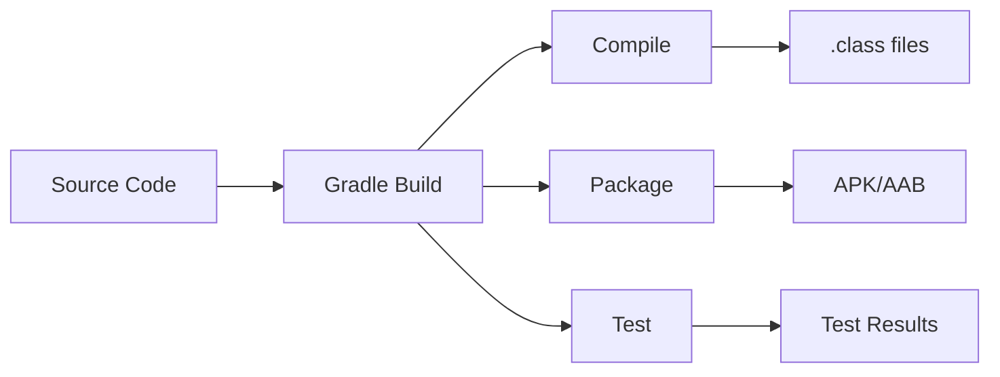

# Gradle Build System - Android Interview Preparation Guide

> Comprehensive guide to Gradle build system for Android development. Covers basics, configurations, build variants, multi-module projects, and optimization techniques.

## Table of Contents

1. [What is Gradle?](#1-what-is-gradle)
2. [Project Structure](#2-project-structure)
3. [Build Configuration Files](#3-build-configuration-files)
4. [Dependencies Management](#4-dependencies-management)
5. [Build Variants and Product Flavors](#5-build-variants-and-product-flavors)
6. [Build Types](#6-build-types)
7. [Signing Configurations](#7-signing-configurations)
8. [ProGuard/R8 Configuration](#8-proguardr8-configuration)
9. [Multi-Module Projects](#9-multi-module-projects)
10. [Build Optimization](#10-build-optimization)
11. [Gradle Plugins](#11-gradle-plugins)
12. [Custom Tasks](#12-custom-tasks)
13. [Build Scripts (Groovy vs Kotlin DSL)](#13-build-scripts-groovy-vs-kotlin-dsl)
14. [Common Configurations](#14-common-configurations)
15. [Best Practices](#15-best-practices)
16. [Interview Questions](#16-interview-questions)

---

## 1. What is Gradle?

Gradle is an open-source build automation tool that manages dependencies and builds Android applications.

### Key Features

- **Declarative Builds**: Define what to build, not how
- **Dependency Management**: Automatic dependency resolution
- **Incremental Builds**: Only rebuilds what changed
- **Multi-Project Support**: Handles multi-module projects
- **Plugin System**: Extensible via plugins
- **DSL Support**: Groovy or Kotlin DSL

### How Gradle Works



**Build Process**:
1. **Initialization**: Loads settings.gradle, identifies projects
2. **Configuration**: Evaluates build.gradle files, creates task graph
3. **Execution**: Runs tasks in dependency order

---

## 2. Project Structure

### Standard Android Project Structure

```
project-root/
├── settings.gradle                    # Project/module configuration
├── build.gradle                        # Project-level build config
├── gradle.properties                   # Gradle properties
├── local.properties                    # Local SDK paths (gitignored)
├── gradle/
│   └── wrapper/
│       ├── gradle-wrapper.jar
│       └── gradle-wrapper.properties
└── app/
    ├── build.gradle                    # Module-level build config
    ├── src/
    │   ├── main/
    │   │   ├── AndroidManifest.xml
    │   │   ├── java/
    │   │   └── res/
    │   ├── test/                       # Unit tests
    │   └── androidTest/                # Instrumented tests
    └── proguard-rules.pro              # ProGuard rules
```

### Key Files

| File | Purpose |
|------|---------|
| `settings.gradle` | Defines which modules are part of the project |
| `build.gradle` (project) | Project-wide configurations, dependencies |
| `build.gradle` (module) | Module-specific configurations |
| `gradle.properties` | Gradle and project properties |
| `gradle-wrapper.properties` | Gradle version configuration |

---

## 3. Build Configuration Files

### settings.gradle

Defines project structure and included modules.

```groovy
// Groovy DSL
pluginManagement {
    repositories {
        google()
        mavenCentral()
        gradlePluginPortal()
    }
}

dependencyResolutionManagement {
    repositoriesMode.set(RepositoriesMode.FAIL_ON_PROJECT_REPOS)
    repositories {
        google()
        mavenCentral()
    }
}

rootProject.name = "MyApp"
include ':app'
include ':feature:login'
include ':feature:home'
include ':core'
```

```kotlin
// Kotlin DSL
pluginManagement {
    repositories {
        google()
        mavenCentral()
        gradlePluginPortal()
    }
}

dependencyResolutionManagement {
    repositoriesMode.set(RepositoriesMode.FAIL_ON_PROJECT_REPOS)
    repositories {
        google()
        mavenCentral()
    }
}

rootProject.name = "MyApp"
include(":app")
include(":feature:login")
include(":feature:home")
include(":core")
```

### Project-Level build.gradle

```groovy
// Groovy DSL
buildscript {
    ext.kotlin_version = '1.9.0'
    repositories {
        google()
        mavenCentral()
    }
    dependencies {
        classpath 'com.android.tools.build:gradle:8.1.0'
        classpath "org.jetbrains.kotlin:kotlin-gradle-plugin:$kotlin_version"
        classpath 'com.google.dagger:hilt-android-gradle-plugin:2.48'
    }
}

allprojects {
    repositories {
        google()
        mavenCentral()
    }
}

task clean(type: Delete) {
    delete rootProject.buildDir
}
```

```kotlin
// Kotlin DSL
buildscript {
    val kotlinVersion = "1.9.0"
    repositories {
        google()
        mavenCentral()
    }
    dependencies {
        classpath("com.android.tools.build:gradle:8.1.0")
        classpath("org.jetbrains.kotlin:kotlin-gradle-plugin:$kotlinVersion")
        classpath("com.google.dagger:hilt-android-gradle-plugin:2.48")
    }
}

allprojects {
    repositories {
        google()
        mavenCentral()
    }
}

tasks.register("clean", Delete::class) {
    delete(rootProject.buildDir)
}
```

### Module-Level build.gradle

```groovy
// Groovy DSL
plugins {
    id 'com.android.application'
    id 'kotlin-android'
    id 'kotlin-kapt'
    id 'dagger.hilt.android.plugin'
}

android {
    namespace 'com.example.myapp'
    compileSdk 34
    
    defaultConfig {
        applicationId "com.example.myapp"
        minSdk 24
        targetSdk 34
        versionCode 1
        versionName "1.0"
        
        testInstrumentationRunner "androidx.test.runner.AndroidJUnitRunner"
    }
    
    buildTypes {
        release {
            minifyEnabled true
            proguardFiles getDefaultProguardFile('proguard-android-optimize.txt'), 'proguard-rules.pro'
        }
    }
    
    compileOptions {
        sourceCompatibility JavaVersion.VERSION_17
        targetCompatibility JavaVersion.VERSION_17
    }
    
    kotlinOptions {
        jvmTarget = '17'
    }
}

dependencies {
    implementation 'androidx.core:core-ktx:1.12.0'
    implementation 'androidx.appcompat:appcompat:1.6.1'
    // ... more dependencies
}
```

```kotlin
// Kotlin DSL
plugins {
    id("com.android.application")
    id("org.jetbrains.kotlin.android")
    id("kotlin-kapt")
    id("dagger.hilt.android.plugin")
}

android {
    namespace = "com.example.myapp"
    compileSdk = 34
    
    defaultConfig {
        applicationId = "com.example.myapp"
        minSdk = 24
        targetSdk = 34
        versionCode = 1
        versionName = "1.0"
        
        testInstrumentationRunner = "androidx.test.runner.AndroidJUnitRunner"
    }
    
    buildTypes {
        release {
            isMinifyEnabled = true
            proguardFiles(
                getDefaultProguardFile("proguard-android-optimize.txt"),
                "proguard-rules.pro"
            )
        }
    }
    
    compileOptions {
        sourceCompatibility = JavaVersion.VERSION_17
        targetCompatibility = JavaVersion.VERSION_17
    }
    
    kotlinOptions {
        jvmTarget = "17"
    }
}

dependencies {
    implementation("androidx.core:core-ktx:1.12.0")
    implementation("androidx.appcompat:appcompat:1.6.1")
    // ... more dependencies
}
```

### gradle.properties

Project-wide Gradle settings.

```properties
# Project-wide Gradle settings
org.gradle.jvmargs=-Xmx2048m -Dfile.encoding=UTF-8
org.gradle.parallel=true
org.gradle.caching=true
org.gradle.configureondemand=true
android.useAndroidX=true
android.enableJetifier=true

# Kotlin
kotlin.code.style=official

# AndroidX
android.useAndroidX=true
android.enableJetifier=true
```

---

## 4. Dependencies Management

### Dependency Types

| Type | Description | Example |
|------|-------------|---------|
| `implementation` | Compile and runtime dependency | `implementation 'androidx.core:core-ktx:1.12.0'` |
| `api` | Exposed to consumers (transitive) | `api 'com.squareup.retrofit2:retrofit:2.9.0'` |
| `compileOnly` | Compile-time only | `compileOnly 'javax.annotation:jsr250-api:1.0'` |
| `runtimeOnly` | Runtime only | `runtimeOnly 'com.h2database:h2:1.4.200'` |
| `testImplementation` | Test dependencies | `testImplementation 'junit:junit:4.13.2'` |
| `androidTestImplementation` | Android test dependencies | `androidTestImplementation 'androidx.test.espresso:espresso-core:3.5.1'` |
| `kapt` | Kotlin annotation processor | `kapt 'com.google.dagger:dagger-compiler:2.48'` |
| `ksp` | Kotlin Symbol Processing | `ksp 'com.google.devtools.ksp:symbol-processing-api:1.9.0'` |

### Dependency Configurations

```groovy
dependencies {
    // Local module
    implementation project(':core')
    
    // Local file
    implementation files('libs/custom-library.jar')
    implementation fileTree(dir: 'libs', include: ['*.jar'])
    
    // Remote repository
    implementation 'com.squareup.retrofit2:retrofit:2.9.0'
    
    // Version catalog (recommended)
    implementation libs.retrofit
    
    // Exclude transitive dependencies
    implementation('com.example:library:1.0') {
        exclude group: 'com.unwanted', module: 'dependency'
    }
    
    // Force version
    implementation('com.example:library:1.0') {
        force = true
    }
}
```

### Version Catalogs (Recommended)

**libs.versions.toml** (in `gradle/` directory):

```toml
[versions]
kotlin = "1.9.0"
retrofit = "2.9.0"
hilt = "2.48"

[libraries]
retrofit = { module = "com.squareup.retrofit2:retrofit", version.ref = "retrofit" }
hilt-android = { module = "com.google.dagger:hilt-android", version.ref = "hilt" }

[plugins]
kotlin-android = { id = "org.jetbrains.kotlin.android", version.ref = "kotlin" }
```

**Usage in build.gradle**:

```kotlin
plugins {
    alias(libs.plugins.kotlin.android)
}

dependencies {
    implementation(libs.retrofit)
    implementation(libs.hilt.android)
}
```

### Dependency Resolution

Gradle resolves dependencies using:
1. **Dependency Graph**: Builds dependency tree
2. **Conflict Resolution**: Chooses highest version by default
3. **Transitive Dependencies**: Automatically includes dependencies of dependencies

```bash
# View dependency tree
./gradlew app:dependencies

# View dependency tree for specific configuration
./gradlew app:dependencies --configuration implementation
```

---

## 5. Build Variants and Product Flavors

### Build Variants

Build Variant = Build Type × Product Flavor

```
Build Variants:
├── debug
│   ├── freeDebug
│   └── paidDebug
└── release
    ├── freeRelease
    └── paidRelease
```

### Product Flavors

```groovy
android {
    flavorDimensions "version", "environment"
    
    productFlavors {
        free {
            dimension "version"
            applicationIdSuffix ".free"
            versionNameSuffix "-free"
        }
        
        paid {
            dimension "version"
            applicationIdSuffix ".paid"
            versionNameSuffix "-paid"
        }
        
        dev {
            dimension "environment"
            applicationIdSuffix ".dev"
            buildConfigField "String", "API_URL", '"https://dev.api.com"'
        }
        
        prod {
            dimension "environment"
            buildConfigField "String", "API_URL", '"https://api.com"'
        }
    }
}
```

### Flavor-Specific Configurations

```groovy
android {
    productFlavors {
        free {
            // Different resources
            resValue "string", "app_name", "MyApp Free"
            
            // Different manifest
            manifestPlaceholders = [
                appName: "MyApp Free"
            ]
            
            // Different dependencies
            dependencies {
                freeImplementation 'com.example:free-library:1.0'
            }
        }
        
        paid {
            resValue "string", "app_name", "MyApp Pro"
            dependencies {
                paidImplementation 'com.example:paid-library:1.0'
            }
        }
    }
}
```

### Source Sets

```
app/
├── src/
│   ├── main/                    # Common code
│   ├── free/                     # Free flavor specific
│   │   ├── java/
│   │   └── res/
│   ├── paid/                     # Paid flavor specific
│   │   ├── java/
│   │   └── res/
│   ├── debug/                    # Debug build type specific
│   └── release/                  # Release build type specific
```

---

## 6. Build Types

### Default Build Types

```groovy
android {
    buildTypes {
        debug {
            applicationIdSuffix ".debug"
            versionNameSuffix "-debug"
            debuggable true
            minifyEnabled false
            shrinkResources false
        }
        
        release {
            minifyEnabled true
            shrinkResources true
            proguardFiles getDefaultProguardFile('proguard-android-optimize.txt'), 'proguard-rules.pro'
            signingConfig signingConfigs.release
        }
        
        staging {
            initWith release
            applicationIdSuffix ".staging"
            versionNameSuffix "-staging"
            debuggable true
        }
    }
}
```

### Build Type Properties

| Property | Description |
|----------|-------------|
| `minifyEnabled` | Enable code shrinking |
| `shrinkResources` | Remove unused resources |
| `proguardFiles` | ProGuard rule files |
| `signingConfig` | Signing configuration |
| `debuggable` | Allow debugging |
| `applicationIdSuffix` | Append to applicationId |
| `versionNameSuffix` | Append to versionName |
| `buildConfigField` | Add BuildConfig fields |
| `manifestPlaceholders` | Replace manifest placeholders |

### BuildConfig Fields

```groovy
buildTypes {
    release {
        buildConfigField "String", "API_URL", '"https://api.com"'
        buildConfigField "boolean", "ENABLE_LOGGING", "false"
        buildConfigField "int", "TIMEOUT", "30"
    }
}
```

**Usage in code**:
```kotlin
val apiUrl = BuildConfig.API_URL
val enableLogging = BuildConfig.ENABLE_LOGGING
```

---

## 7. Signing Configurations

### Signing Config Setup

```groovy
android {
    signingConfigs {
        debug {
            storeFile file('debug.keystore')
            storePassword 'android'
            keyAlias 'androiddebugkey'
            keyPassword 'android'
        }
        
        release {
            storeFile file('release.keystore')
            storePassword System.getenv("KEYSTORE_PASSWORD")
            keyAlias System.getenv("KEY_ALIAS")
            keyPassword System.getenv("KEY_PASSWORD")
        }
    }
    
    buildTypes {
        release {
            signingConfig signingConfigs.release
        }
    }
}
```

### Secure Signing (Recommended)

**gradle.properties** (not in version control):
```properties
RELEASE_STORE_FILE=../release.keystore
RELEASE_STORE_PASSWORD=your_password
RELEASE_KEY_ALIAS=your_alias
RELEASE_KEY_PASSWORD=your_key_password
```

**build.gradle**:
```groovy
signingConfigs {
    release {
        if (project.hasProperty('RELEASE_STORE_FILE')) {
            storeFile file(RELEASE_STORE_FILE)
            storePassword RELEASE_STORE_PASSWORD
            keyAlias RELEASE_KEY_ALIAS
            keyPassword RELEASE_KEY_PASSWORD
        }
    }
}
```

### V1 and V2 Signing

```groovy
android {
    signingConfigs {
        release {
            v1SigningEnabled true  // JAR signing
            v2SigningEnabled true  // APK Signature Scheme v2
        }
    }
}
```

---

## 8. ProGuard/R8 Configuration

### R8 Overview

R8 performs:
- **Code Shrinking**: Removes unused code
- **Resource Shrinking**: Removes unused resources
- **Obfuscation**: Renames classes/methods
- **Optimization**: Optimizes bytecode

### ProGuard Rules

**proguard-rules.pro**:

```proguard
# Keep classes
-keep class com.example.model.** { *; }

# Keep annotations
-keepattributes *Annotation*

# Keep native methods
-keepclasseswithmembernames class * {
    native <methods>;
}

# Keep Parcelable
-keepclassmembers class * implements android.os.Parcelable {
    public static final android.os.Parcelable$Creator CREATOR;
}

# Keep Serializable
-keepclassmembers class * implements java.io.Serializable {
    static final long serialVersionUID;
    private static final java.io.ObjectStreamField[] serialPersistentFields;
    private void writeObject(java.io.ObjectOutputStream);
    private void readObject(java.io.ObjectInputStream);
    java.lang.Object writeReplace();
    java.lang.Object readResolve();
}

# Keep Retrofit interfaces
-keepattributes Signature, InnerClasses, EnclosingMethod
-keepattributes RuntimeVisibleAnnotations, RuntimeVisibleParameterAnnotations
-keepclassmembers,allowshrinking,allowobfuscation interface * {
    @retrofit2.http.* <methods>;
}

# Keep Gson
-keepattributes Signature
-keepattributes *Annotation*
-keep class sun.misc.Unsafe { *; }
-keep class com.google.gson.** { *; }

# Remove logging
-assumenosideeffects class android.util.Log {
    public static *** d(...);
    public static *** v(...);
    public static *** i(...);
    public static *** w(...);
    public static *** e(...);
}
```

### Keep Rules

```proguard
# Keep class
-keep class com.example.MyClass

# Keep class and members
-keep class com.example.MyClass { *; }

# Keep class name only
-keepnames class com.example.MyClass

# Keep if class members present
-keepclasseswithmembers class com.example.MyClass {
    <methods>;
}

# Keep if class members present (allow shrinking)
-keepclasseswithmembernames class com.example.MyClass {
    <methods>;
}
```

### Testing ProGuard

```bash
# Build release APK with ProGuard
./gradlew assembleRelease

# Check mapping file
cat app/build/outputs/mapping/release/mapping.txt

# Test ProGuard rules
./gradlew assembleRelease
# Install and test app
```

---

## 9. Multi-Module Projects

### Module Structure

```
project/
├── app/                    # Application module
├── core/                    # Core module (shared)
├── feature/
│   ├── login/              # Login feature module
│   └── home/               # Home feature module
└── data/                    # Data module
```

### Module Dependencies

**app/build.gradle**:
```groovy
dependencies {
    implementation project(':core')
    implementation project(':feature:login')
    implementation project(':feature:home')
    implementation project(':data')
}
```

**feature/login/build.gradle**:
```groovy
dependencies {
    implementation project(':core')
    // Feature modules don't depend on app module
}
```

### Library Modules

```groovy
// build.gradle for library module
plugins {
    id 'com.android.library'  // Not 'com.android.application'
    id 'kotlin-android'
}

android {
    // Same configuration as app module
    // But no applicationId
}
```

### Shared Dependencies

**build.gradle** (project level):
```groovy
subprojects {
    dependencies {
        // Shared dependencies for all modules
    }
}
```

**Or use version catalog** (recommended):
```toml
[versions]
kotlin = "1.9.0"

[libraries]
kotlin-stdlib = { module = "org.jetbrains.kotlin:kotlin-stdlib", version.ref = "kotlin" }
```

### Module Communication

```groovy
// Expose API from module
// core/build.gradle
android {
    publishing {
        singleVariant("release") {
            withSourcesJar()
        }
    }
}
```

---

## 10. Build Optimization

### Gradle Performance

**gradle.properties**:
```properties
# Increase heap size
org.gradle.jvmargs=-Xmx4096m -XX:MaxMetaspaceSize=512m

# Enable parallel builds
org.gradle.parallel=true

# Enable build cache
org.gradle.caching=true

# Enable configuration on demand
org.gradle.configureondemand=true

# Enable daemon
org.gradle.daemon=true
```

### Build Speed Optimization

```groovy
// build.gradle (project)
android {
    // Use non-transitive R classes
    android.nonTransitiveRClass = true
    
    // Use non-final ResValues
    android.nonFinalResIds = false
}
```

### Dependency Optimization

```groovy
// Use implementation instead of api when possible
dependencies {
    // ❌ Bad - exposes transitive dependencies
    api 'com.squareup.retrofit2:retrofit:2.9.0'
    
    // ✅ Good - hides transitive dependencies
    implementation 'com.squareup.retrofit2:retrofit:2.9.0'
}
```

### Incremental Builds

Gradle automatically:
- Only compiles changed files
- Only processes changed resources
- Reuses previous build outputs

### Build Variant Optimization

```groovy
// Only build specific variant
./gradlew assembleFreeDebug

// Skip tests for faster build
./gradlew assembleRelease -x test
```

### Kapt vs KSP

**KSP (Kotlin Symbol Processing)** is faster than Kapt:

```groovy
// build.gradle
plugins {
    id 'com.google.devtools.ksp' version '1.9.0-1.0.13'
}

dependencies {
    // Use ksp instead of kapt
    ksp 'com.google.dagger:dagger-compiler:2.48'
}
```

---

## 11. Gradle Plugins

### Applying Plugins

```groovy
// Method 1: plugins block (recommended)
plugins {
    id 'com.android.application'
    id 'kotlin-android'
}

// Method 2: apply plugin
apply plugin: 'com.android.application'

// Method 3: Legacy
apply from: 'custom-plugin.gradle'
```

### Common Android Plugins

| Plugin | Purpose |
|--------|---------|
| `com.android.application` | Android application module |
| `com.android.library` | Android library module |
| `kotlin-android` | Kotlin support |
| `kotlin-kapt` | Kotlin annotation processing |
| `dagger.hilt.android.plugin` | Hilt dependency injection |
| `com.google.devtools.ksp` | Kotlin Symbol Processing |

### Custom Plugins

**buildSrc/src/main/groovy/MyPlugin.groovy**:
```groovy
class MyPlugin implements Plugin<Project> {
    void apply(Project project) {
        project.task('myTask') {
            doLast {
                println 'Hello from custom plugin!'
            }
        }
    }
}
```

**Usage**:
```groovy
apply plugin: MyPlugin
```

---

## 12. Custom Tasks

### Creating Tasks

```groovy
// Simple task
task hello {
    doLast {
        println 'Hello, Gradle!'
    }
}

// Task with configuration
task copyFiles(type: Copy) {
    from 'src/main'
    into 'build/output'
    include '**/*.txt'
}

// Task dependencies
task build {
    dependsOn 'compile', 'test'
}

// Task execution order
task taskA {
    doLast { println 'Task A' }
}

task taskB {
    mustRunAfter taskA
    doLast { println 'Task B' }
}
```

### Android-Specific Tasks

```groovy
// Custom task after assemble
afterEvaluate {
    tasks.named('assembleRelease').configure {
        doLast {
            // Copy APK
            copy {
                from 'app/build/outputs/apk/release'
                into 'dist'
            }
        }
    }
}
```

### Task Types

```groovy
// Copy task
task copyFiles(type: Copy) {
    from 'source'
    into 'destination'
}

// Delete task
task cleanBuild(type: Delete) {
    delete 'build'
}

// Exec task
task runScript(type: Exec) {
    commandLine 'bash', 'script.sh'
}
```

---

## 13. Build Scripts (Groovy vs Kotlin DSL)

### Groovy DSL

```groovy
android {
    compileSdkVersion 34
    
    defaultConfig {
        applicationId "com.example.app"
        minSdkVersion 24
        targetSdkVersion 34
    }
    
    buildTypes {
        release {
            minifyEnabled true
        }
    }
}
```

### Kotlin DSL

```kotlin
android {
    compileSdk = 34
    
    defaultConfig {
        applicationId = "com.example.app"
        minSdk = 24
        targetSdk = 34
    }
    
    buildTypes {
        release {
            isMinifyEnabled = true
        }
    }
}
```

### Comparison

| Feature | Groovy DSL | Kotlin DSL |
|--------|------------|------------|
| **Type Safety** | ❌ Runtime | ✅ Compile-time |
| **IDE Support** | ⚠️ Limited | ✅ Full support |
| **Refactoring** | ❌ Limited | ✅ Full support |
| **Learning Curve** | ✅ Easier | ⚠️ Steeper |
| **Performance** | ✅ Faster | ⚠️ Slower (compilation) |

---

## 14. Common Configurations

### Compile Options

```groovy
android {
    compileOptions {
        sourceCompatibility JavaVersion.VERSION_17
        targetCompatibility JavaVersion.VERSION_17
        coreLibraryDesugaringEnabled true  // Java 8+ APIs on older Android
    }
    
    kotlinOptions {
        jvmTarget = '17'
        freeCompilerArgs += [
            '-Xopt-in=kotlin.RequiresOptIn',
            '-Xjvm-default=all'
        ]
    }
}
```

### Packaging Options

```groovy
android {
    packagingOptions {
        resources {
            excludes += ['META-INF/DEPENDENCIES', 'META-INF/LICENSE']
        }
        jniLibs {
            useLegacyPackaging = true
        }
    }
}
```

### Lint Options

```groovy
android {
    lintOptions {
        abortOnError false
        checkReleaseBuilds true
        disable 'InvalidPackage'
        warningsAsErrors true
    }
}
```

### Data Binding

```groovy
android {
    buildFeatures {
        dataBinding = true
        viewBinding = true
    }
}
```

### Namespace

```groovy
android {
    namespace 'com.example.myapp'
    // Replaces package in AndroidManifest.xml
}
```

---

## 15. Best Practices

### 1. Use Version Catalogs

```toml
# ✅ Good - Centralized version management
[versions]
kotlin = "1.9.0"

[libraries]
kotlin-stdlib = { module = "org.jetbrains.kotlin:kotlin-stdlib", version.ref = "kotlin" }
```

### 2. Avoid api When Possible

```groovy
// ❌ Bad - Exposes transitive dependencies
api 'com.squareup.retrofit2:retrofit:2.9.0'

// ✅ Good - Hides transitive dependencies
implementation 'com.squareup.retrofit2:retrofit:2.9.0'
```

### 3. Use Specific Versions

```groovy
// ❌ Bad - Dynamic version
implementation 'com.example:library:+'

// ✅ Good - Specific version
implementation 'com.example:library:1.0.0'
```

### 4. Enable Build Cache

```properties
# gradle.properties
org.gradle.caching=true
```

### 5. Use KSP Instead of Kapt

```groovy
// ✅ Faster compilation
plugins {
    id 'com.google.devtools.ksp'
}

dependencies {
    ksp 'com.google.dagger:dagger-compiler:2.48'
}
```

### 6. Organize Dependencies

```groovy
dependencies {
    // Kotlin
    implementation "org.jetbrains.kotlin:kotlin-stdlib:$kotlin_version"
    
    // AndroidX
    implementation 'androidx.core:core-ktx:1.12.0'
    
    // Third-party
    implementation 'com.squareup.retrofit2:retrofit:2.9.0'
    
    // Testing
    testImplementation 'junit:junit:4.13.2'
}
```

### 7. Use Build Variants Properly

```groovy
// ✅ Good - Use flavors for different app versions
productFlavors {
    free { }
    paid { }
}
```

### 8. Secure Signing Config

```groovy
// ✅ Good - Use environment variables or gradle.properties
signingConfigs {
    release {
        storeFile file(System.getenv("KEYSTORE_FILE") ?: RELEASE_STORE_FILE)
    }
}
```

---

## 16. Interview Questions

### Basic Questions

**Q: What is Gradle?**
A: Gradle is a build automation tool that manages dependencies, compiles code, and packages Android applications. It uses a declarative DSL (Groovy or Kotlin) to define build configurations.

**Q: What is the difference between `implementation` and `api`?**
A:
- `implementation`: Dependency is used internally, not exposed to consumers
- `api`: Dependency is exposed to consumers (transitive dependency)

**Q: What are build variants?**
A: Build variants are combinations of build types and product flavors. They allow building different versions of the app (e.g., freeDebug, paidRelease).

**Q: What is the difference between `compileSdk`, `minSdk`, and `targetSdk`?**
A:
- `compileSdk`: API level used to compile the app
- `minSdk`: Minimum Android version the app supports
- `targetSdk`: API level the app is designed for

### Intermediate Questions

**Q: How does Gradle resolve dependency conflicts?**
A: Gradle uses a dependency resolution strategy. By default, it chooses the highest version. You can use `force = true` or exclude specific dependencies to resolve conflicts.

**Q: What is R8 and what does it do?**
A: R8 is a code shrinker, obfuscator, and optimizer that:
- Removes unused code (shrinking)
- Renames classes/methods (obfuscation)
- Optimizes bytecode (optimization)

**Q: How do you handle ProGuard rules for third-party libraries?**
A: Add keep rules in `proguard-rules.pro` to prevent R8 from removing or obfuscating classes/methods needed by third-party libraries. Many libraries provide their own ProGuard rules.

**Q: What is the difference between Groovy DSL and Kotlin DSL?**
A:
- **Groovy DSL**: More concise, dynamic typing, faster to write
- **Kotlin DSL**: Type-safe, better IDE support, compile-time checking

### Advanced Questions

**Q: How do you optimize Gradle build times?**
A:
- Enable build cache (`org.gradle.caching=true`)
- Enable parallel builds (`org.gradle.parallel=true`)
- Use KSP instead of Kapt
- Use `implementation` instead of `api`
- Increase heap size
- Use build variants efficiently
- Enable configuration on demand

**Q: How do you set up a multi-module project?**
A:
1. Define modules in `settings.gradle`
2. Create module directories
3. Add `build.gradle` for each module
4. Configure dependencies between modules
5. Use library modules for shared code

**Q: How do you handle different API endpoints for different build variants?**
A:
```groovy
productFlavors {
    dev {
        buildConfigField "String", "API_URL", '"https://dev.api.com"'
    }
    prod {
        buildConfigField "String", "API_URL", '"https://api.com"'
    }
}
```

**Q: What is the Gradle build lifecycle?**
A:
1. **Initialization**: Loads `settings.gradle`, identifies projects
2. **Configuration**: Evaluates `build.gradle` files, creates task graph
3. **Execution**: Runs tasks in dependency order

**Q: How do you create a custom Gradle task?**
A:
```groovy
task myTask {
    doLast {
        println 'Custom task executed'
    }
}

// Or with type
task copyFiles(type: Copy) {
    from 'source'
    into 'destination'
}
```

**Q: What is the difference between `buildTypes` and `productFlavors`?**
A:
- **buildTypes**: Different build configurations (debug, release) - same app, different optimizations
- **productFlavors**: Different app versions (free, paid) - different features, same build configuration

**Q: How do you handle signing for release builds securely?**
A: Store signing credentials in `gradle.properties` (not in version control) or use environment variables. Reference them in `signingConfigs`.

---

## Quick Reference

### Common Gradle Commands

| Command | Purpose |
|--------|---------|
| `./gradlew build` | Build all variants |
| `./gradlew assembleDebug` | Build debug APK |
| `./gradlew assembleRelease` | Build release APK |
| `./gradlew installDebug` | Install debug APK |
| `./gradlew clean` | Clean build directory |
| `./gradlew tasks` | List all tasks |
| `./gradlew dependencies` | Show dependency tree |
| `./gradlew :module:dependencies` | Show dependencies for specific module |

### Build Configuration Properties

| Property | Description |
|----------|-------------|
| `compileSdk` | API level to compile against |
| `minSdk` | Minimum supported API level |
| `targetSdk` | Target API level |
| `versionCode` | Internal version number |
| `versionName` | User-visible version string |
| `applicationId` | Unique app identifier |
| `namespace` | Package namespace |

### Dependency Types Summary

| Type | When to Use |
|------|-------------|
| `implementation` | Default for most dependencies |
| `api` | When dependency needs to be exposed |
| `compileOnly` | Compile-time only dependencies |
| `runtimeOnly` | Runtime only dependencies |
| `testImplementation` | Unit test dependencies |
| `androidTestImplementation` | Instrumented test dependencies |

---

## References

- [Gradle User Guide](https://docs.gradle.org/current/userguide/userguide.html)
- [Android Gradle Plugin](https://developer.android.com/studio/build)
- [Gradle Build Configuration](https://developer.android.com/studio/build/gradle-tips)
- [Version Catalogs](https://docs.gradle.org/current/userguide/platforms.html)
- [R8 Configuration](https://developer.android.com/studio/build/shrink-code)

---

**Last Updated**: 2025
