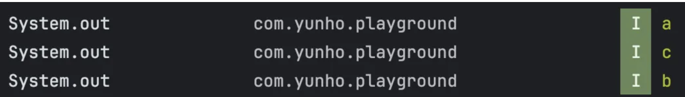

# COROUTINES

## 1. What will be the order of the print statements in the code below? Also, could you explain why?

```kotlin
// in Activity
override fun onCreate(savedInstanceState: Bundle?) {
    super.onCreate(savedInstanceState)
       
    lifecycleScope.launch {
        println("a")
    }
    
    GlobalScope.launch {
        println("b")
    }

    println("c")
}
```

**The answer I expected**



Coroutines are often described as non-blocking because they actually operate without blocking threads. So even when you open a coroutine scope and execute it, it doesn’t block the main thread. Instead, the internal coroutine scheduler handles tasks asynchronously via the Dispatcher.

At first glance, **it may seem like `c` would run first**. However, **`lifecycleScope` uses `Dispatchers.Main.immediate` by default**, which means **this dispatcher will execute the coroutine immediately if the current thread is the main thread**, without dispatching it separately.

Consequently, a prints first.

Next, c, which runs synchronously, prints.

Finally, b, which runs non-blockingly in a separate thread pool, prints.

**Therefore, the final order is a → c → b.**


**Follow-up question**  
Then, how can we make it print in the order a b c while maintaining the current coroutine scope?

**The answer I expected**  
* Add Dispatcher.Unconfined or Dispatcher.Main.immediate to GlobalScope’s launch

```kotlin
GlobalScope.launch(Dispatchers.Main.immediate) { // or Dispatchers.Unconfined
    println("b")
}
```

* Add CoroutineStart.UNDISPATCHED to GlobalScope’s launch

```kotlin
GlobalScope.launch(start = CoroutineStart.UNDISPATCHED) {
    println("b")
}
```

**Key Points:**

- **`Dispatchers.Unconfined`**: _Starts execution **immediately** on the **current thread**_.  
- **`Dispatchers.Main.immediate`**: _Starts execution **immediately** on the **main thread** (when already on main)_.

➡️ **Since an Activity runs on the main thread, using either of these dispatchers causes the coroutine to execute right away in this context—achieving the desired print order.**

- **`CoroutineStart.UNDISPATCHED`**: _A coroutine builder option that allows the coroutine to **start immediately in the current call frame, before suspension**._  
  - **This also ensures the coroutine begins on the current thread and executes instantly.**

---

**Intent of the question:**  
Tests your understanding of **non-blocking coroutine behavior** and your ability to **distinguish** and **apply various Dispatchers and CoroutineStart options** to achieve specific execution orders when launching coroutines.


## 2. Which of the following data classes would the Compose compiler consider Stable?

```kotlin
data class A(val value: Int)

data class B(var value: Int)

data class C(val value: MutableState<Int>)

data class D(val value: List<Int>)

data class E(val value: SnapshotStateList<Int>)

data class F(val value: I)

sealed interface I {
    data object Child : I
}
```

**The answer I expected:**  
**A, C, E**

In Compose, stability is determined based on whether the class’s internal properties are immutable or whether the Compose runtime can track the type.

**A:** ✅ **Stable** — Internal property is **immutable** (`val value: Int`).

**B:** ❌ **Unstable** — Internal property is **mutable and _not traceable_** by Compose (`var value: Int`).

**C:** ✅ **Stable** — Internal property is **mutable _but traceable_** by Compose (`val value: MutableState<Int>`).

**D:** ❌ **Unstable** — `List<T>` is a **read-only API** but does **not guarantee immutability**, so its stability cannot be ensured.

**E:** ✅ **Stable** — Uses `SnapshotStateList`, which is a **mutable list _traceable_** by the Compose runtime.

**F:** ⚠️ **Runtime** — Property is an **interface type**; the **actual stability depends on the implementation at runtime**. Compose cannot determine its stability at compile time.

---

**In summary:** The stable classes are:  
**A, C, E**

**Actual Compose Compiler Metrics:**

```kotlin
// Stable: A class whose fields are immutable or tracked types
stable class A {
    stable val value: Int
    <runtime stability> = Stable
}

// Unstable: Class with mutable property not tracked by Compose
unstable class B {
    stable var value: Int
    <runtime stability> = Unstable
}

// Stable: Compose tracks MutableState automatically
stable class C {
    stable val value: MutableState<Int>
    <runtime stability> = Stable
}

// Unstable: List is not regarded as truly immutable or tracked
unstable class D {
    unstable val value: List<Int>
    <runtime stability> = Unstable
}

// Stable: SnapshotStateList is tracked by Compose
stable class E {
    stable val value: SnapshotStateList<B>
    <runtime stability> = Stable
}

// Runtime: Stability depends on the implementation of interface I
runtime class F {
    runtime val value: I
    <runtime stability> = Uncertain(I)
}
```

**Intent of this question:**  
This question tests your understanding of Compose's stability rules and your ability to correctly identify and apply stable or unstable types.

## 3. Select Child Composables that do not directly read the Count state from the Parent.

```kotlin
@Composable
fun Parent() {
    val count = remember { mutableIntStateOf(0) }

    LaunchedEffect(Unit) {
        delay(1000)
        
        count.value += 1
    }

    ChildA(count.intValue)

    ChildB { count.intValue }

    ChildC(count)

    ChildD(count)
}

@Composable
fun ChildA(count: Int) {
    Text("$count")
}

@Composable
fun ChildB(count: () -> Int) {
    Text("${count()}")
}

@Composable
fun ChildC(count: State<Int>) {
    Text("${count.value}")
}

@Composable
fun ChildD(count: State<Int>) {
    Text("$count")
} 
```

**Expected Answer:**  
**B, C, D**

---

### 📋 Explanation

In Compose, **state is considered "read" at the moment `.value` is called**. The *Composable* that reads the state is registered in the recomposition scope and will recompose if that state changes.

| Child   | Does it read state at the Parent? | Why?                                                                                                 |
|---------|:---------------------------------:|------------------------------------------------------------------------------------------------------|
| **A**   | ✅ Yes                            | State is read in the **Parent** (because `count.intValue` is accessed directly in Parent).           |
| **B**   | ❌ No                             | Passing a **lambda**, not a value. The state is only read *inside ChildB* when the lambda is invoked.|
| **C**   | ❌ No                             | Passes the **State object**, not its value; reading occurs inside **ChildC**                         |
| **D**   | ❌ No                             | Same as C: State object is passed; reading occurs inside **ChildD**                                  |

- **A:** Reads state in Parent, because `.intValue` is accessed directly in Parent  
- **B:** Does *not* read in Parent; lambda delays reading until called in ChildB  
- **C & D:** Do *not* read in Parent; state object is passed and `.value` is accessed in child

---

**🟢 Final Answer:**  
> **B, C, D**

**Follow-Up Question:**  
If the `count` changes, will `ChildD` recompose? Why or why not?

**Expected Answer:**  
No, `ChildD` will *not* recompose. This is because `ChildD` receives the entire `State<Int>` object, but does not read its `.value` property within its composable. Since Compose only tracks state reads when `.value` is accessed, `ChildD` is not registered in the recomposition scope for changes to `count`.

**Clarification with Examples:**

- **Case 1: ChildA, ChildB, ChildC, ChildD in Parent**  
  - If only `ChildA` reads `count.value` in the parent, only the parent and `ChildA` are registered for recomposition on `count` changes.
- **Case 2: Only ChildB, ChildC, ChildD in Parent**  
  - When `ChildA` is removed and the parent no longer reads `count.value`, then only children that read `.value` in their own composable (`ChildC`) are registered for recomposition.
  - `ChildB` and `ChildD` do not read `.value` (unless invoked inside), so they will *not* recompose when `count` changes.

**Intent of This Follow-Up:**  
This question checks whether you understand how Compose tracks state reads for recomposition, and how reading (or not reading) `state.value` within a composable determines recomposition behavior and efficiency.


